.. note:: 

    Hola, bienvenido a la comunidad de entusiastas de SunFounder Raspberry Pi, Arduino y ESP32 en Facebook. Profundiza en Raspberry Pi, Arduino y ESP32 junto a otros entusiastas.

    **¿Por qué unirse?**

    - **Soporte experto**: Resuelve problemas posventa y desafíos técnicos con ayuda de nuestra comunidad y equipo.
    - **Aprende y comparte**: Intercambia consejos y tutoriales para mejorar tus habilidades.
    - **Avances exclusivos**: Accede anticipadamente a anuncios de nuevos productos y adelantos.
    - **Descuentos especiales**: Disfruta de descuentos exclusivos en nuestros productos más recientes.
    - **Promociones y sorteos festivos**: Participa en sorteos y promociones especiales por festividades.

    👉 ¿Listo para explorar y crear con nosotros? Haz clic en [|link_sf_facebook|] y únete hoy mismo.

.. _breakout_clone:

2.18 JUEGO - Breakout Clone
==============================

En este proyecto, usaremos el potenciómetro para jugar un juego tipo Breakout.

Después de hacer clic en la bandera verde, debes usar el potenciómetro para controlar la paleta en el escenario y atrapar la pelota para que suba y golpee los ladrillos. Si desaparecen todos los ladrillos, el juego está ganado; si no atrapas la pelota, el juego está perdido.

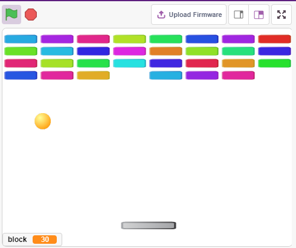

Construir el Circuito
-------------------------

El potenciómetro es un elemento resistivo con tres terminales: los dos pines laterales se conectan a 5V y GND, y el pin del medio se conecta a A0. Después de la conversión por el convertidor ADC de la placa Arduino, el rango de valores es 0-1023.

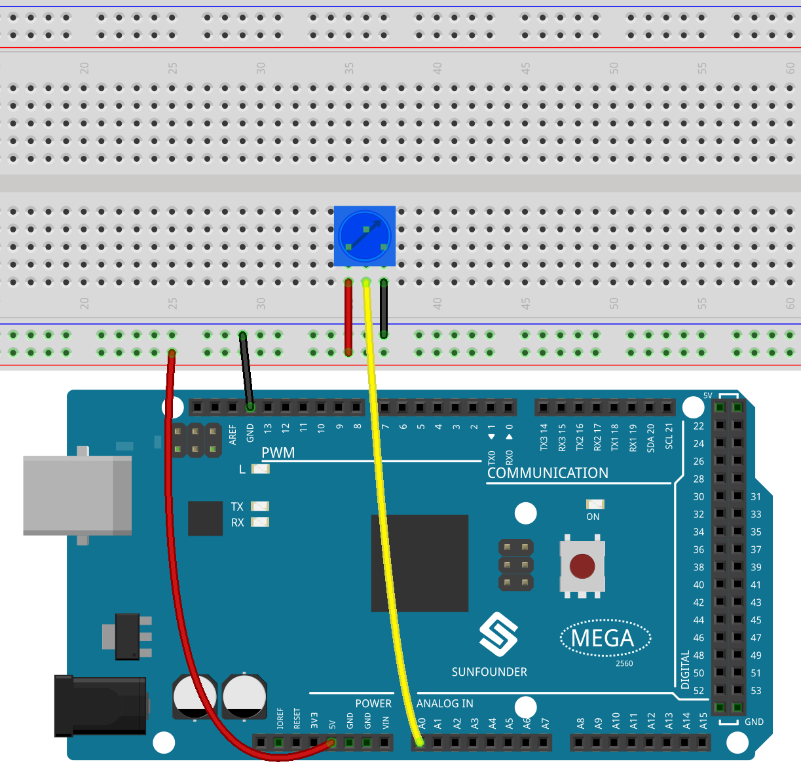

* :ref:`cpn_breadboard`
* :ref:`cpn_potentiometer`

Programación
----------------

Hay 3 sprites en el escenario.

**1. Sprite Paddle**

El efecto deseado para el **Paddle** es que la posición inicial esté en el centro inferior del escenario, y que pueda moverse hacia la izquierda o hacia la derecha controlado por el potenciómetro.

* Elimina el sprite predeterminado, utiliza el botón **Choose a Sprite** para agregar el sprite **Paddle**, y configura sus coordenadas en (0, -140).

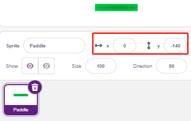

* Ve a la página **Costumes**, elimina el contorno y cambia su color a gris oscuro.

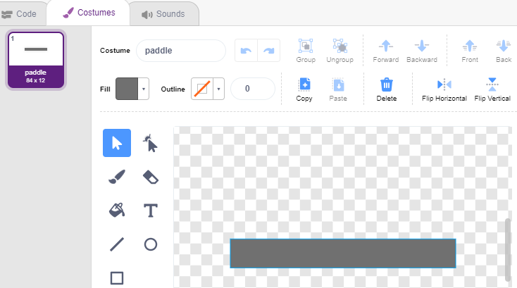

* Ahora, escribe el guion para el sprite **Paddle** para que, al hacer clic en la bandera verde, configure su posición inicial en (0, -140) y lea el valor de A0 (potenciómetro) en la variable **a0**. Dado que el sprite **Paddle** se mueve de izquierda a derecha en las coordenadas x -195~195, utiliza el bloque [map] para mapear el rango de **a0** (0~1023) a -195~195.

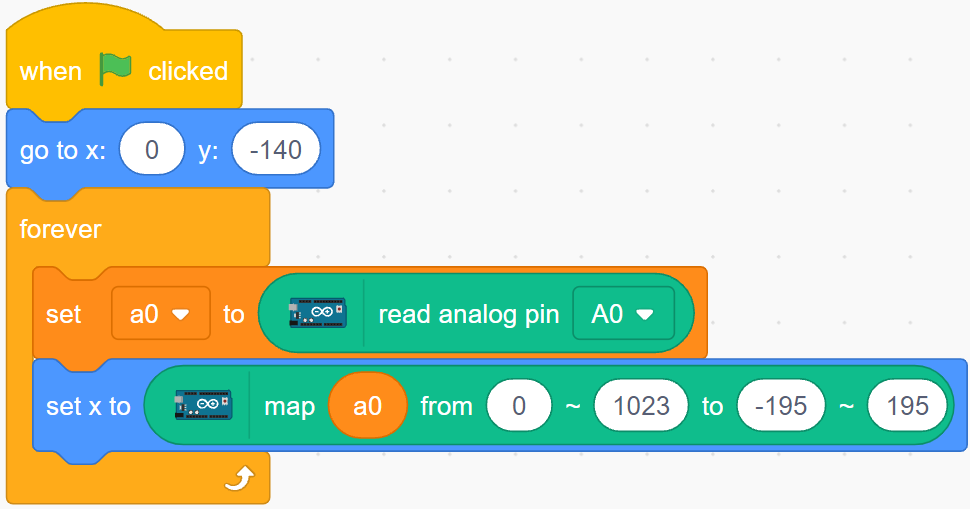

* Ahora puedes rotar el potenciómetro para verificar si el **Paddle** se mueve de izquierda a derecha en el escenario.

**2. Sprite Ball**

El sprite de la pelota debe moverse por el escenario y rebotar al tocar los bordes; rebotar hacia abajo al tocar el bloque sobre el escenario; rebotar hacia arriba si toca el sprite **Paddle** mientras cae; si no lo hace, el guion se detiene y el juego termina.

* Agrega el sprite **Ball**.

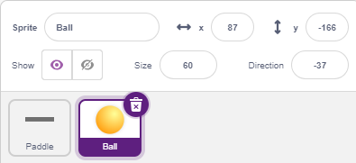

* Cuando se haga clic en la bandera verde, configura el ángulo del sprite **Ball** a 45° y su posición inicial en (0, -120).

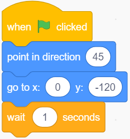

* Haz que el sprite **Ball** se mueva por el escenario y rebote al tocar los bordes. Haz clic en la bandera verde para ver el efecto.

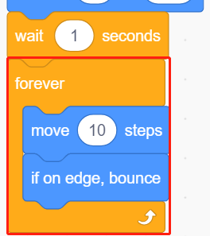

* Cuando el sprite **Ball** toque el sprite **Paddle**, realiza un rebote. Para evitar que el camino de la pelota sea fijo, calcula el rebote basado en el centro de ambos sprites.

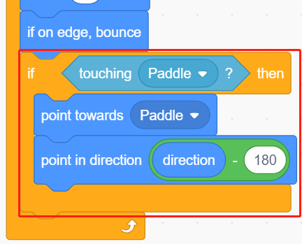

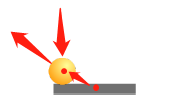

* Cuando el sprite **Ball** caiga al borde del escenario, el guion se detendrá y el juego terminará.

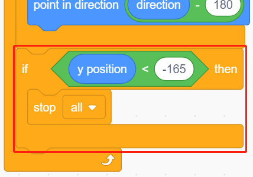

**3. Sprite Block1**

El sprite **Block1** debe clonarse 4x8 veces por encima del escenario con colores aleatorios, y eliminar un clon si es tocado por el sprite **Ball**.

El sprite **Block1** no está disponible en la biblioteca de **PictoBlox**; debes dibujarlo o modificar un sprite existente. Aquí usaremos el sprite **Button3**.

* Después de agregar el sprite **Button3**, ve a la página **Costumes**. Elimina **button-a**, reduce la altura y anchura de **button-b**, y cambia el nombre del sprite a **Block1**.

.. note::

    * Para el ancho de **Block1**, simula en la pantalla si puedes colocar 8 en una fila; si no, reduce el ancho adecuadamente.
    * Mantén el punto central en el medio del sprite al reducir su tamaño.

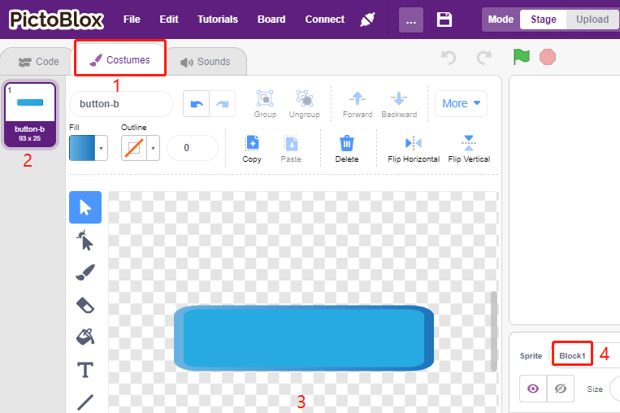

* Crea 2 variables: **block** para almacenar el número de bloques y **roll** para almacenar el número de filas.

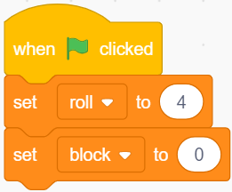

* Clona el sprite **Block1** para que se muestre de izquierda a derecha y de arriba a abajo, 4x8 en total, con colores aleatorios.

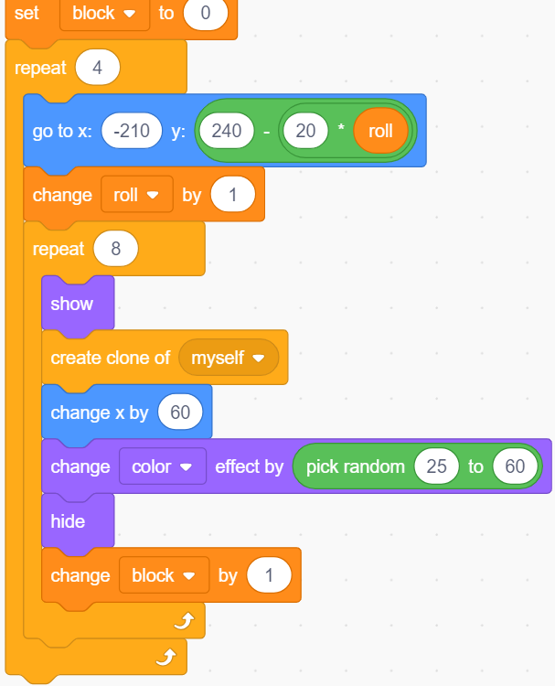

* Haz clic en la bandera verde para ver el resultado en el escenario. Ajusta el tamaño si es muy compacto o pequeño.

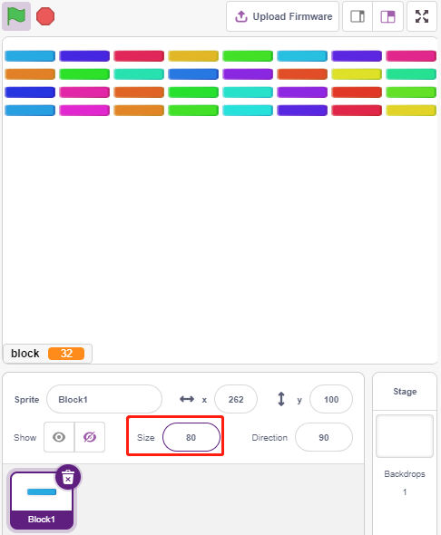

* Escribe el evento disparador. Si el clon del sprite **Block1** toca el sprite **Ball**, elimina el clon y emite el mensaje **crush**.

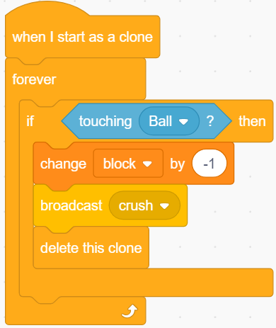

* Regresa al sprite **Ball**. Cuando reciba el mensaje **crush**, haz que el sprite **Ball** rebote en dirección opuesta.

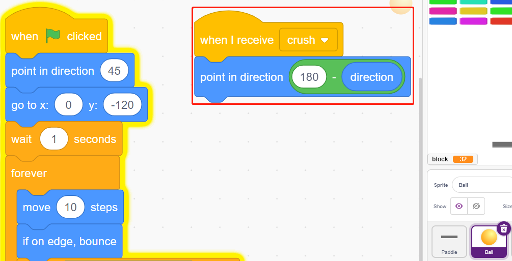
