.. _parrot:

2.18 SPIEL - Flatterhafter Papagei
========================================

Hier verwenden wir das Ultraschallmodul, um ein "Flappy Parrot"-Spiel zu spielen.

Nachdem das Skript läuft, bewegt sich der grüne Bambus langsam von rechts nach links in einer zufälligen Höhe. Wenn der Abstand zwischen deiner Hand und dem Ultraschallmodul weniger als 10 beträgt, fliegt der Parrot nach oben, ansonsten fällt er nach unten.
Du musst den Abstand zwischen deiner Hand und dem Ultraschallmodul so steuern, dass der Parrot dem grünen Bambus (Paddle) ausweichen kann. Wenn er ihn berührt, ist das Spiel vorbei.

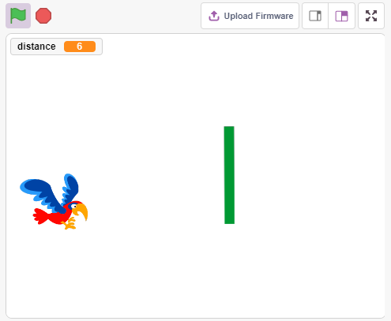

Baue den Schaltkreis
-----------------------

Ein Ultraschallsensormodul ist ein Instrument, das die Entfernung zu einem Objekt mithilfe von Ultraschallwellen misst. 
Es hat zwei Sonden. Der eine sendet Ultraschallwellen aus, der andere empfängt die Wellen und wandelt die Zeit des Sendens und Empfangens in eine Entfernung um, wodurch die Entfernung zwischen dem Gerät und einem Hindernis ermittelt wird.

Baue nun die Schaltung nach folgendem Schema auf.

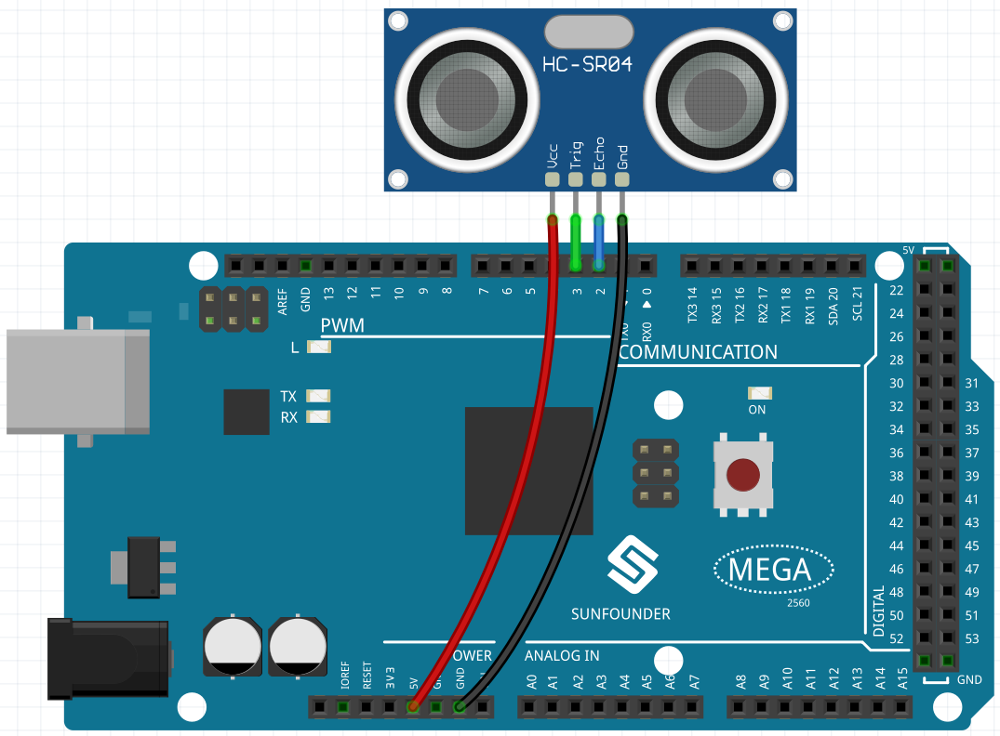

* :ref:`cpn_breadboard`
* :ref:`cpn_ultrasonic`

Programmierung
------------------

Der Effekt, den wir erreichen wollen, ist, dass wir das Ultraschallmodul benutzen, um die Flughöhe des Figur **Parrot** zu kontrollieren, während wir den Figur **Paddle** vermeiden.

**1. Hinzufügen eines Figur**

Löschen Sie das Standard-Figur, und fügen Sie über die Schaltfläche **Figur wählen** das Figur **Parrot** hinzu. Setzen Sie seine Größe auf 50%, und verschieben Sie seine Position in die linke Mitte.

.. image:: img/15_sprite.png

Fügen Sie nun das Figur **Paddle** hinzu, setzen Sie seine Größe auf 150%, setzen Sie seinen Winkel auf 180 und verschieben Sie seine Ausgangsposition in die obere rechte Ecke.

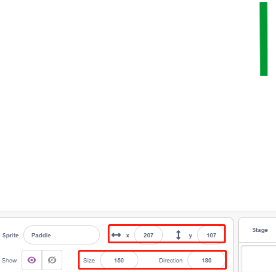

Gehen Sie auf die Seite **Costumes(Kostüme)** des Figur **Paddle** und entfernen Sie den Umriss.

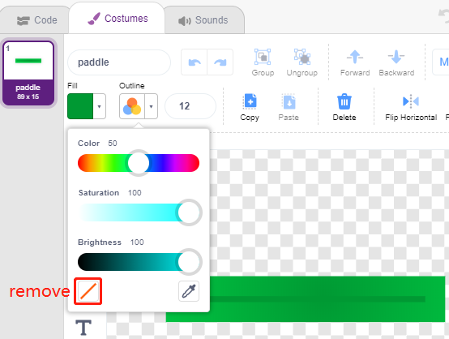

**2. Skripting für das Parroten-Figur**

Nun wird das Skript für das **Parrot**-Figur erstellt, das sich im Flug befindet und dessen Flughöhe durch den Erfassungsbereich des Ultraschallmoduls bestimmt wird.

* Wenn die grüne Flagge angeklickt wird, schalte das Kostüm alle 0,2s um, so dass es immer im Flug ist.

.. image:: img/15_parr1.png

* Lies den Wert des Ultraschallmoduls und speichere ihn in der Variablen **distance**, nachdem du ihn mit dem [round]-Block gerundet hast.

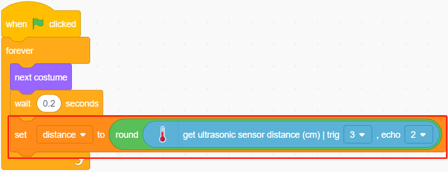

* Wenn die Ultraschallentfernung weniger als 10 cm beträgt, wird die y-Koordinate um 50 erhöht, der **Parrot** fliegt nach oben. Andernfalls wird der y-Koordinatenwert um 40 verringert, **Parrot** fällt nach unten.

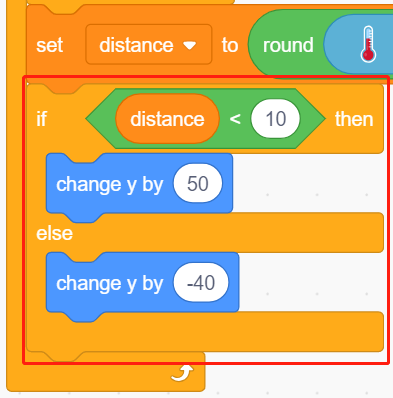

* Wenn der **Parrot** das **Paddle**-Figur berührt, endet das Spiel und das Skript hört auf zu laufen.

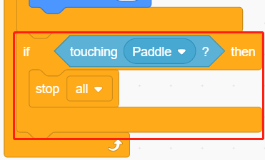

**3. Scripting für das Paddle-Figur**

Schreiben Sie nun das Skript für das **Paddle**-Figur, das zufällig auf der Bühne erscheinen soll.

* Verstecke das Figur **Paddle**, wenn die grüne Flagge angeklickt wird, und klone es gleichzeitig. Der Block [Klon von <https://en.scratch-wiki.info/wiki/Create_Clone_of_()_(Block)>`_ erzeugen] ist ein Kontrollblock und ein Stapelblock. Er erzeugt einen Klon des Figur, das als Argument angegeben ist. Er kann auch das Figur klonen, in dem er läuft, und so rekursiv Klone von Klonen erzeugen.

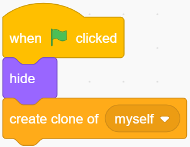

* Wenn **Paddle** als Klon dargestellt wird, ist seine Position 220 (ganz rechts) für die x-Koordinate und seine y-Koordinate bei (-125 bis 125) zufällig (Höhe zufällig).

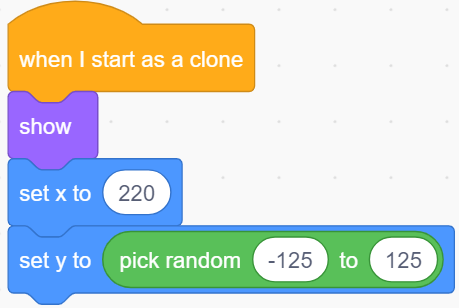

* Verwenden Sie den [repeat]-Block, um den Wert der x-Koordinate langsam zu verringern, so dass Sie sehen können, wie sich der Klon des **Paddle**-Figur langsam von rechts nach links bewegt, bis er verschwindet.

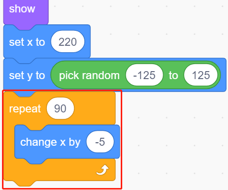

* Klonen Sie ein neues **Paddle**-Figur und löschen Sie den vorherigen Klon.

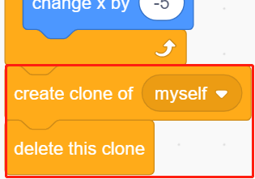