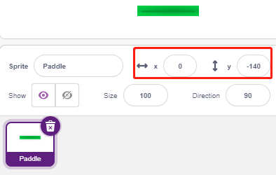

.. _breakout_clone:

2.19 SPIEL - Breakout-Klon
============================

Hier benutzen wir das Potentiometer, um ein Breakout-Clone-Spiel zu spielen.

Nachdem du auf die grüne Fahne geklickt hast, musst du mit dem Potentiometer das Paddle auf der Bühne steuern, um den Ball zu fangen, damit er nach oben fliegt und die Ziegelsteine trifft. Wenn alle Ziegelsteine verschwinden, ist das Spiel gewonnen, wenn du den Ball nicht fängst, ist das Spiel verloren.

Baue den Kreislauf
-----------------------

Das Potentiometer ist ein Widerstandselement mit 3 Anschlüssen. Die beiden seitlichen Pins sind mit 5V und GND verbunden, der mittlere Pin ist mit A0 verbunden. Nach der Umwandlung durch den ADC-Wandler des Arduino-Boards beträgt der Wertebereich 0-1023.

* :ref:`cpn_breadboard`
* :ref:`cpn_potentiometer`

Programmierung
------------------

Es gibt 3 Figurs auf der Bühne.

**1. Paddle-Figur**

Der Effekt, der mit dem **Paddle** erreicht werden soll, besteht darin, dass sich die Ausgangsposition in der Mitte des Bühnenbodens befindet, und dass es mit einem Potentiometer nach links oder rechts bewegt werden kann.

* Lösche das Standard-Figur, verwende den Button **Figur wählen**, um das **Paddle**-Figur hinzuzufügen, und setze dessen x und y auf (0, -140).

* Gehen Sie zur Seite **Costumes(Kostüme)**, entfernen Sie den Umriss und ändern Sie seine Farbe in Dunkelgrau.

.. image:: img/17_padd3.png

* Schreibe nun ein Skript für das Figur **Paddle**, damit es seine Ausgangsposition auf (0, -140) setzt, wenn die grüne Flagge angeklickt wird, und lese den Wert von A0 (Potentiometer) in die Variable **a0**. Da sich das **Paddle**-Figur auf der Bühne von links nach rechts mit den X-Koordinaten -195~195 bewegt, musst du den [map]-Block verwenden, um den Variablenbereich **a0** von 0~1023 auf -195~195 zu mappen. 

.. image:: img/17_padd2.png

* Jetzt kannst du das Potentiometer drehen, um zu sehen, ob sich das **Paddle** auf der Bühne nach links und rechts bewegen kann.

**2. Ball-Figur**

Der Effekt des Ball-Figur ist, dass er sich auf der Bühne bewegt und abprallt, wenn er den Rand berührt; er prallt nach unten, wenn er den Block über der Bühne berührt; er prallt nach oben, wenn er das Paddle-Figur während seines Falls berührt; wenn er das nicht tut, hört das Skript auf zu laufen und das Spiel endet.

**Ball** Figur hinzufügen.

* Wenn die grüne Flagge angeklickt wird, setze den Winkel des **Ball**-Figur auf 45° und setze die Anfangsposition auf (0, -120).

* Lassen Sie nun das Figur **Ball** sich auf der Bühne bewegen und abprallen, wenn es den Rand berührt. Sie können auf die grüne Flagge klicken, um den Effekt zu sehen.

* Wenn das **Ball**-Figur das **Paddle**-Figur berührt, führe eine Reflexion durch. Der einfachste Weg, dies zu tun, ist, den Winkel direkt invertieren zu lassen, aber dann wird man feststellen, dass der Weg des Balls komplett festgelegt ist, was zu langweilig ist. Daher verwenden wir die Mitte der beiden Figurs zur Berechnung und lassen den Ball in die entgegengesetzte Richtung der Mitte der Schallwand abprallen.

.. image:: img/17_ball4.png

.. image:: img/17_ball6.png

* Wenn das Figur **Ball** an den Rand der Bühne fällt, hört das Skript auf zu laufen und das Spiel endet.

.. note:: img/17_ball5.png

**3. Block1-Figur**

Das Figur **Block1** soll mit dem Effekt erscheinen, dass es 4x8 von sich selbst über der Bühne in einer zufälligen Farbe klont und einen Klon löscht, wenn es vom Figur **Ball** berührt wird.

Das **Block1**-Figur ist in der **PictoBlox**-Bibliothek nicht verfügbar, man muss es selbst zeichnen oder mit einem vorhandenen Figur modifizieren. Hier werden wir es mit dem **Button3**-Figur modifizieren.

* Nachdem du das **Button3**-Figur hinzugefügt hast, gehe auf die Seite **Costumes(Kostüme)**. Löschen Sie nun zuerst **Button-a**, reduzieren Sie dann sowohl die Breite als auch die Höhe von **Button-b** und ändern Sie den Namen des Figur in **Block1**, wie im folgenden Bild gezeigt.

.. note::

    * Was die Breite von **Block1** betrifft, so können Sie wahrscheinlich auf dem Bildschirm simulieren, ob Sie 8 Zeichen in einer Reihe unterbringen können, wenn nicht, dann reduzieren Sie die Breite entsprechend.
    * Beim Verkleinern des **Block1**-Figur müssen Sie den Mittelpunkt in der Mitte des Figur halten.

.. image:: img/17_bri2.png

* Erstelle nun zunächst 2 Variablen, **block**, um die Anzahl der Blöcke zu speichern und **roll**, um die Anzahl der Zeilen zu speichern.

* Wir müssen einen Klon des **Block1**-Figur erstellen, so dass es von links nach rechts, von oben nach unten, eins nach dem anderen, insgesamt 4x8, mit zufälligen Farben angezeigt wird.

.. image:: img/17_bri4.png

* Nachdem das Skript geschrieben wurde, klicke auf die grüne Fahne und sieh dir die Anzeige auf der Bühne an, wenn sie zu kompakt oder zu klein ist, kannst du die Größe ändern.

.. image:: img/17_bri5.png

* Schreiben Sie nun das Trigger-Ereignis. Wenn das geklonte Figur **Block1** das Figur **Ball** berührt, lösche den Klon und sende die Nachricht **crush**.

* Zurück zum **Ball**-Figur: Wenn die Nachricht **crush** empfangen wird (das **Ball**-Figur berührt den Klon des **Block1**-Figur), wird der **Ball** aus der entgegengesetzten Richtung gestoßen.

