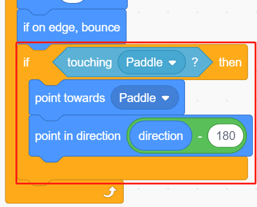
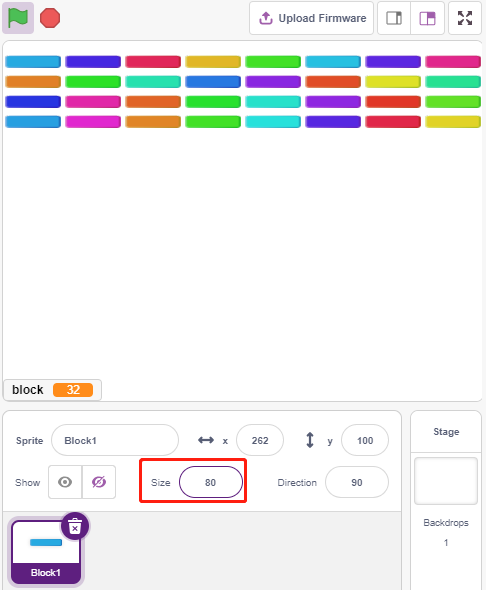

.. _breakout_clone:

2.19 GAME - Breakout Clone
============================

Here we use the potentiometer to play a Breakout Clone game.

After clicking the green flag, you need to use the potentiometer to control the paddle on the stage to catch the ball so that it can go up and hit the bricks, all the bricks disappear then the game is won, if you don't catch the ball, the game is lost.

.. image:: img/17_brick.png

Build the Circuit
-----------------------

The potentiometer is a resistive element with 3 terminals, the 2 side pins are connected to 5V and GND, and the middle pin is connected to A0. After the conversion by the ADC converter of the Arduino board, the value range is 0-1023.

.. image:: img/circuit/potentiometer_circuit.png

* :ref:`cpn_breadboard`
* :ref:`cpn_potentiometer`

Programming
------------------

There are 3 sprites on the stage.

**1. Paddle sprite**

The effect to be achieved by the **Paddle** is that the initial position is in the middle of the bottom of the stage, and it is controlled by a potentiometer to move it to the left or to the right.

* Delete the default sprite, use the **Choose a Sprite** button to add the **Paddle** sprite, and set its x and y to (0, -140).

.. image:: img/17_padd1.png

* Go to the **Costumes** page, remove the Outline and change its color to dark gray.

* Now script the **Paddle** sprite to set its initial position to (0, -140) when the green flag is clicked, and read the value of A0 (potentiometer) into the variable **a0**. Since the **Paddle** sprite moves from left to right on the stage at x-coordinates -195~195, you need to use the [map] block to map the variable **a0** range 0~1023 to -195~195. 

* Now you can rotate the potentiometer to see if the **Paddle** can move left and right on the stage.

**2. Ball sprite**

The effect of the ball sprite is that it moves around the stage and bounces when it touches the edge; it bounces down if it touches the block above the stage; it bounces up if it touches the Paddle sprite during its fall; if it doesn't, the script stops running and the game ends.

* Add **Ball** sprite.

.. image:: img/17_ball1.png

* When the green flag is clicked, set the angle of the **Ball** sprite to 45° and set the initial position to (0, -120).

.. image:: img/17_ball2.png

* Now let the **Ball** sprite move around the stage and bounce when it touches the edge, and you can click on the green flag to see the effect.

.. image:: img/17_ball3.png

* When the **Ball** sprite touches the **Paddle** sprite, do a reflection. The easy way to do this is to let the angle be directly inverted, but then you'll find that the path of the ball is completely fixed, which is too boring. Therefore, we use the center of the two sprites to calculate and make the ball bounce in the opposite direction of the center of the baffle.

* When the **Ball** sprite falls to the edge of the stage, the script stops running and the game ends.

**3. Block1 sprite**

The **Block1** sprite is to appear with the effect of cloning 4x8 of itself above the stage in a random color, and deleting a clone if it is touched by the **Ball** sprite.

The **Block1** sprite is not available in the **PictoBlox** library, you need to draw it yourself or modify it with an existing sprite. Here we are going to modify it with the **Button3** sprite.

* After adding the **Button3** sprite, go to the **Costumes** page. Now delete **button-a** first, then reduce both the width and height of **button-b**, and change the sprite name to **Block1**, as shown in the following image.

.. note::

    * For the width of **Block1**, you can probably simulate it on the screen to see if you can put down 8 in a row, if not, then reduce the width appropriately.
    * In the process of shrinking the **Block1** sprite, you need to keep the center point in the middle of the sprite.

.. image:: img/17_bri2.png

* Now create 2 variables first, **block** to store the number of blocks and **roll** to store the number of rows.

.. image:: img/17_bri3.png

* We need to make a clone of the **Block1** sprite, so that it displays from left to right, top to bottom, one by one, 4x8 in total, with random colors.

* After the script is written, click on the green flag and look at the display on the stage, if it is too compact or too small, you can change the size.

* Now write the trigger event. If the cloned **Block1** sprite touches the **Ball** sprite, delete the clone and broadcast the message **crush**.

.. image:: img/17_bri6.png

* Back to the **Ball** sprite, when the broadcast **crush** is received (the **Ball** sprite touches the clone of **Block1** sprite), the **Ball** is popped from the opposite direction.

.. image:: img/17_ball7.png

