.. _fishing:

2.19 GAME - Fishing
===========================

Here, we play a fishing game with a button.

When the script is running, the fish swim left and right on the stage, you need to press the button when the fish is almost close to the hook (it is recommended to press it for a longer time) to catch the fish, and the number of fish caught will be recorded automatically.

.. image:: img/18_fish.png

Build the Circuit
-----------------------

The button is a 4-pin device, since the pin 1 is connected to pin 2, and pin 3 to pin 4, when the button is pressed, the 4 pins are connected, thus closing the circuit.

.. image:: img/5_buttonc.png

Build the circuit according to the following diagram.

* Connect one of the pins on the left side of the button to pin 12, which is connected to a pull-down resistor and a 0.1uF (104) capacitor (to eliminate jitter and output a stable level when the button is working).
* Connect the other end of the resistor and capacitor to GND, and one of the pins on the right side of the button to 5V.

.. image:: img/circuit/button_circuit.png

* :ref:`cpn_breadboard`
* :ref:`cpn_button`
* :ref:`cpn_resistor`
* :ref:`cpn_capacitor`

Programming
------------------

We need to select an **Underwater** backdrop first, then add a **Fish** sprite and let it swim back and forth on the stage. Then draw a **Fishhook** sprite and control it by a button to start fishing. When the **Fish** sprite touches the **Fishhook** sprite in the hooked state (turns red), it will be hooked.

**1. Adding a backdrop**

Use the **Choose a Backdrop** button to add an **Underwater** backdrop.

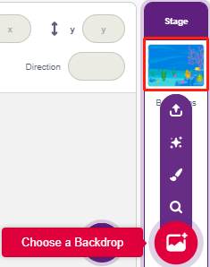

**2. Fishhook sprite**

The **Fishhook** sprite is intended to have the effect that it normally stays underwater in a yellow state; when the button is pressed, it is in a fishing state (red) and it moves above the stage.

There is no **Fishhook** sprite in Pictoblox, we can modify the **Glow-J** sprite to look like a fishhook.

* Add the **Glow-J** sprite via **Choose a Sprite**.

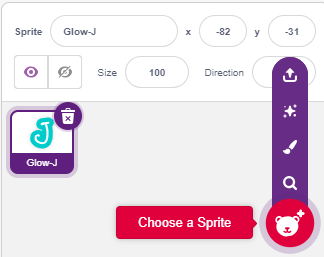

* Now go to the **Costumes** page of the **Glow-J** sprite, select Cyan's fill in the screen and remove it. Then change the J color to red and also reduce its width. The most important point to note is that you need to have the top of it just at the center point.

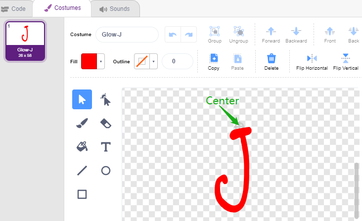

* Use the **Line tool** to draw a line as long as possible from the center point up (line out of the stage). Now that the sprite is drawn, set the sprite name to **Fishhook** and move it to the right position.

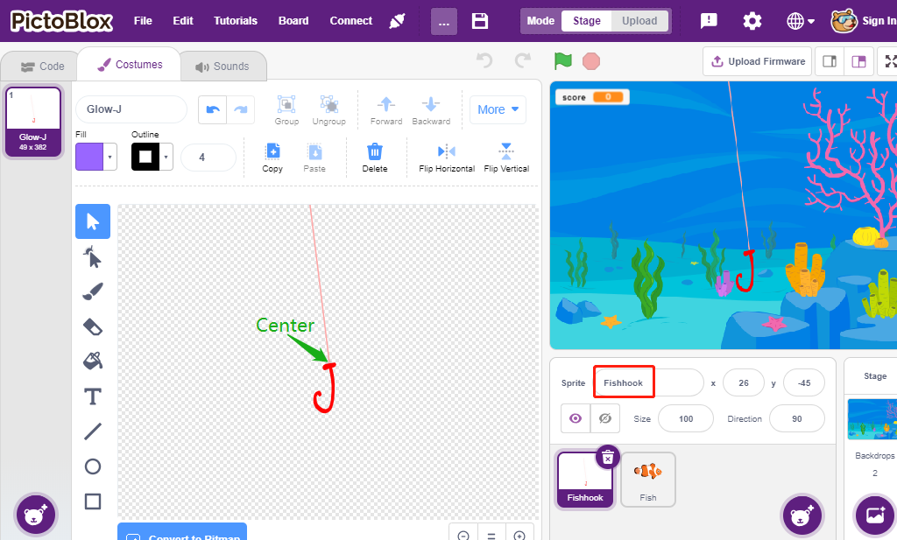

* When the green flag is clicked, set the sprite's color effect to 30 (yellow), and set its initial position.

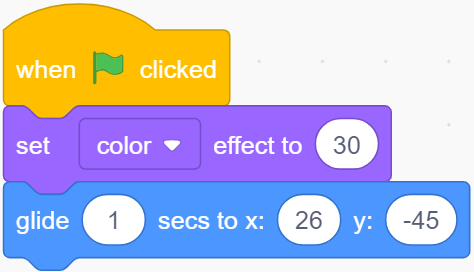

* If the button is pressed, set the color effect to 0 (red, start fishing state), wait for 0.1 and then move the **Fishhook** sprite to the top of the stage. Release the button and let the **Fishhook** return to its initial position.

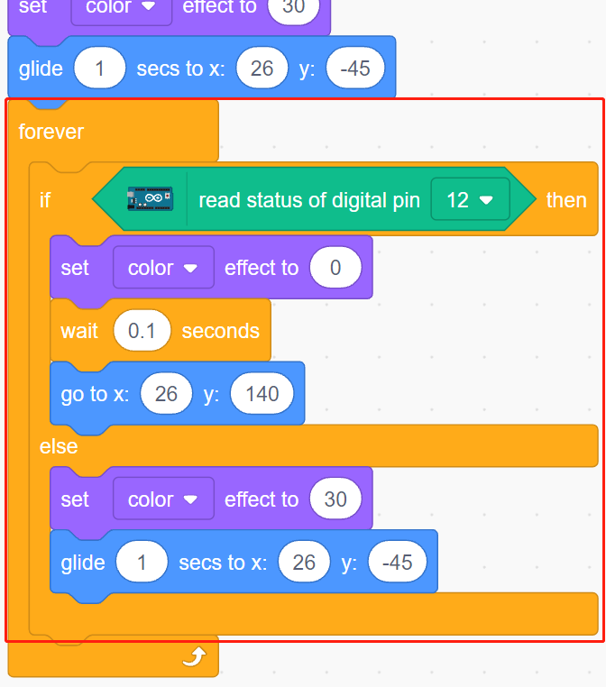

**3. Fish sprite**

The effect to be achieved by the **Fish** sprite is to move left and right on the stage, and when it encounters a **Fishhook** sprite in the fishing state, it shrinks and moves to a specific position and then disappears, and then clones a new **fish** sprite again.

* Now add the **fish** sprite and adjust its size and position.

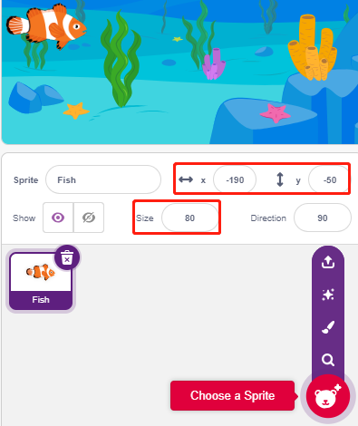

* Create a variable **score** to store the number of fish caught, hide this sprite and clone it.

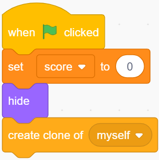

* Show the clone of the **fish** sprite, switch its costume and finally set the initial position.

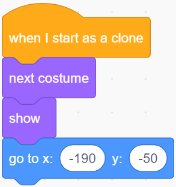

* Make the **fish** sprite's clone move left and right and bounce back when it touches the edge.

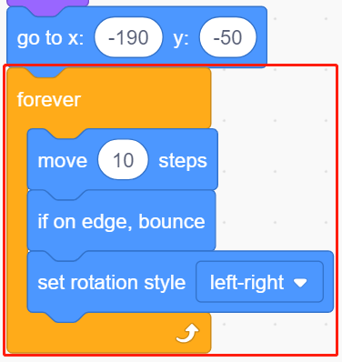

* The **fish** sprite (of the clone) will not react when it passes the **Fishhook** sprite; when it touches the **Fishhook** sprite in the fishing state (turns red), it will be caught, at which point the score (variable score) +1, and it will also show a score animation (shrinks 40%, quickly moves to the position of the scoreboard and disappears). At the same time, a new fish is created (a new fish sprite clone) and the game continues.

.. note::
    
    You need to click on the color area in the [Touch color] block, and then select the eyedropper tool to pick up the red color of the **Fishhook** sprite on the stage. If you choose a color arbitrarily, this [Touch color] block will not work.

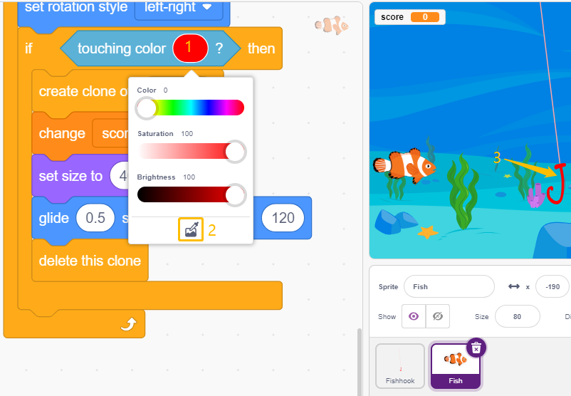

