.. note::

    * Benvenuti nella community di SunFounder per appassionati di Raspberry Pi, Arduino e ESP32 su Facebook! Approfondisci Raspberry Pi, Arduino ed ESP32 insieme ad altri appassionati.

    **Perché unirti a noi?**

    - **Supporto esperto**: Risolvi i problemi post-vendita e le sfide tecniche con l'aiuto della nostra comunità e del nostro team.
    - **Impara e condividi**: Scambia consigli e tutorial per migliorare le tue competenze.
    - **Anteprime esclusive**: Ottieni l'accesso anticipato agli annunci sui nuovi prodotti e agli sneak peek.
    - **Sconti speciali**: Goditi sconti esclusivi sui nostri prodotti più recenti.
    - **Promozioni festive e giveaway**: Partecipa a giveaway e promozioni durante le festività.

    👉 Pronto a esplorare e creare con noi? Clicca [|link_sf_facebook|] e unisciti oggi stesso!

.. _fishing:

2.19 GIOCO - Pesca
===========================

In questo progetto giochiamo a un gioco di pesca utilizzando un pulsante.

Quando lo script è in esecuzione, i pesci nuotano a destra e a sinistra sul palco. È necessario premere il pulsante quando il pesce è quasi vicino all'amo (si consiglia di tenerlo premuto per un po') per catturare il pesce, e il numero di pesci catturati verrà registrato automaticamente.

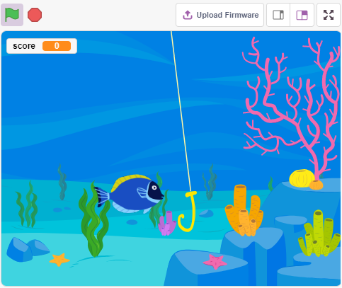

Costruzione del circuito
-----------------------------

Il pulsante è un dispositivo a 4 pin. Poiché il pin 1 è collegato al pin 2 e il pin 3 al pin 4, quando il pulsante viene premuto, i 4 pin sono collegati, chiudendo così il circuito.

.. image:: img/5_buttonc.png

Costruisci il circuito seguendo il diagramma sottostante:

* Collega uno dei pin sul lato sinistro del pulsante al pin 12, che è collegato a una resistenza pull-down e a un condensatore da 0.1uF (104) per eliminare il jitter e ottenere un livello stabile quando il pulsante è attivo.
* Collega l'altra estremità della resistenza e del condensatore a GND e uno dei pin sul lato destro del pulsante a 5V.

.. image:: img/circuit/button_circuit.png

* :ref:`cpn_breadboard`
* :ref:`cpn_button`
* :ref:`cpn_resistor`
* :ref:`cpn_capacitor`

Programmazione
------------------

Dobbiamo prima selezionare uno sfondo **Underwater**, quindi aggiungere uno sprite **Fish** e farlo nuotare avanti e indietro sul palco. Poi disegnare uno sprite **Fishhook** e controllarlo tramite un pulsante per iniziare la pesca. Quando lo sprite **Fish** tocca lo sprite **Fishhook** nello stato agganciato (diventa rosso), verrà catturato.

**1. Aggiungere uno sfondo**

Utilizza il pulsante **Scegli uno sfondo** per aggiungere uno sfondo **Underwater**.

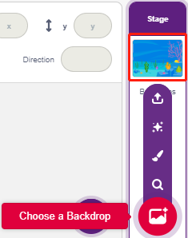

**2. Sprite Fishhook**

Lo sprite **Fishhook** è progettato per rimanere sott'acqua in uno stato giallo; quando il pulsante viene premuto, entra in uno stato di pesca (rosso) e si sposta sopra il palco.

Non esiste uno sprite **Fishhook** in Pictoblox, possiamo modificare lo sprite **Glow-J** per assomigliare a un amo da pesca.

* Aggiungi lo sprite **Glow-J** tramite **Scegli uno Sprite**.

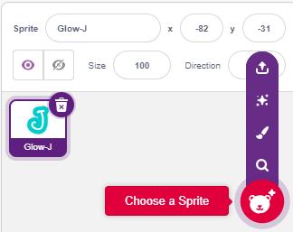

* Ora vai alla pagina **Costumi** dello sprite **Glow-J**, seleziona il riempimento ciano sullo schermo e rimuovilo. Poi cambia il colore della "J" in rosso e riduci la sua larghezza. Il punto più importante è che devi avere la parte superiore giusto al punto centrale.

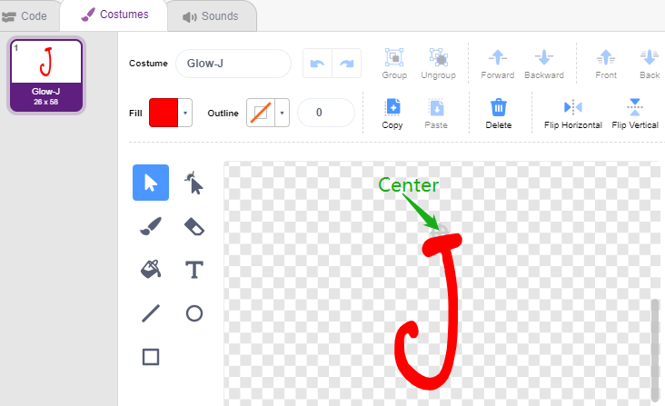

* Usa lo strumento **Linea** per disegnare una linea il più lunga possibile dal punto centrale verso l'alto (linea fuori dal palco). Ora che lo sprite è disegnato, assegna il nome **Fishhook** e spostalo nella posizione corretta.

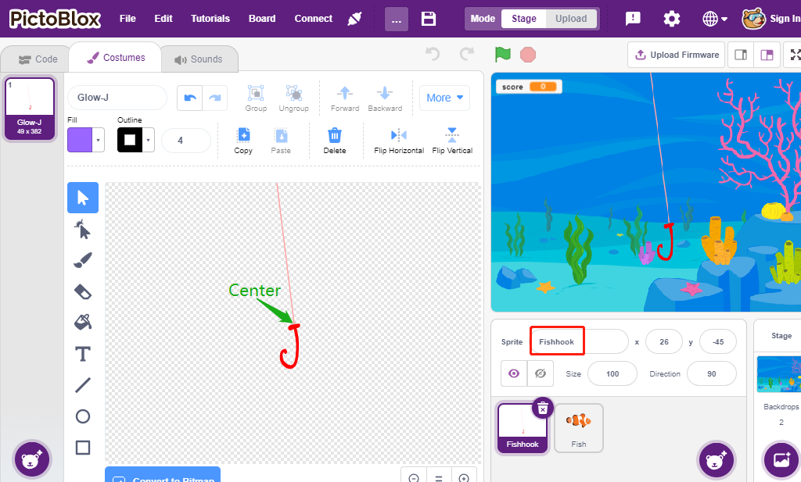

* Quando viene cliccata la bandiera verde, imposta l'effetto colore dello sprite su 30 (giallo) e la posizione iniziale.

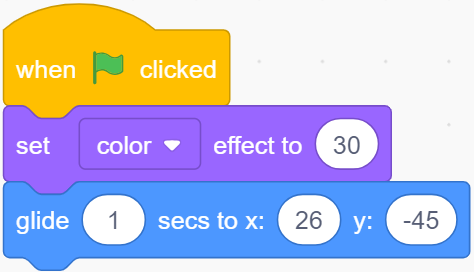

* Se il pulsante viene premuto, imposta l'effetto colore su 0 (rosso, stato di pesca), aspetta 0,1 secondi e poi sposta lo sprite **Fishhook** in cima al palco. Rilascia il pulsante e fai tornare **Fishhook** alla sua posizione iniziale.

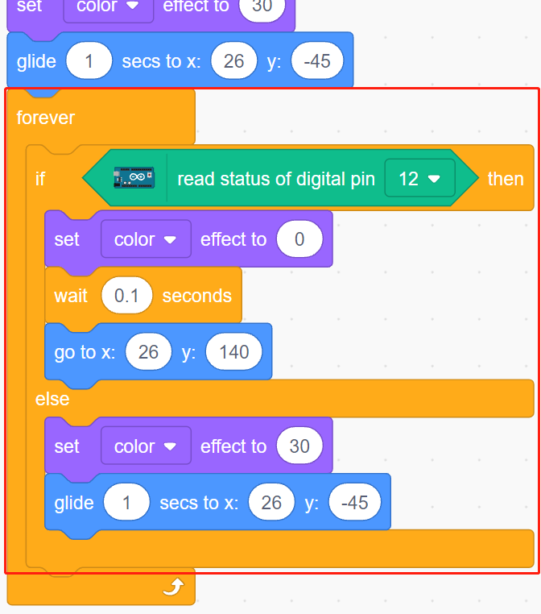

**3. Sprite Fish**

L'effetto da ottenere dallo sprite **Fish** è che si muove a sinistra e a destra sul palco, e quando incontra lo sprite **Fishhook** nello stato di pesca, si restringe, si sposta in una posizione specifica e poi scompare, quindi crea un nuovo clone dello sprite **Fish**.

* Ora aggiungi lo sprite **Fish** e regola le sue dimensioni e posizione.

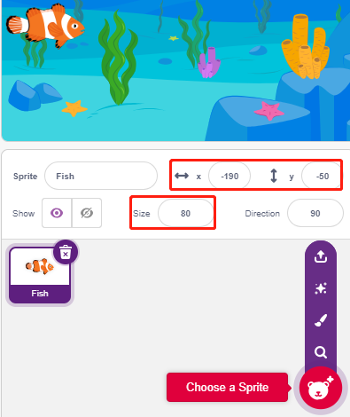

* Crea una variabile **score** per memorizzare il numero di pesci catturati, nascondi questo sprite e clona.

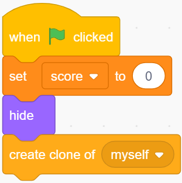

* Mostra il clone dello sprite **Fish**, cambia il suo costume e infine imposta la posizione iniziale.

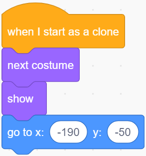

* Fai muovere il clone dello sprite **Fish** a sinistra e a destra e rimbalza quando tocca il bordo.

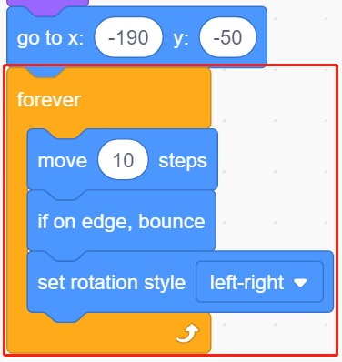

* Lo sprite **Fish** (del clone) non reagirà quando passa davanti allo sprite **Fishhook**; quando tocca lo sprite **Fishhook** nello stato di pesca (diventa rosso), verrà catturato, a questo punto il punteggio (variabile score) aumenta di 1, e mostrerà anche un'animazione di punteggio (si restringe del 40%, si sposta rapidamente nella posizione del segnapunti e scompare). Allo stesso tempo, viene creato un nuovo pesce (un nuovo clone dello sprite Fish) e il gioco continua.

.. note::

    Devi cliccare sull'area del colore nel blocco [Touch color] e poi selezionare lo strumento contagocce per catturare il colore rosso dello sprite **Fishhook** sul palco. Se scegli un colore a caso, questo blocco [Touch color] non funzionerà.

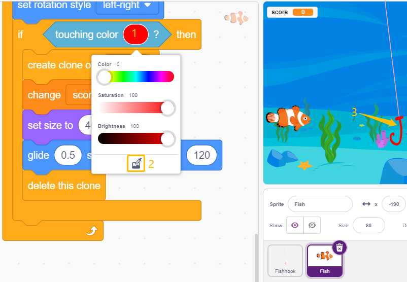

