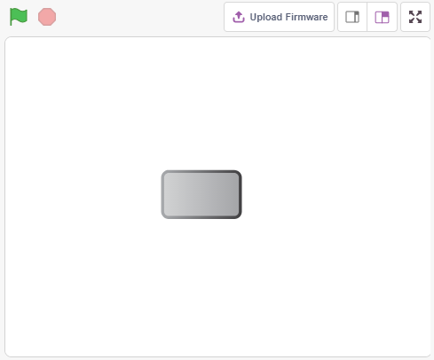
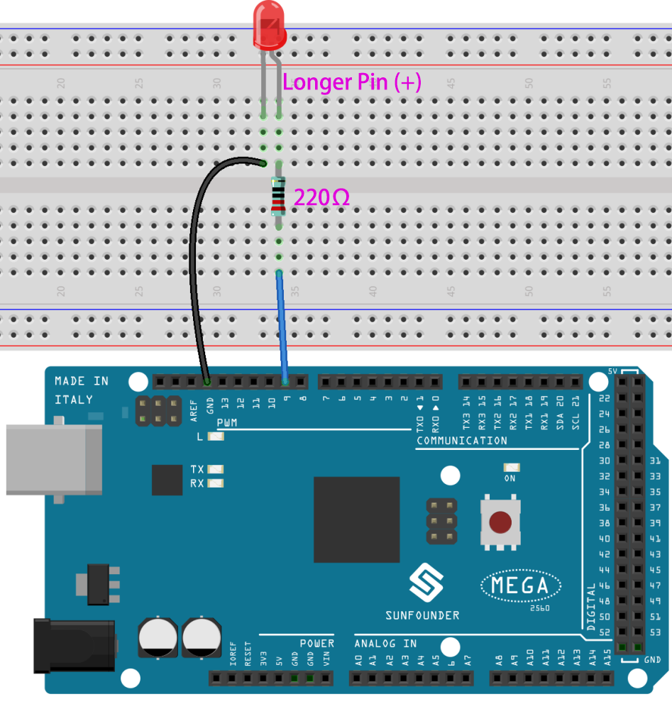
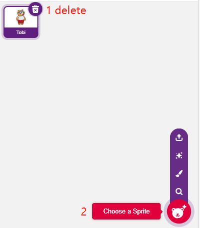
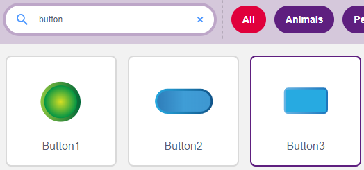
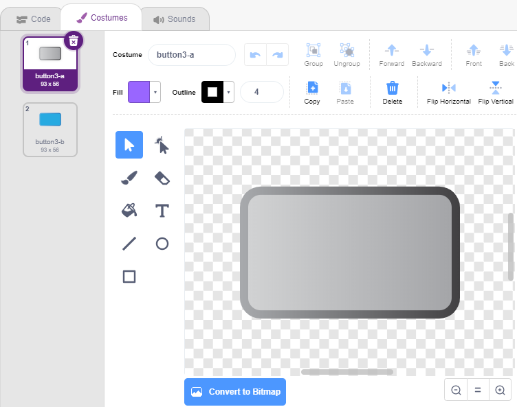
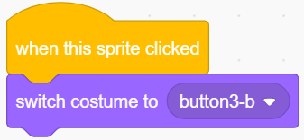
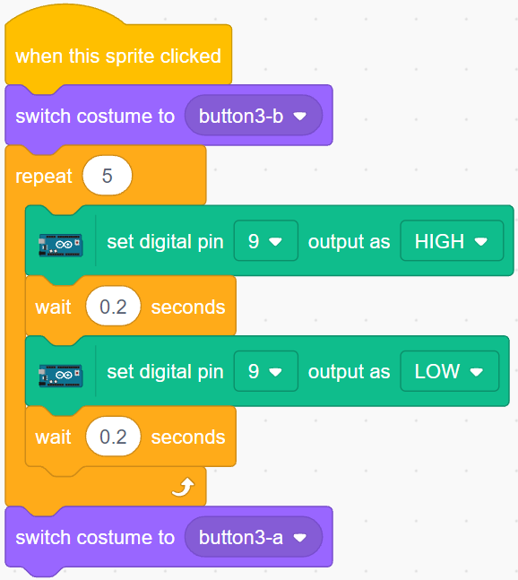

.. _table_lamp:

2.1 Tischleuchte
================

Hier schließen wir eine LED auf dem Breadboard an und lassen das Figur das Blinken dieser LED steuern.

Wenn das Button-Figur auf der Bühne angeklickt wird, blinkt die LED 5 Mal und hört dann auf.

Sie werden lernen
---------------------

- Breadboard, LEDs und Widerstände
- Aufbau einer Schaltung auf einem Breadboard
- Figurs löschen und auswählen
- Kostüme umschalten
- Einstellen einer begrenzten Anzahl von Wiederholungsschleifen

Aufbau der Schaltung
-----------------------

Baue die Schaltung auf dem Breadboard nach folgendem Schema auf.

Da die Anode der LED (der längere Pin) über einen 220Ω-Widerstand mit Pin 9 verbunden ist und die Kathode der LED mit GND verbunden ist, kannst du die LED zum Leuchten bringen, indem du Pin 9 einen hohen Pegel gibst.

* :ref:`cpn_breadboard`
* :ref:`cpn_led`
* :ref:`cpn_water`

Programmierung
------------------

Die gesamte Programmierung ist in 3 Teile gegliedert, der erste Teil ist die Auswahl des gewünschten Figurs, der zweite Teil ist der Wechsel des Kostüms für das Figur, um es klickbar zu machen, und der dritte Teil ist, die LED blinken zu lassen.

**1. Button3-Figur auswählen**

Lösche das bestehende Tobi-Figur mit dem Delete-Button in der oberen rechten Ecke und wähle erneut ein Figur aus.

Hier wählen wir das Figur **Button3** aus.

Klicke auf **Costumes(Kostüme)** in der oberen rechten Ecke und du wirst sehen, dass das Button3-Figur 2 Kostüme hat, wir setzen **button3-a** auf losgelassen und **button3-b** auf gedrückt.

**2. Umschalten der Kostüme**.

Wenn das Figur angeklickt wird (Palette **Ereignisse**), schaltet es auf das Kostüm für **Button3-b** um (Palette **Aussehen**).

**3. Lass die LED 5 Mal blinken**

Benutze den [Repeat]-Block, um die LED 5 Mal blinken zu lassen (High-> LOW-Zyklus), vergiss nicht, Pin 13 in Pin 9 zu ändern, und schalte schließlich das Kostüm zurück auf **button3-a**.

* [Repeat 10]: begrenzte Anzahl von Wiederholungsschleifen, Sie können die Anzahl der Wiederholungen selbst in der **Steuerung**-Palette einstellen.

