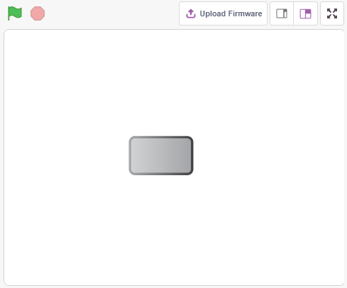
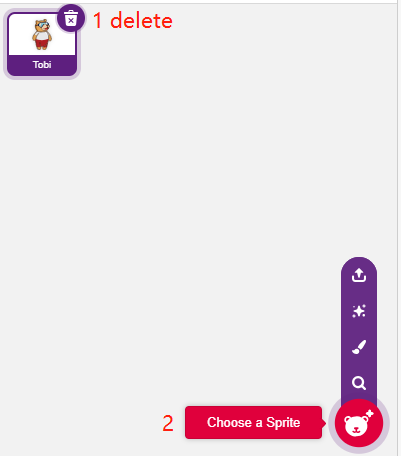
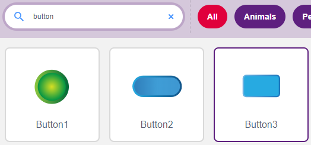
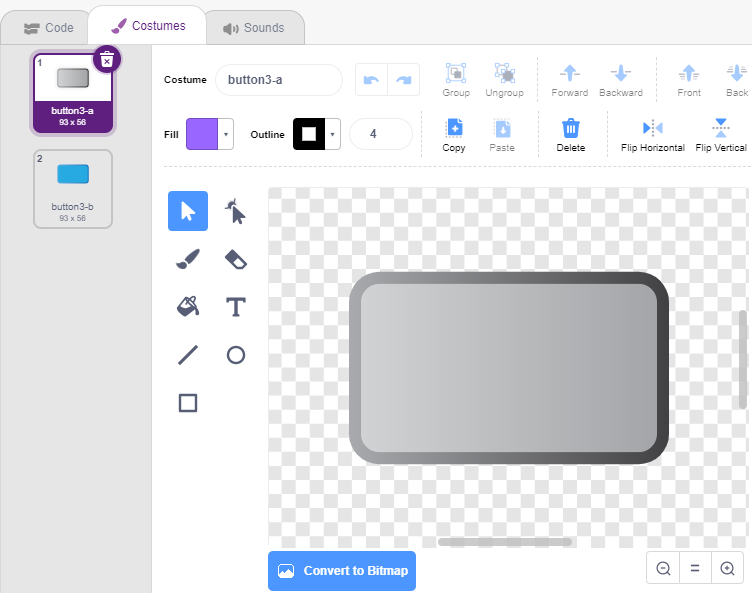
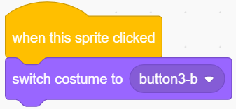
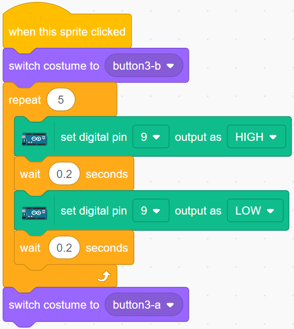

.. note:: 

    Bonjour, bienvenue dans la communauté des passionnés de SunFounder Raspberry Pi, Arduino et ESP32 sur Facebook ! Explorez plus en profondeur les univers de Raspberry Pi, Arduino et ESP32 avec d’autres passionnés.

    **Pourquoi nous rejoindre ?**

    - **Support d'experts** : Résolvez vos problèmes après-vente et techniques grâce à l’aide de notre communauté et de notre équipe.
    - **Apprendre & Partager** : Échangez des conseils et des tutoriels pour enrichir vos compétences.
    - **Aperçus exclusifs** : Profitez d’un accès anticipé aux annonces de nouveaux produits.
    - **Réductions spéciales** : Bénéficiez de remises exclusives sur nos produits les plus récents.
    - **Promotions festives et cadeaux** : Participez à des concours et promotions festives.

    👉 Prêt à explorer et créer avec nous ? Cliquez sur [|link_sf_facebook|] pour nous rejoindre dès aujourd'hui !

.. _table_lamp:

2.1 Lampe de Table
=======================

Dans ce projet, nous connectons une LED sur la breadboard et faisons en sorte que le lutin contrôle le clignotement de cette LED.

Lorsque le lutin Bouton sur la scène est cliqué, la LED clignote 5 fois avant de s’arrêter.

Ce Que Vous Apprendrez
---------------------------

- Utiliser une breadboard, des LED et des résistances
- Construire un circuit sur une breadboard
- Supprimer et sélectionner des lutins
- Changer de costumes
- Configurer un nombre limité de boucles de répétition

Construire le Circuit
------------------------

Suivez le schéma ci-dessous pour construire le circuit sur la breadboard.

Comme l'anode de la LED (la patte la plus longue) est connectée à la broche 9 via une résistance de 220Ω et que la cathode est connectée au GND, vous pouvez allumer la LED en donnant un niveau haut à la broche 9.

.. image:: img/circuit/led_circuit.png

* :ref:`cpn_breadboard`
* :ref:`cpn_led`
* :ref:`cpn_resistor`

Programmation
------------------

La programmation est divisée en 3 parties : la première consiste à sélectionner le lutin souhaité, la deuxième à changer le costume du lutin pour le rendre cliquable, et la troisième à faire clignoter la LED.

**1. Sélectionner le lutin Bouton3**

Supprimez le lutin Tobi existant en utilisant le bouton Supprimer en haut à droite, puis sélectionnez un nouveau lutin.

Ici, nous choisissons le lutin **Button3**.

Cliquez sur l’onglet Costumes en haut à droite, vous verrez que le lutin Button3 possède 2 costumes : **button3-a** pour l’état relâché et **button3-b** pour l’état enfoncé.

**2. Changer de costume**

Lorsque le lutin est cliqué (palette **Événements**), il passe au costume **button3-b** (palette **Apparence**).

**3. Faire clignoter la LED 5 fois**

Utilisez le bloc [Répéter] pour faire clignoter la LED 5 fois (cycle Haut -> Bas), n'oubliez pas de changer la broche 13 pour la broche 9, puis de revenir au costume **button3-a**.

* [Répéter 10] : boucle de répétition à nombre limité, vous pouvez définir le nombre de répétitions depuis la palette **Contrôle**.

