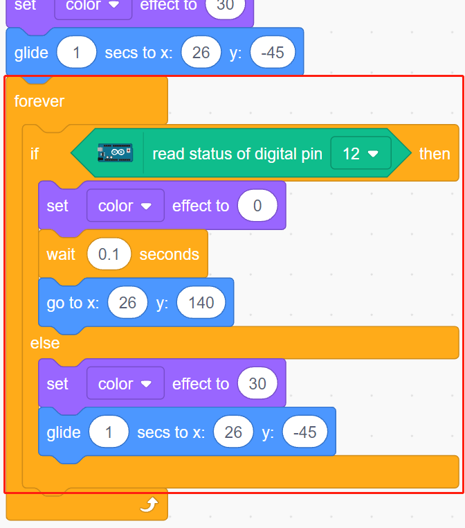
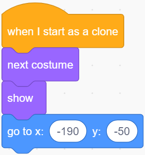

.. _fishing:

2.20 GAME - Fischen
===========================

Hier spielen wir ein Angelspiel mit einer Taste.

Wenn das Skript läuft, schwimmen die Fische links und rechts auf der Bühne, du musst den Knopf drücken, wenn der Fisch fast am Haken ist (es wird empfohlen, ihn länger zu drücken), um den Fisch zu fangen, und die Anzahl der gefangenen Fische wird automatisch aufgezeichnet.

.. image:: img/18_fish.png

Bauen Sie den Kreislauf auf
------------------------------------

Der Taster ist ein 4-Pin-Bauteil, da Pin 1 mit Pin 2 und Pin 3 mit Pin 4 verbunden ist. Wenn der Taster gedrückt wird, werden die 4 Pins miteinander verbunden, wodurch der Stromkreis geschlossen wird.

.. image:: img/5_buttonc.png

Baue die Schaltung nach dem folgenden Schema auf.

* Verbinde einen der Stifte auf der linken Seite des Knopfes mit Pin 12, der mit einem Pull-Down-Widerstand und einem 0,1uF (104) Kondensator verbunden ist (um Jitter zu eliminieren und einen stabilen Pegel auszugeben, wenn der Knopf funktioniert).
* Verbinden Sie das andere Ende des Widerstands und des Kondensators mit GND und einen der Pins auf der rechten Seite des Tasters mit 5 V.

.. image:: img/circuit/button_circuit.png

* :ref:`cpn_breadboard`
* :ref:`cpn_button`
* :ref:`cpn_water`
* :ref:`cpn_capacitor`

Programmierung
------------------

Wir müssen zuerst eine **Underwater**-Kulisse auswählen, dann ein **Fish**-Figur hinzufügen und es auf der Bühne hin und her schwimmen lassen. Dann zeichnen wir ein **Fishhook**-Figur und steuern es mit einem Knopf, um zu fischen. Wenn das **Fish**-Figur das **Fishhook**-Figur im eingehakten Zustand berührt (wird rot), wird es eingehakt.

**1. Hinzufügen einer Kulisse**

Verwenden Sie die Schaltfläche **Choose a Backdrop(Bühnenbild wählen)**, um eine **Underwater** hinzuzufügen.

.. image:: img/18_under.png

**2. Fishhook-Figur**

Das **Fishhook**-Figur soll den Effekt haben, dass es normalerweise in einem gelben Zustand unter Wasser bleibt; wenn die Schaltfläche gedrückt wird, befindet es sich in einem Angelzustand (rot) und bewegt sich über die Bühne.

Es gibt kein **Fishhook**-Figur in Pictoblox, wir können das **Glow-J**-Figur so verändern, dass es wie ein Angelhaken aussieht.

* Füge das **Glow-J**-Figur über **Choose a Sprite(Figur wählen)** hinzu.

.. image:: img/18_hook.png

* Gehen Sie nun auf die Seite **Costumes(Kostüme)** des **Glow-J**-Figur, wählen Sie Cyans Füllung im Bildschirm aus und entfernen Sie sie. Ändern Sie dann die Farbe des J in Rot und verringern Sie auch seine Breite. Der wichtigste Punkt ist, dass die Spitze des J genau in der Mitte liegen muss.

.. image:: img/18_hook1.png

* Verwenden Sie das **Linien**-werkzeug, um eine möglichst lange Linie vom Mittelpunkt nach oben zu ziehen (Linie außerhalb der Bühne). Jetzt, wo das Figur gezeichnet ist, setze den Figur-Namen auf **Fishhook** und verschiebe es an die richtige Position.

.. image:: img/18_hook2.png

* Wenn die grüne Flagge angeklickt wird, setzen Sie den Farbeffekt des Figur auf 30 (gelb), und legen Sie seine Ausgangsposition fest.

.. image:: img/18_hook3.png

* Wenn der Knopf gedrückt wird, setze den Farbeffekt auf 0 (rot, Beginn des Angelzustandes), warte auf 0,1 und bewege dann das **Fishhook**-Figur an den oberen Rand der Bühne. Lassen Sie die Taste los und lassen Sie den **Fishhook** in seine Ausgangsposition zurückkehren.

**3. Fisch-Figur**

Der Effekt, den das **Fish**-Figur erzielen soll, besteht darin, dass es sich auf der Bühne nach links und rechts bewegt, und wenn es auf ein **Fishhook**-Figur im Angelzustand trifft, schrumpft es und bewegt sich an eine bestimmte Position, um dann zu verschwinden, und dann wieder ein neues **Fish**-Figur zu klonen.

* Füge nun das **Fish**-Figur hinzu und passe seine Größe und Position an.

.. image:: img/18_fish1.png

* Erstelle eine Variable **score**, um die Anzahl der gefangenen Fische zu speichern, verstecke dieses Figur und klone es.

.. image:: img/18_fish2.png

* Zeige den Klon des **Fish**-Figur, wechsle sein Kostüm und setze schließlich die Anfangsposition.

* Der Klon des **Fish**-Figur bewegt sich nach links und rechts und springt zurück, wenn er den Rand berührt.

.. image:: img/18_fish4.png

* Das **Fish**-Figur (des Klons) reagiert nicht, wenn es das **Fishhook**-Figur passiert; wenn es das **Fishhook**-Figur im Angelzustand berührt (wird rot), wird es gefangen, wobei die Punktzahl (variable Punktzahl) +1 ist, und es wird auch eine Punktzahl-Animation gezeigt (schrumpft um 40%, bewegt sich schnell zur Position der Punktetafel und verschwindet). Gleichzeitig wird ein neuer Fisch erstellt (ein neuer Fisch-Figur-Klon) und das Spiel geht weiter.

.. note::
    
    Sie müssen auf den Farbbereich im Block [Touch Color] klicken und dann das Pipettenwerkzeug auswählen, um die rote Farbe des **Fishhook**-Figur auf der Bühne zu übernehmen. Wenn du eine beliebige Farbe auswählst, wird dieser [Touch color]-Block nicht funktionieren.

.. image:: img/18_fish5.png

