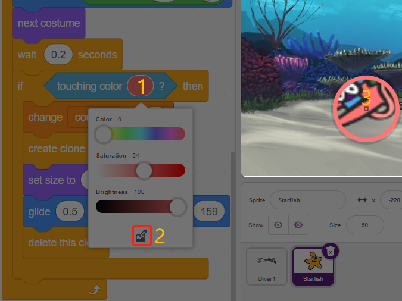

.. note::

    * Benvenuti nella community SunFounder per appassionati di Raspberry Pi, Arduino e ESP32 su Facebook! Approfondisci Raspberry Pi, Arduino ed ESP32 insieme ad altri appassionati.

    **Perché unirti a noi?**

    - **Supporto esperto**: Risolvi problemi post-vendita e sfide tecniche con l'aiuto della nostra comunità e del nostro team.
    - **Impara e condividi**: Scambia consigli e tutorial per migliorare le tue competenze.
    - **Anteprime esclusive**: Ottieni accesso anticipato agli annunci sui nuovi prodotti e anteprime esclusive.
    - **Sconti speciali**: Approfitta di sconti esclusivi sui nostri prodotti più recenti.
    - **Promozioni festive e giveaway**: Partecipa a giveaway e promozioni speciali durante le festività.

    👉 Pronto a esplorare e creare con noi? Clicca [|link_sf_facebook|] e unisciti oggi!

.. _starfish:

2.20 Cattura la Stella Marina
==============================

In questo progetto, creiamo un gioco per catturare stelle marine. All'avvio dello script, una stella marina nuota tranquillamente sul palco, mentre un subacqueo nuota a destra e a sinistra. È necessario controllare la profondità del modulo sensore di livello dell'acqua per fare in modo che il subacqueo sul palco catturi la stella marina. Per ogni stella marina catturata, il conteggio aumenterà di 1.

.. image:: img/21_starfish.png

Costruzione del circuito
-------------------------

Il modulo sensore di livello dell'acqua è un sensore compatto, facile da usare e conveniente per il rilevamento del livello dell'acqua o delle gocce. Misura il livello dell'acqua attraverso una serie di tracce parallele esposte per determinare la quantità d'acqua o il volume.

Maggiore è l'immersione del sensore, maggiore sarà il valore dell'uscita del pin **S**.

Ora costruisci il circuito seguendo il diagramma qui sotto.

.. image:: img/circuit/water_circuit.png

* :ref:`cpn_breadboard`
* :ref:`cpn_water`

Programmazione
-----------------

**1. Selezionare sprite e sfondo**

Elimina lo sprite predefinito e seleziona gli sprite **Diver1** e **Starfish**.

.. image:: img/21_starfish1.png

Vai alla pagina **Costumi** di **Diver1** e utilizza lo strumento **Riempi** per aggiungere i colori che preferisci.

.. note::

    Dovrai colorare entrambe le braccia di **Diver1** con un colore unico che non si trovi altrove sul palco.

.. image:: img/21_starfish3.png

Riduci la dimensione dello sprite **Starfish**; puoi anche modificarne il colore a tuo piacimento.

.. image:: img/21_starfish4.png

Seleziona uno sfondo **Underwater1**.

.. image:: img/21_starfish2.png

**2. Script per lo sprite Diver1**

Imposta la posizione iniziale dello sprite **Diver1** e fallo nuotare avanti e indietro sul palco.

.. image:: img/21_starfish5.png

Più in profondità immergi il sensore di livello dell'acqua, maggiore sarà il valore ottenuto, il che determina la profondità (coordinata y) a cui nuota lo sprite **Diver1**.

* Leggi A0 (valore del sensore di livello dell'acqua) e mappa il suo intervallo alle coordinate y del palco per ottenere una nuova coordinata y.
* Se **new_y** è maggiore dell'attuale coordinata Y, fallo salire fino alla posizione **new_y**.
* Se **new_y** è minore dell'attuale coordinata Y, fallo scendere fino alla posizione **new_y**.

.. image:: img/21_starfish6.png
    :width: 800

**3. Script per lo sprite Starfish**

Quando lo script inizia, nascondi prima lo sprite **Starfish**, quindi clonalo.

.. image:: img/21_starfish7.png

Quando appare come clone, imposta il suo effetto di movimento.

.. image:: img/21_starfish8.png

Quando tocca il colore rosso (il colore delle braccia di **Diver1**), il che significa che è stato catturato dallo sprite **Diver1**, vengono applicati i seguenti effetti:

* Aggiungi 1 al valore della variabile **count**.
* Viene visualizzata un'animazione di punteggio (si riduce del 20%, si sposta rapidamente nella posizione del contatore e scompare).
* Allo stesso tempo, viene clonato una nuova stella marina e il gioco continua.

.. note::

    Devi cliccare sull'area del colore nel blocco [Touch color] e selezionare lo strumento contagocce per catturare il colore rosso dello sprite **Diver1** sul palco. Se scegli un colore a caso, questo blocco [Touch color] non funzionerà.

Quando il clone della stella marina nuota verso l'estrema destra, elimina il clone e clonane uno nuovo.

.. image:: img/21_starfish11.png
