.. note:: 

    Hola, bienvenido a la comunidad de entusiastas de SunFounder Raspberry Pi, Arduino y ESP32 en Facebook. Profundiza en Raspberry Pi, Arduino y ESP32 junto a otros entusiastas.

    **¿Por qué unirse?**

    - **Soporte experto**: Resuelve problemas posventa y desafíos técnicos con ayuda de nuestra comunidad y equipo.
    - **Aprende y comparte**: Intercambia consejos y tutoriales para mejorar tus habilidades.
    - **Avances exclusivos**: Accede anticipadamente a anuncios de nuevos productos y adelantos.
    - **Descuentos especiales**: Disfruta de descuentos exclusivos en nuestros productos más recientes.
    - **Promociones y sorteos festivos**: Participa en sorteos y promociones especiales por festividades.

    👉 ¿Listo para explorar y crear con nosotros? Haz clic en [|link_sf_facebook|] y únete hoy mismo.

.. _starfish:

2.20 Juego - Atrapar Estrellas de Mar
========================================

Aquí crearemos un juego para atrapar estrellas de mar. Al inicio del guion, una estrella de mar nada cómodamente en el escenario, y un buzo también nada hacia la derecha e izquierda. Debes controlar la profundidad del módulo sensor de nivel de agua para que el buzo en el escenario atrape la estrella de mar. Por cada estrella atrapada, la cuenta aumentará en 1.

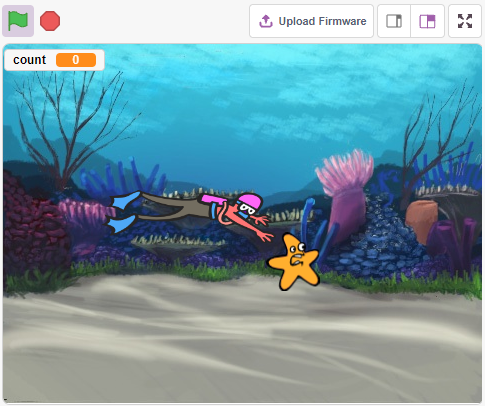

Construir el Circuito
----------------------

El módulo sensor de nivel de agua es un sensor compacto y fácil de usar que mide el nivel de agua mediante una serie de trazas paralelas expuestas para determinar el tamaño de la gota/volumen de agua.

Cuanto más se sumerja el sensor en el agua, mayor será el valor de salida del pin **S**.

Ahora construye el circuito según el siguiente diagrama:

.. image:: img/circuit/water_circuit.png

* :ref:`cpn_breadboard`
* :ref:`cpn_water`

Programación
---------------

**1. Seleccionar sprites y fondo**

Elimina el sprite predeterminado, selecciona los sprites **Diver1** y **Starfish**.

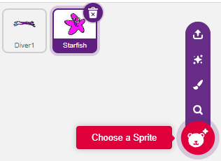

Ve a la página de **Disfraces** de **Diver1** y utiliza la herramienta **Relleno** para llenar los colores que prefieras.

.. note:: 

    Necesitarás llenar ambos brazos de Diver1 con un color único que no coincida con otros colores en el escenario.

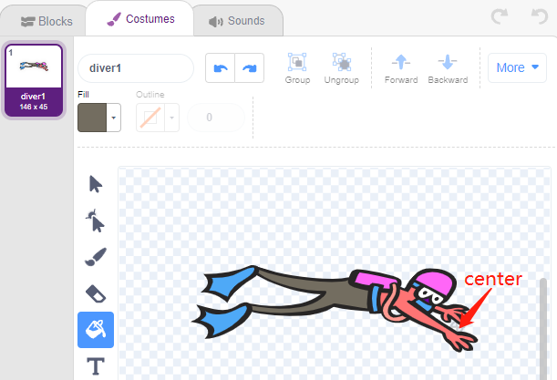

Reduce el tamaño del sprite **Starfish**, también puedes modificar su color como desees.

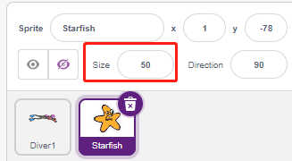

Selecciona el fondo **Underwater1**.

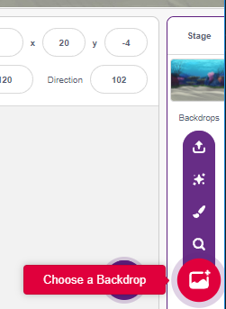

**2. Escribir guion para el sprite Diver1**

Configura la posición inicial del sprite **Diver1** y haz que nade de un lado a otro del escenario.

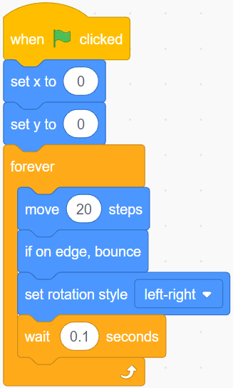

Cuanto más profundo sumerjas el sensor de nivel de agua, mayor será el valor obtenido, lo que determina la profundidad (coordenada y) a la que nada el sprite **Diver1**.

* Lee A0 (el valor del sensor de nivel de agua) y mapea su rango a la coordenada y del escenario para obtener una nueva coordenada y.
* Si **new_y** es mayor que la coordenada Y actual, haz que suba hasta la posición **new_y**.
* Si **new_y** es menor que la coordenada Y actual, haz que baje hasta la posición **new_y**.

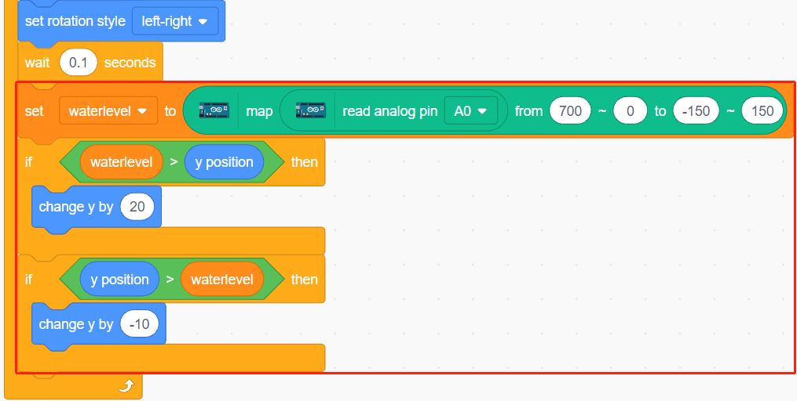

**3. Escribir guion para el sprite Starfish**

Cuando el guion comience, primero oculta el sprite **Starfish** y luego clónalo.

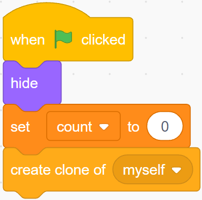

Cuando aparezca como un clon, configura su efecto de movimiento.

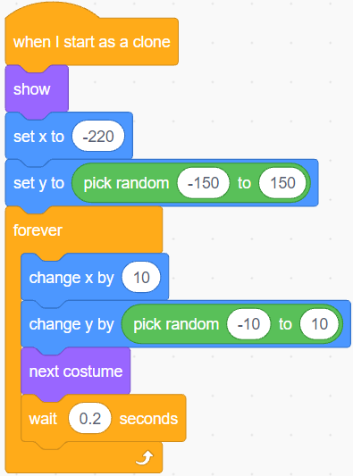

Cuando toque el color rojo (los brazos de **Diver1**), lo que significa que es atrapado por el sprite **Diver1**, se realiza el siguiente efecto:

* Se suma 1 al valor de la variable **count**.
* Se muestra una animación de puntuación (se reduce un 20%, se mueve rápidamente a la posición del marcador y desaparece).
* Al mismo tiempo, se clona una nueva estrella de mar y el juego continúa.

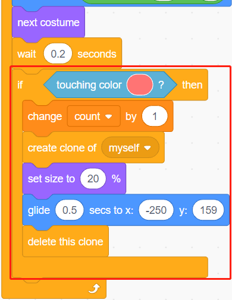

.. note:: 
    Debes hacer clic en el área de color en el bloque [Touch color] y luego seleccionar la herramienta cuentagotas para recoger el color rojo del sprite **Diver1** en el escenario. Si eliges un color arbitrario, este bloque no funcionará.

    .. image:: img/21_starfish10.png

Cuando el clon de **Starfish** nade hasta el extremo derecho, elimina el clon y vuelve a clonarlo.

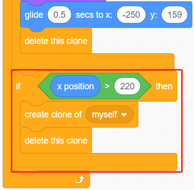