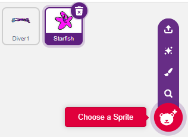
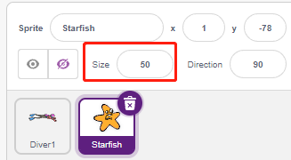
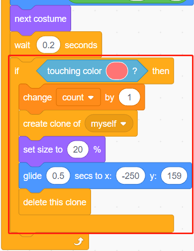

.. _starfish:

2.20 Catching Starfish
============================

Here, let's make a game to catch starfish. At the start of the script, a starfish is swimming comfortably on the stage, and a diver is also swimming to the right and left. You need to control the depth of the water level sensor module in the water in order to let the diver on the stage catch the starfish, and for each starfish caught, the count will be increased by 1.

.. image:: img/21_starfish.png

Build the Circuit
-----------------------

The Water Level Sensor module is an easy-to-use, compact and cost effective water level/drop detection sensor that measures the water level by a series of exposed parallel wire traces to determine the size of the water drop/volume.

The more water the sensor is immersed in, the greater the value of the **S** pin output.

Now build the circuit according to the diagram below.

.. image:: img/circuit/water_circuit.png

* :ref:`cpn_breadboard`
* :ref:`cpn_water` 

Programming
------------------

**1. Select sprites and backdrop**

Delete the default sprite, select the **Diver1** and **Starfish** sprite.

Go to **Diver1's Costumes** page and use the **Fill** tool to fill in the colors you like.

.. Note:: 

    You will need to fill both arms of Diver1 with a unique color that will not find the same on the stage.

.. image:: img/21_starfish3.png

Reduce the size of the **Starfish** sprite, you can also modify its color as you like.

Select an **Underwater1** backdrop.

.. image:: img/21_starfish2.png

**2. Scripting the Diver1 sprite**

Set the initial position of the **Diver1** sprite and have it swim back and forth across the stage.

.. image:: img/21_starfish5.png

The deeper you put the water level sensor in, the greater the value you get as a way to determine the depth (y coordinate) that the **Diver1** sprite swims.

* Read A0 (the value of the water level sensor) and map its range to the y-coordinate of the stage as a way to get a new y-coordinate.
* If **new_y** is greater than the current Y coordinate, let it move up to the **new_y** position.
* If **new_y** is less than the current Y coordinate, let it move down to the **new_y** position

.. image:: img/21_starfish6.png
    :width: 800

**3. Scripting the Starfish sprite**

When the script starts, first hide **Starfish** sprite and then clone it.

.. image:: img/21_starfish7.png

When appearing as a clone, set its movement effect.

.. image:: img/21_starfish8.png

When it touches red (the color of **Diver1**'s two arms), which means it is caught by **Diver1** sprite, the following effect is made.

* Adds 1 to the value of the variable **count**.
* A score animation is displayed (shrinks by 20%, moves quickly to the position of the scoreboard and disappears).
* At the same time, a new starfish is cloned and the game continues.

.. Note:: 
    You need to click on the color area in the [Touch color] block, and then select the eyedropper tool to pick up the red color of the **Diver1** sprite on the stage. If you choose a color arbitrarily, this [Touch color] block will not work.

    .. image:: img/21_starfish10.png

When the Starfish's clone swims to the far right, delete the clone and clone it again.

.. image:: img/21_starfish11.png