.. _dragon:

2.21 GAME - Kill Dragon
============================

Here, we use the joystick to play a game of dragon killing.

When clicking on green, the dragon will float up and down on the right side and blow fire intermittently. You need to use the joystick to control the movement of the magic wand and launch star attacks at the dragon, while avoiding the flames it shoots, and finally defeat it.

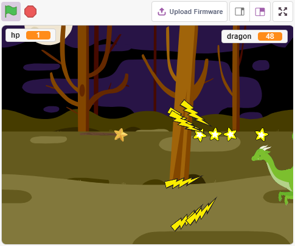

Build the Circuit
-----------------------

A joystick is an input device consisting of a stick that pivots on a base and reports its angle or direction to the device it is controlling. Joysticks are often used to control video games and robots.

In order to communicate a full range of motion to the computer, a joystick needs to measure the stick’s position on two axes – the X-axis (left to right) and the Y-axis (up and down).

The motion coordinates of the joystick are shown in the following figure.

.. note::

    * The x coordinate is from left to right, the range is 0-1023.
    * y coordinate is from top to bottom, range is 0-1023.

.. image:: img/16_joystick.png

Now build the circuit according to the following diagram.

.. image:: img/circuit/joystick_circuit.png

* :ref:`cpn_breadboard`
* :ref:`cpn_joystick`

Programming
------------------

**1. Dragon**

**Woods** backdrop added via the **Choose a Backdrop** button.

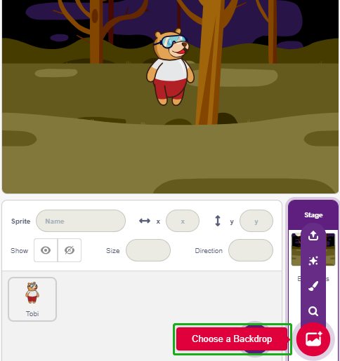

* Delete the default sprite and add the **Dragon** sprite.

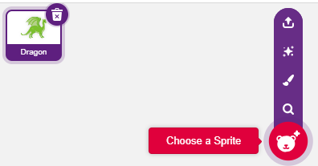

* Go to the **Costumes** page and flip the dragon-b and dragon-c horizontally.

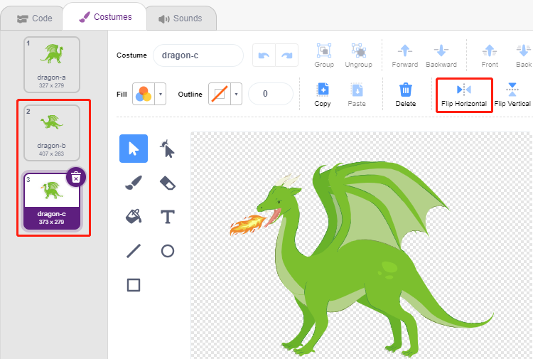

* Set the size to 50%.

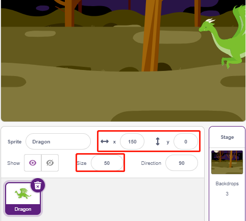

* Now create a variable - **dragon** to record the dragon's life points, and set the initial value to 50.

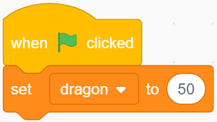

* Next, switch the sprite costume to **dragon-b** and have the **Dragon** sprite up and down in a range.

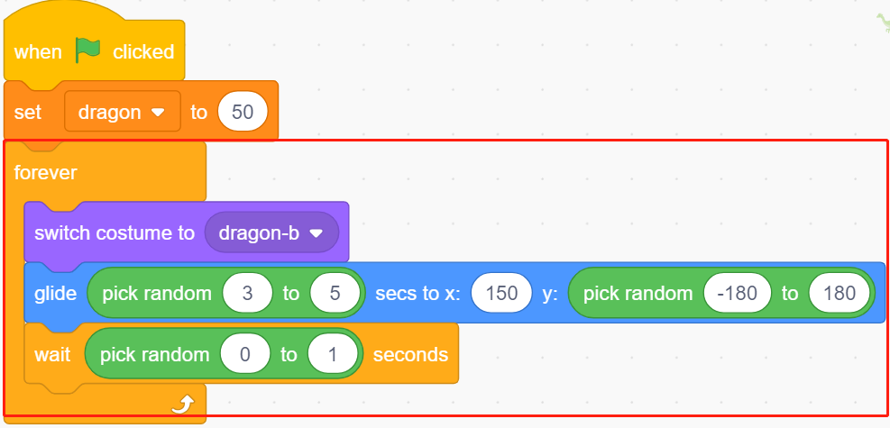

* Add a **Lightning** sprite as the fire blown by the **Dragon** sprite. You need to rotate it 90° clockwise in the Costumes page, this is to make the **Lightning** sprite move in the right direction.

.. note::
    When adjusting the **Lightning** sprite's costume, you may move it off-center, which must be avoided! The center point must be right in the middle of the sprite!

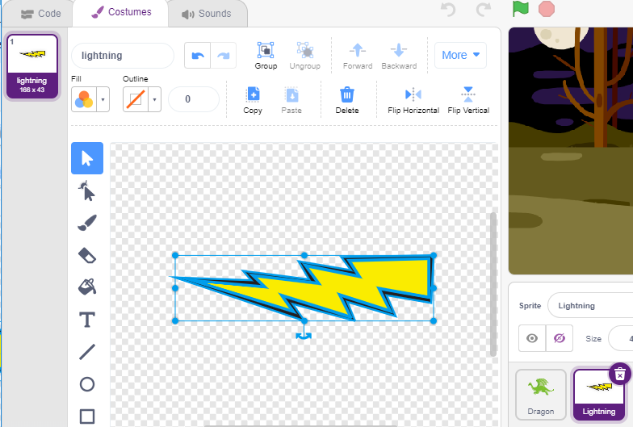

* Then adjust the **dragon-c** costume of the **Dragon** sprite so that its center point should be at the tail of the fire. This will make the positions of the **Dragon** sprite and the **Lightning** sprite correct, and prevent **Lightning** from launching from the dragon's feet. 

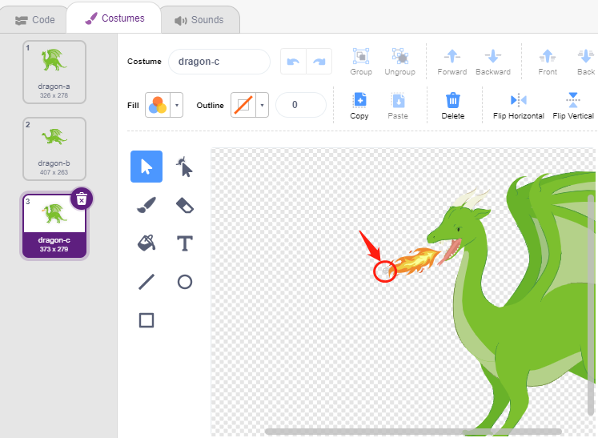

* Correspondingly, **dragon-b** needs to make the head of the dragon coincide with the center point.

* Adjust the size and orientation of the **Lightning** sprite to make the image look more harmonious.

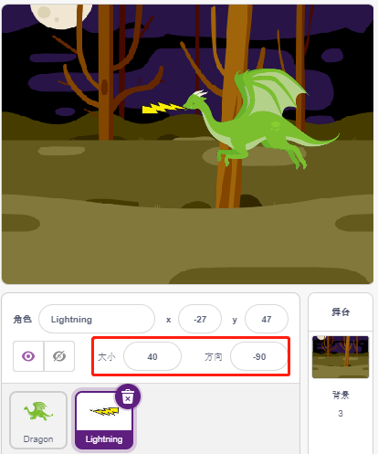

* Now script the **Lightning** sprite. This is easy, just have it follow the **Dragon** sprite all the time. At this point, click on the green flag and you will see **Dragon** moving around with lightning in its mouth.

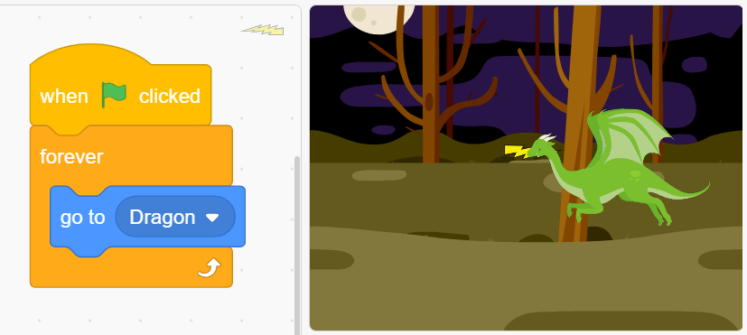

* Back to the **Dragon** sprite, now have it blow out fire, being careful not to let the fire in its mouth shoot out, but to create a clone for the **Lightning** sprite.

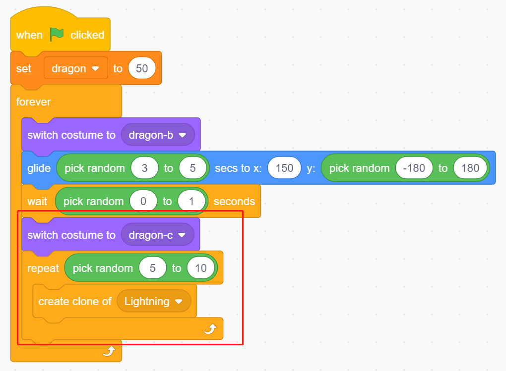

* Click on the **Lightning** sprite and let the **Lightning** clone shoot out at a random angle, it will bounce off the wall and disappear after a certain amount of time.

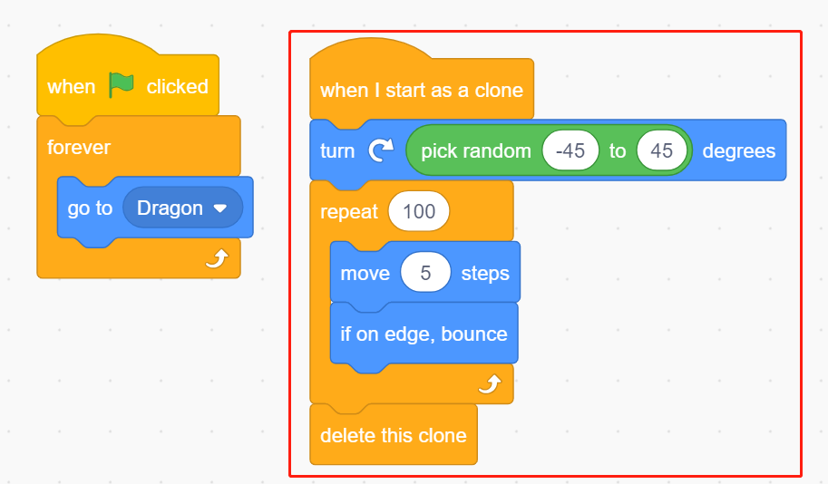

* In the **Lightning** sprite, hide its body and show the clone.

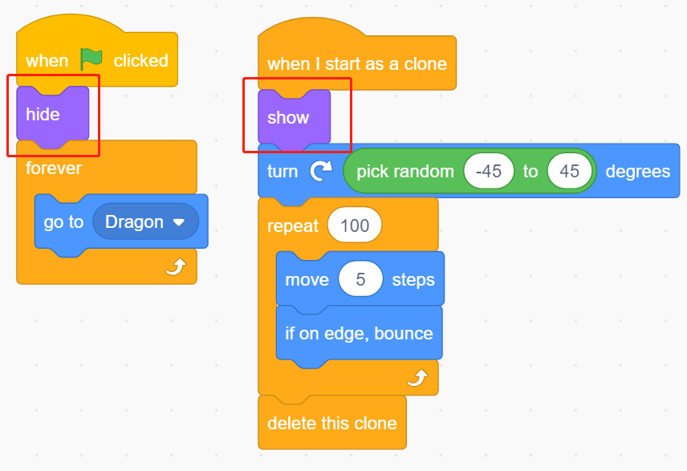

Now the dragon can move up and down and blow out fire.

**2.Wand**

* Create a **Wand** sprite and rotate its direction to 180 to point to the right.

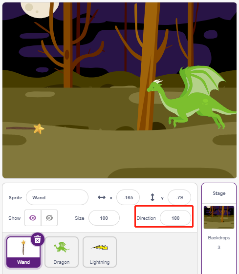

* Now create a variable **hp** to record its life value, initially set to 3. Then read the Joystick's value, which is used to control the wand's movement.

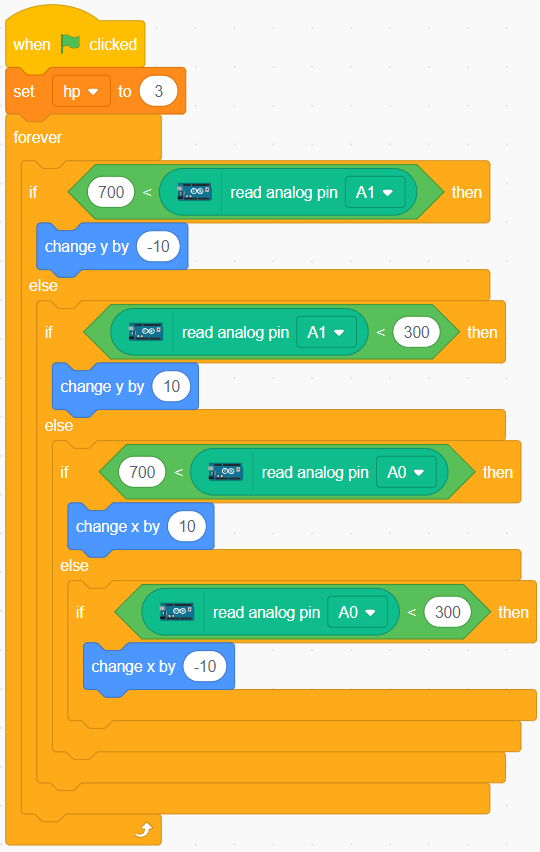

* The dragon has lightning, and the wand that crushes it has its "magic bullet"! Create a **Star** sprite, resize it, and script it to always follow the **Wand** sprite, and limit the number of stars to three.

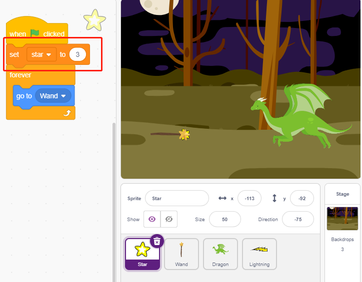

* Make the **Wand** sprite shoot stars automatically. The **Wand** sprite shoots stars the same way the dragon blows fire -- by creating clones.

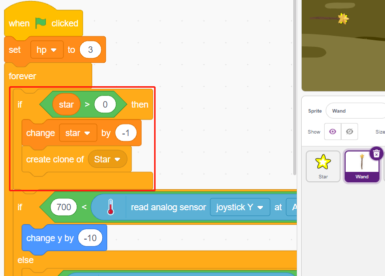

* Go back to the **Star** sprite and script its clone to spin and shoot to the right, disappear after going beyond the stage and restoring the number of stars. Same as **Lightning** sprite, hide the body and show the clone.

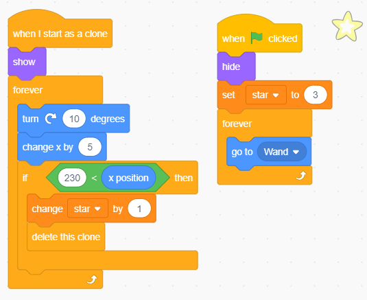

Now we have a wand that shoots star bullets.

**3. Fight!**

The wand and the dragon are currently still at odds with each other, and we're going to make them fight. The dragon is strong, and the wand is the brave man who crusades against the dragon. The interaction between them consists of the following parts.

1. if the wand touches the dragon, it will be knocked back and lose life points.
2. if lightning strikes the wand, the wand will lose life points.
3. if the star bullet hits the dragon, the dragon will lose life points.

Once that's sorted out, let's move on to changing the scripts for each sprite.

* If the **Wand** hits the **Dragon**, it will be knocked back and lose life points.

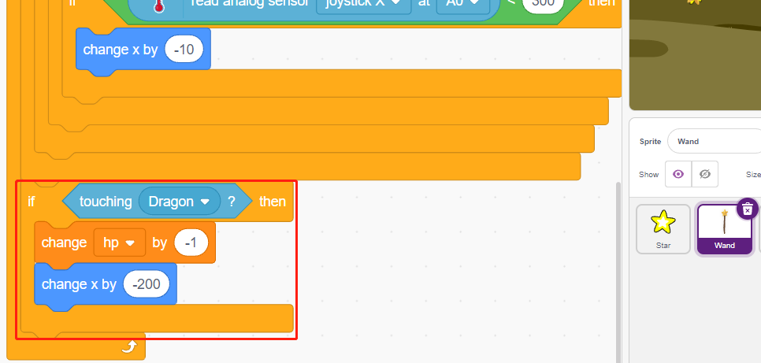

* If **Lightning** (a **Lightning** sprite clone) hits the **Wand** sprite, it will make a pop sound and disappear, and the **Wand** will lose life points.

.. image:: img/19_lightning7.png

* If a **Star** (clone of the **Star** sprite) hits the **Dragon**, it will emit a collect sound and disappear, while restoring the **Star** count, and the **Dragon** will lose life points.

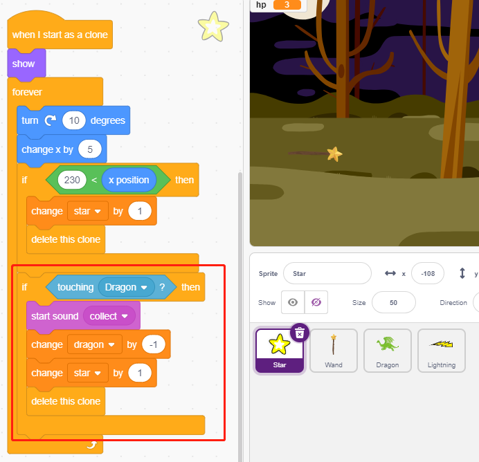

**4. stage**

The battle between the **Wand** and the **Dragon** will eventually be divided into winners and losers, which we represent with the stage.

* Add **Blue Sky** backgdrop, and write the character "WIN!" on it to represent that the dragon has been defeated and the dawn has come.

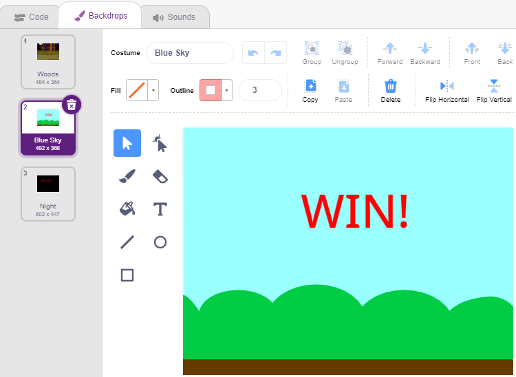

* And modify the blank backdrop as follows, to represent that the game has failed and everything will be in darkness.

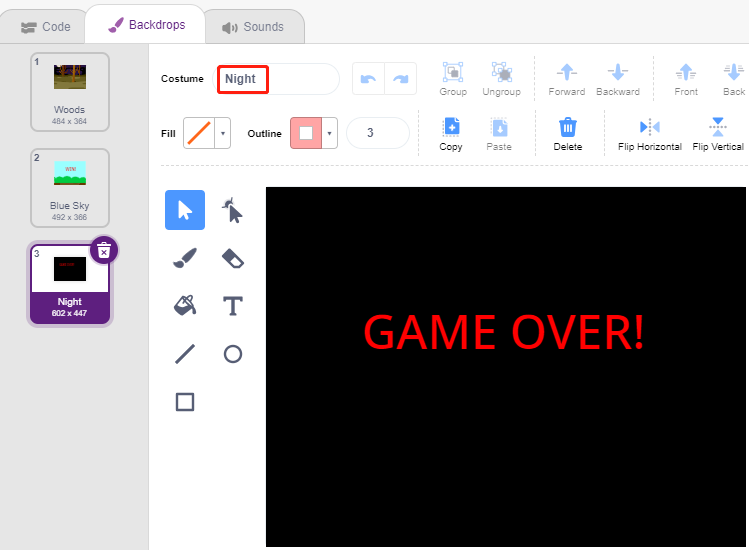

* Now write a script to switch these backgdrops, when the green flag is clicked, switch to **Woods** backgdrop; if the dragon's life point is less than 1 , then the game succeeds and switch the backdrop to **Blue Sky**; if the life value point of the **Wand** is less than 1, then switch to **Night** backdrop and the game fails.

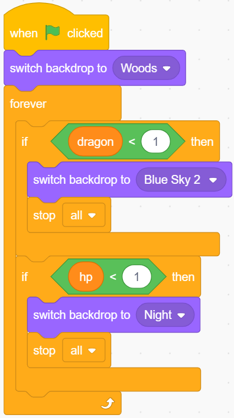
