.. note:: 

    Bonjour, bienvenue dans la communauté des passionnés de SunFounder Raspberry Pi, Arduino et ESP32 sur Facebook ! Plongez au cœur des projets avec Raspberry Pi, Arduino et ESP32 aux côtés d’autres passionnés.

    **Pourquoi rejoindre ?**

    - **Soutien d'experts** : Résolvez vos problèmes après-vente et surmontez vos défis techniques avec l'aide de notre communauté et de notre équipe.
    - **Apprenez & Partagez** : Échangez des astuces et des tutoriels pour améliorer vos compétences.
    - **Aperçus exclusifs** : Accédez en avant-première aux nouvelles annonces de produits et aux avant-goûts.
    - **Réductions spéciales** : Profitez de réductions exclusives sur nos nouveaux produits.
    - **Promotions festives et cadeaux** : Participez à nos tirages au sort et promotions saisonnières.

    👉 Prêt à explorer et à créer avec nous ? Cliquez sur [|link_sf_facebook|] et rejoignez-nous dès aujourd'hui !

.. _dragon:

2.21 JEU - Tuer le Dragon
==============================

Ici, nous utilisons le joystick pour jouer à un jeu de combat contre un dragon.

Au lancement du jeu, le dragon flotte de haut en bas à droite de l'écran et souffle du feu par intermittence. Utilisez le joystick pour contrôler les déplacements de la baguette magique et lancer des étoiles pour attaquer le dragon, tout en évitant les flammes qu'il projette, et finissez par le vaincre.

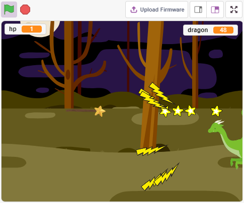

Construction du Circuit
--------------------------

Le joystick est un dispositif d'entrée composé d'un levier qui pivote sur une base et communique son angle ou sa direction au dispositif contrôlé. Les joysticks sont souvent utilisés pour contrôler des jeux vidéo et des robots.

Pour transmettre une gamme complète de mouvements, un joystick doit mesurer la position du levier sur deux axes : l’axe X (de gauche à droite) et l’axe Y (de haut en bas).

Les coordonnées de mouvement du joystick sont illustrées dans le schéma suivant.

.. note::

    * L'axe X va de gauche à droite, avec une plage de valeurs de 0 à 1023.
    * L'axe Y va du haut vers le bas, avec une plage de 0 à 1023.

.. image:: img/16_joystick.png

Construisez maintenant le circuit selon le schéma ci-dessous.

.. image:: img/circuit/joystick_circuit.png

* :ref:`cpn_breadboard`
* :ref:`cpn_joystick`

Programmation
---------------

**1. Le Dragon**

Ajoutez le décor **Woods** via le bouton **Choisir un décor**.

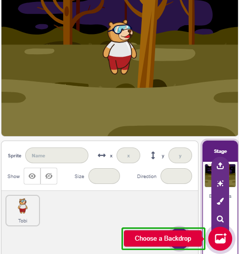

* Supprimez le sprite par défaut et ajoutez le sprite **Dragon**.

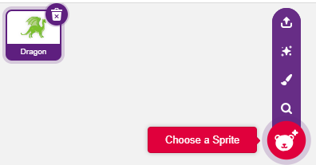

* Accédez à la page **Costumes** et retournez les costumes dragon-b et dragon-c horizontalement.

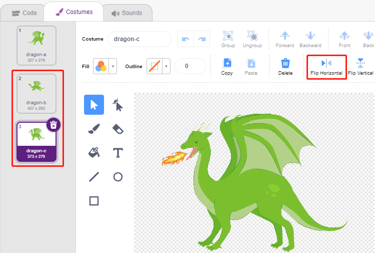

* Réglez la taille à 50 %.

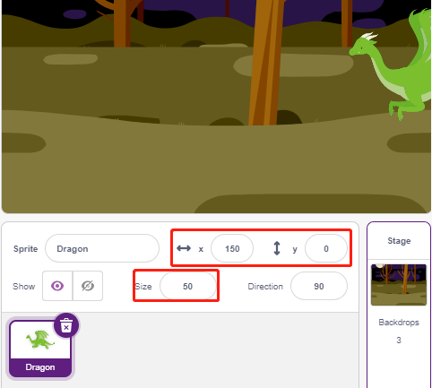

* Créez maintenant une variable - **dragon** pour enregistrer les points de vie du dragon, et initialisez-la à 50.

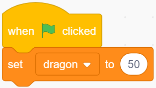

* Ensuite, basculez le costume du sprite sur **dragon-b** et faites bouger le sprite **Dragon** de haut en bas dans une certaine plage.

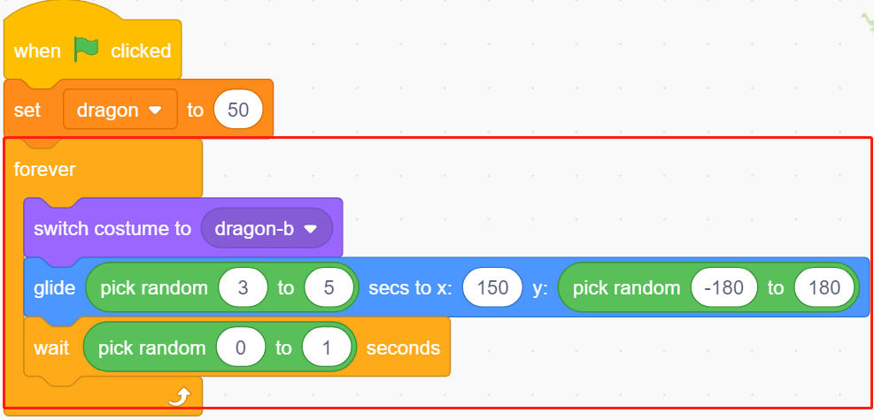

* Ajoutez un sprite **Éclair** représentant le feu soufflé par le **Dragon**. Faites-le pivoter de 90° dans la page Costumes pour que le sprite **Éclair** se déplace dans la bonne direction.

.. note::
    Lors de l’ajustement du costume du sprite **Éclair**, assurez-vous que son centre reste au milieu pour garantir un lancement correct depuis le dragon.

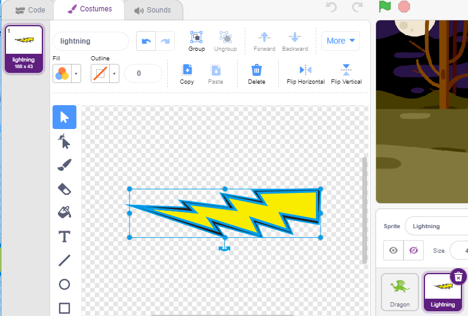

* Ajustez le costume **dragon-c** du sprite **Dragon** pour que son centre coïncide avec la queue du feu, permettant un positionnement précis.

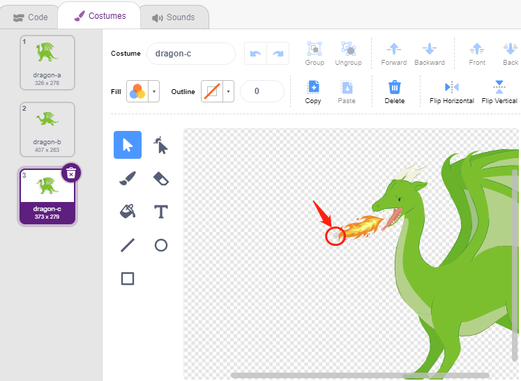

* De la même manière, il est nécessaire d'aligner la tête du **dragon-b** avec le point central.

* Ajustez la taille et l'orientation du sprite **Éclair** pour harmoniser l'image.

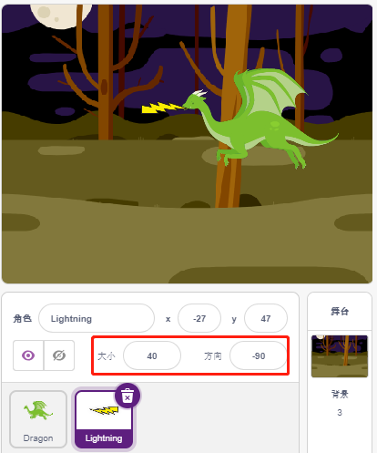

* Programmez maintenant le sprite **Éclair** pour qu'il suive constamment le sprite **Dragon**. Cliquez sur le drapeau vert et observez le **Dragon** bouger avec un éclair dans sa bouche.

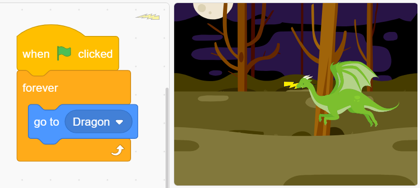

* Revenez au sprite **Dragon** pour lui permettre de souffler du feu en créant un clone du sprite **Éclair**.

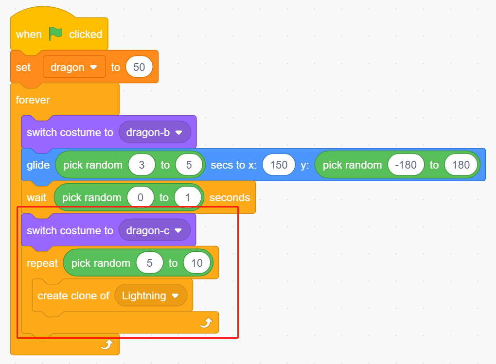

* Configurez le clone du sprite **Éclair** pour qu'il soit lancé à un angle aléatoire, rebondisse contre les murs et disparaisse après un certain temps.

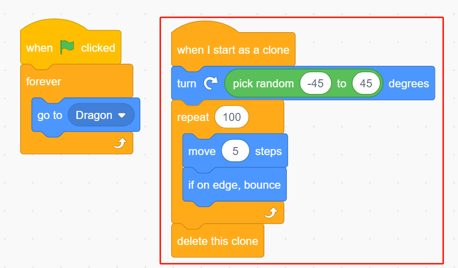

* Dans le sprite **Éclair**, masquez son corps et affichez le clone.

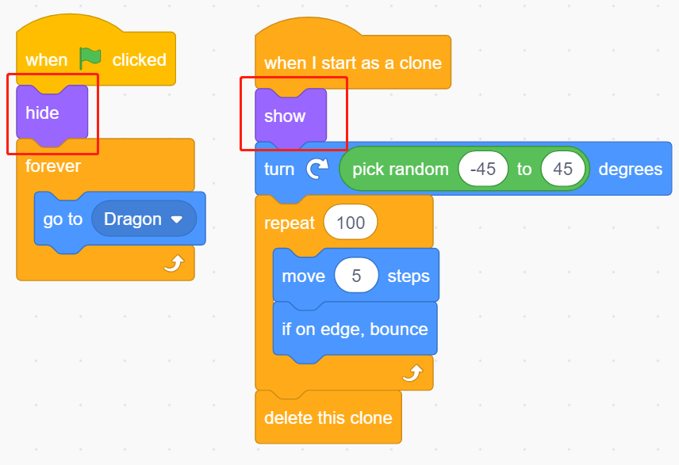

Désormais, le dragon peut se déplacer et souffler du feu.

**2. La Baguette**

* Créez un sprite **Baguette** et orientez-le vers la droite à 180°.

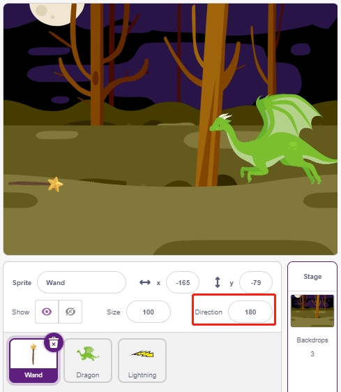

* Créez maintenant une variable **pv** pour enregistrer les points de vie de la baguette, initialement fixés à 3, puis lisez les valeurs du joystick pour contrôler ses mouvements.

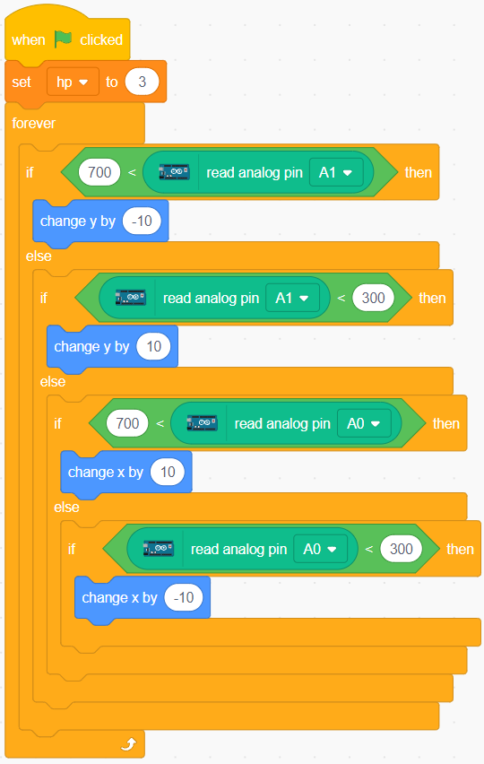

* La baguette possède également un projectile magique, représenté par une **Étoile**. Créez le sprite **Étoile**, redimensionnez-le, et limitez son nombre à trois pour l'attaque.

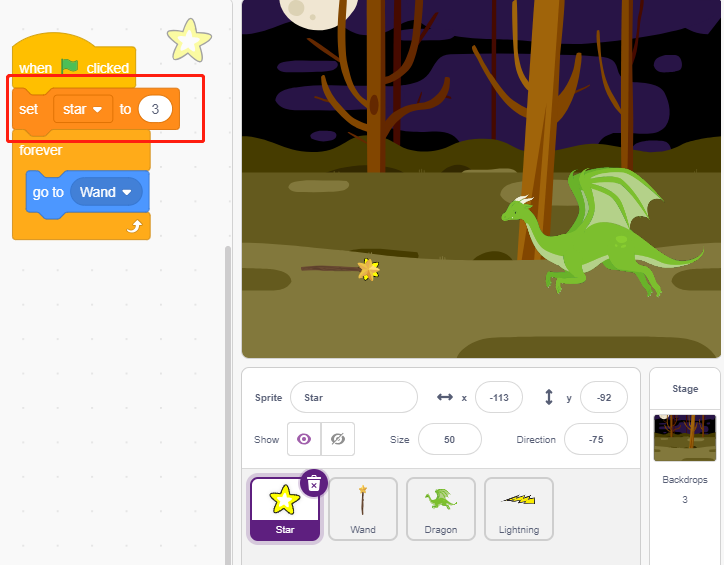

* Configurez le sprite **Baguette** pour qu'il tire des étoiles automatiquement, en utilisant la création de clones comme le **Dragon** avec son feu.

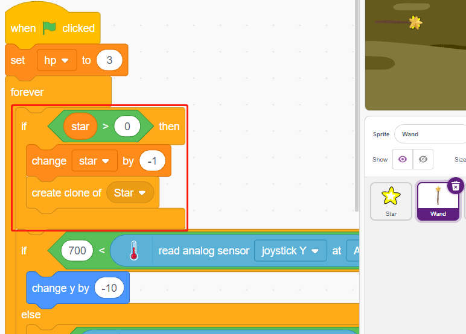

* Revenez au sprite **Étoile** et configurez le clone pour qu'il tourne, tire à droite, disparaisse hors scène et restaure le compte des étoiles. Comme pour **Éclair**, cachez le corps et affichez le clone.

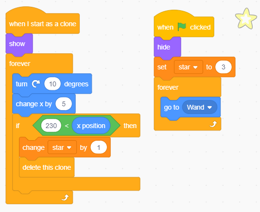

La baguette est maintenant prête à tirer des projectiles en forme d’étoile.

**3. Combat !**

La baguette et le dragon vont maintenant s'affronter, chacun possédant des atouts.

1. Si la baguette touche le dragon, elle est repoussée et perd des points de vie.
2. Si un éclair touche la baguette, elle perd des points de vie.
3. Si une étoile touche le dragon, ce dernier perd des points de vie.

Apportons les modifications aux scripts de chaque sprite.

* Si la **Baguette** touche le **Dragon**, elle est repoussée et perd des points de vie.

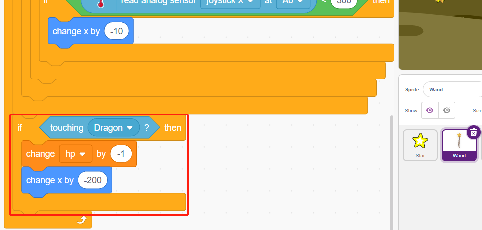

* Si un clone de **Éclair** touche la **Baguette**, il émet un son et disparaît, et la **Baguette** perd des points de vie.

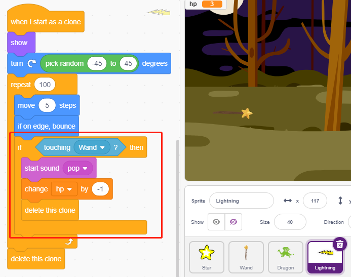

* Si une **Étoile** touche le **Dragon**, elle émet un son, disparaît et restaure le compte d'étoiles, tandis que le **Dragon** perd des points de vie.

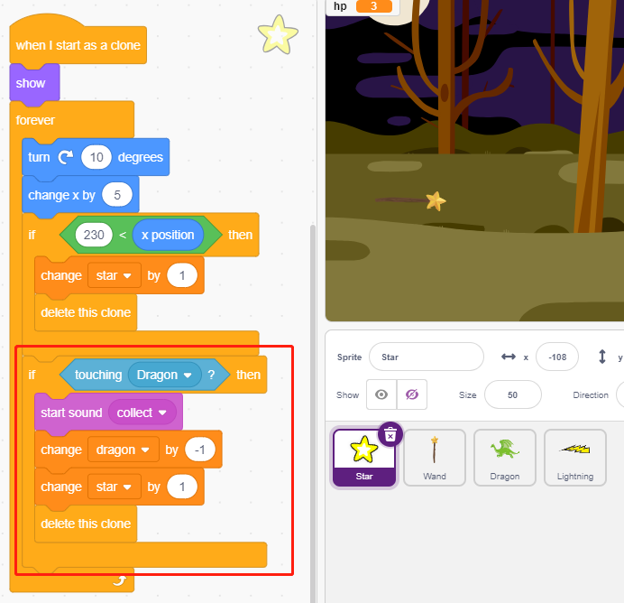

**4. Le Stage**

Le combat entre la **Baguette** et le **Dragon** mènera à une victoire ou une défaite.

* Ajoutez un décor **Ciel Bleu** et écrivez "WIN !" pour indiquer la victoire sur le dragon.

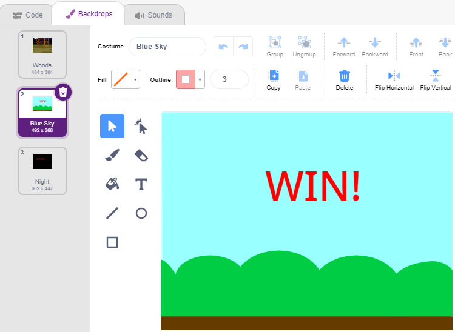

* Modifiez un fond pour représenter l'échec avec une ambiance sombre.

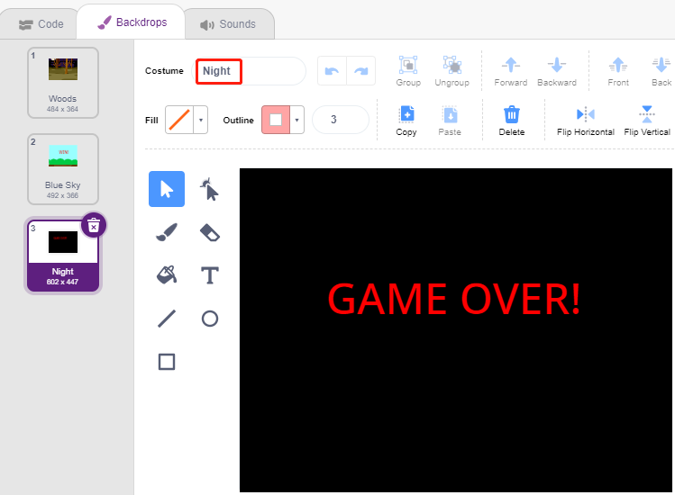

* Écrivez un script pour gérer les décors : au démarrage, afficher **Woods** ; si le dragon n’a plus de points de vie, passez à **Ciel Bleu** ; si la **Baguette** est à court de points de vie, passez à **Nuit**.

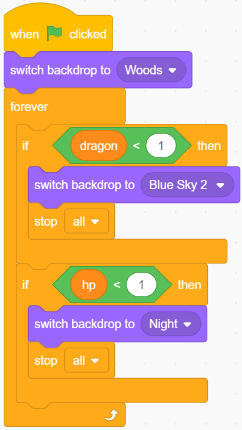
