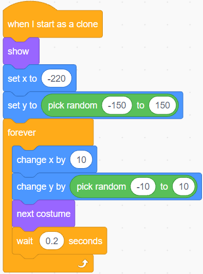

.. _starfish:

2.21 Starfishe fangen
============================

Hier wollen wir ein Spiel zum Fangen von Starfishen machen. Zu Beginn des Skripts schwimmt ein Starfish bequem auf der Bühne, und ein Taucher schwimmt ebenfalls nach rechts und links. Du musst die Tiefe des Wasserstandssensormoduls im Wasser steuern, damit der Taucher auf der Bühne den Starfish fangen kann, und für jeden gefangenen Starfish wird die Anzahl um 1 erhöht.

Baue den Schaltkreis
-----------------------

Das Wasserstandssensormodul ist ein einfach zu bedienender, kompakter und kostengünstiger Sensor zur Erkennung von Wasserständen und -tropfen, der den Wasserstand über eine Reihe freiliegender paralleler Leiterbahnen misst, um die Größe des Wassertropfens/-volumens zu bestimmen.

Je mehr Wasser in den Sensor eingetaucht ist, desto größer ist der Wert des **S**-Pin-Ausgangs.

Baue nun die Schaltung gemäß dem unten stehenden Diagramm auf.

.. image:: img/circuit/water_circuit.png

* :ref:`cpn_breadboard`
* :ref:`cpn_water` 

Programmierung
------------------

**1. Figurs und Kulisse auswählen**

Löschen Sie das Standard-Figur, wählen Sie das Figur **Diver1** und **Starfish**.

.. image:: img/21_starfish1.png

Gehe auf die Seite **Diver1's Kostüme** und benutze das Werkzeug **Fülleimer**, um die gewünschten Farben einzufügen.

.. note:: 

    Du musst beide Arme von Diver1 mit einer einzigartigen Farbe füllen, die auf der Bühne nicht gleich aussehen wird.

.. image:: img/21_starfish3.png

Verkleinere das Figur des **Starfishs**, du kannst auch seine Farbe nach Belieben ändern.

.. image:: img/21_starfish4.png

Wähle einen **Underwater1**-Hintergrund.

**2. Skripting des Diver1-Figur**

Legen Sie die Anfangsposition des Figur **Diver1** fest und lassen Sie es auf der Bühne hin und her schwimmen.

Je tiefer du den Wasserstandssensor einbaust, desto größer ist der Wert, den du erhältst, um die Tiefe (y-Koordinate) zu bestimmen, in der das **Diver1**-Figur schwimmt.

* Lies A0 (den Wert des Wasserstandssensors) und ordne seinen Bereich der y-Koordinate der Bühne zu, um eine neue y-Koordinate zu erhalten.
* Wenn **new_y** größer ist als die aktuelle Y-Koordinate, lasse ihn zur **new_y** Position hochgehen.
* Ist **new_y** kleiner als die aktuelle Y-Koordinate, wird die Position **new_y** angefahren.

.. image:: img/21_starfish6.png
    :width: 800

**3. Scripting des Starfish-Figur**

Wenn das Skript startet, verstecke zuerst das **Starfish**-Figur und klone es dann.

Wenn es als Klon erscheint, stelle seinen Bewegungseffekt ein.

Wenn er die Farbe Rot (die Farbe der beiden Arme von **Diver1**) berührt, was bedeutet, dass er vom Figur **Diver1** gefangen wird, wird der folgende Effekt ausgeführt.

* Der Wert der Variable **count** wird um 1 erhöht.
* Eine Animation des Spielstands wird angezeigt (schrumpft um 20%, bewegt sich schnell zur Position der Anzeigetafel und verschwindet).
* Gleichzeitig wird ein neuer Starfish geklont und das Spiel geht weiter.

.. image:: img/21_starfish9.png

.. note:: 
    Du musst auf den Farbbereich im Block [Farbe berühren] klicken und dann das Pipettenwerkzeug auswählen, um die rote Farbe des Figur **Diver1** auf der Bühne zu übernehmen. Wenn du eine beliebige Farbe auswählst, wird dieser [Touch color]-Block nicht funktionieren.

    .. image:: img/21_starfish10.png

Wenn der Klon des Starfishs ganz nach rechts schwimmt, lösche den Klon und klone ihn erneut.

