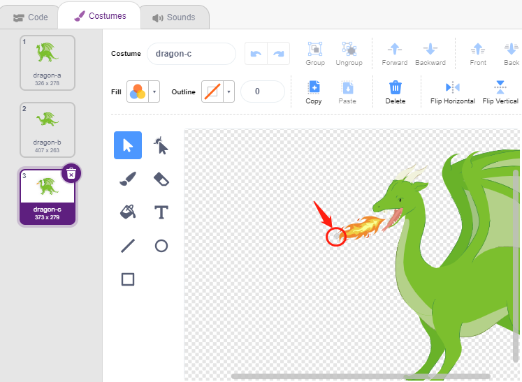
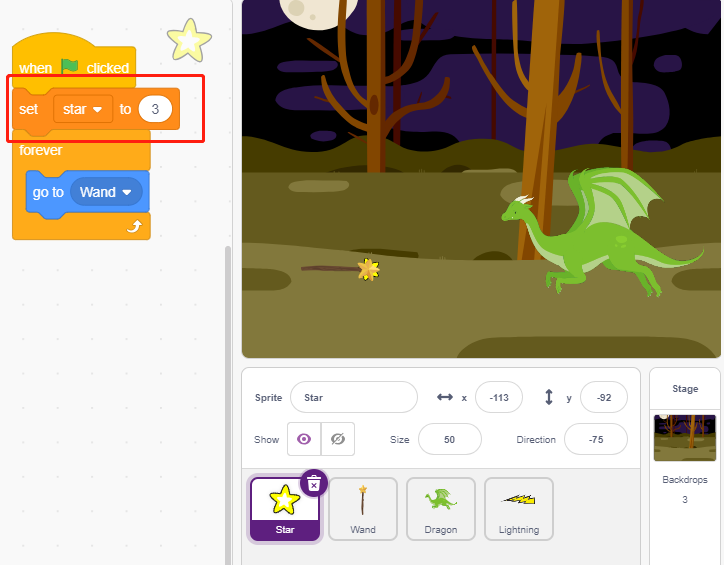
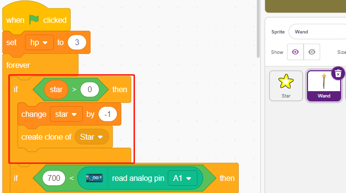

.. _dragon:

2.22 SPIEL - Dragon töten
============================

Hier benutzen wir den Joystick, um ein Dragontötungsspiel zu spielen.

Wenn du auf grün klickst, schwebt der Dragon auf der rechten Seite auf und ab und bläst stoßweise Feuer. Du musst den Joystick benutzen, um die Bewegung des Zauberstabs zu steuern und Sternangriffe auf den Dragon zu starten, während du den Flammen ausweichst, die er schießt, und ihn schließlich besiegen.

.. image:: img/19_dragon.png

Baue den Schaltkreis
-----------------------

Ein Joystick ist ein Eingabegerät, das aus einem Stock besteht, der sich auf einer Basis dreht und dem Gerät, das er steuert, seinen Winkel oder seine Richtung mitteilt. Joysticks werden häufig zur Steuerung von Videospielen und Robotern verwendet.

Damit ein Joystick dem Computer den vollen Bewegungsumfang mitteilen kann, muss er die Position des Sticks auf zwei Achsen messen - der X-Achse (von links nach rechts) und der Y-Achse (nach oben und unten).

Die Bewegungskoordinaten des Joysticks sind in der folgenden Abbildung dargestellt.

.. note::

    * Die x-Koordinate ist von links nach rechts, der Bereich ist 0-1023.
    * Die y-Koordinate ist von oben nach unten, der Bereich ist 0-1023.

.. image:: img/16_joystick.png

Baue nun die Schaltung nach dem folgenden Schema auf.

.. image:: img/circuit/joystick_circuit.png

* :ref:`cpn_breadboard`
* :ref:`cpn_joystick`

Programmierung
------------------

**1. Dragon**

**Woods** Kulisse über die Schaltfläche **Choose a Backdrop** hinzugefügt.

.. image:: img/19_dragon01.png

* Löschen Sie das Standard-Figur und fügen Sie das **Dragon**-Figur hinzu.

.. image:: img/19_dragon0.png

* Gehe auf die Seite **Costumes(Kostüme)** und spiegele den **Dragon-b** und den **Dragon-c** horizontal.

.. image:: img/19_dragon1.png

* Setzen Sie die Größe auf 50%.

.. image:: img/19_dragon3.png

* Erstellen Sie nun eine Variable - **dragon**, um die Lebenspunkte des Dragons zu erfassen, und setzen Sie den Anfangswert auf 50.

.. image:: img/19_dragon2.png

* Als nächstes schalten Sie das Figur-Kostüm auf **Dragon-b** um und lassen den **Dragon** in einem Bereich auf und ab springen.

.. image:: img/19_dragon4.png

* Füge ein **Lightning**-Figur als das Feuer hinzu, das vom **Dragon**-Figur geblasen wird. Du musst es auf der Kostümseite um 90° im Uhrzeigersinn drehen, damit sich das **Lightning**-Figur in die richtige Richtung bewegt.

.. note::
    Wenn du das Kostüm des **Lightning**-Figur anpasst, kann es passieren, dass du es aus der Mitte heraus bewegst, was unbedingt vermieden werden muss! Der Mittelpunkt muss genau in der Mitte des Figur liegen!

.. image:: img/19_lightning1.png

* Passen Sie dann das **Dragon-c**-Kostüm des **Dragon**-Figur so an, dass sich sein Mittelpunkt am Ende des Feuers befindet. Dadurch werden die Positionen des **Dragon**-Figur und des **Lightning**-Figur korrigiert und verhindert, dass der **Lightning** von den Füßen des Dragons ausgeht. 

* Bei **Dragon-b** muss der Kopf des Dragons mit dem Mittelpunkt übereinstimmen.

* Passen Sie die Größe und Ausrichtung des **Lightning**-Figur an, damit das Bild harmonischer aussieht.

.. image:: img/19_lightning3.png

* Erstellen Sie nun ein Skript für das **Lightning**-Figur. Das ist ganz einfach, lass es einfach die ganze Zeit dem **Dragon**-Figur folgen. An diesem Punkt klicke auf die grüne Fahne und du wirst den **Dragon** sehen, der sich mit einem Lightning im Mund bewegt.

.. image:: img/19_lightning4.png

* Zurück zum **Dragon**, lass ihn jetzt Feuer ausblasen, wobei du darauf achten musst, dass das Feuer in seinem Mund nicht herausschießt, sondern einen Klon für den **Lightning**-Figur erzeugt.

.. image:: img/19_dragon6.png

* Klicken Sie auf den **Lightning** und lassen Sie den **Lightning**-Klon in einem zufälligen Winkel herausschießen. Er prallt von der Wand ab und verschwindet nach einer gewissen Zeit.

.. image:: img/19_lightning5.png

* Verstecke den Körper des **Lightning** und zeige den Klon.

.. image:: img/19_lightning6.png

Jetzt kann sich der Dragon auf und ab bewegen und Feuer ausstoßen.

**2.Wand**

* Erstelle ein **Wand**-Figur und drehe seine Richtung um 180, so dass er nach rechts zeigt.

.. image:: img/19_wand1.png

* Erstelle nun eine Variable **hp**, um den Lebenswert des Zauberstabs zu speichern, der anfangs auf 3 gesetzt ist, und lese dann den Wert des Joysticks aus, der zur Steuerung der Bewegung des Zauberstabs verwendet wird.

.. image:: img/19_wand2.png

* Der Dragon hat einen Lightning, und der Zauberstab, der ihn zerquetscht, hat seine "magische Kugel"! Erstelle ein **Star**-Figur, ändere seine Größe und sorge dafür, dass es immer dem **Wand**-Figur folgt, und beschränke die Anzahl der Sterne auf drei.

* Lass das **Wand**-Figur automatisch Sterne verschießen. Das **Wand**-Figur verschießt Sterne auf die gleiche Weise wie der Dragon Feuer verschießt - indem es Klone erzeugt.

* Kehren Sie zum **Star**-Figur zurück und skripten Sie seinen Klon, damit er sich dreht und nach rechts schießt, verschwindet, nachdem er über die Bühne gegangen ist, und die Anzahl der Sterne wiederherstellt. Dasselbe wie beim **Lightning**-Figur, den Körper ausblenden und den Klon anzeigen.

.. image:: img/19_star3.png

Jetzt haben wir einen Zauberstab, der Sternenkugeln verschießt.

**3. Kämpfen!**

Der Zauberstab und der Dragon sind im Moment noch miteinander verfeindet, und wir werden sie kämpfen lassen. Der Dragon ist stark, und der Zauberstab ist der tapfere Mann, der gegen den Dragon kämpft. Die Interaktion zwischen den beiden besteht aus den folgenden Teilen.

1. Wenn der Zauberstab den Dragon berührt, wird er zurückgeschlagen und verliert Lebenspunkte.
2. Wenn der Lightning in den Zauberstab einschlägt, verliert der Zauberstab Lebenspunkte.
3. Wenn die Sternenkugel den Dragon trifft, verliert der Dragon Lebenspunkte.

Sobald das geklärt ist, können wir die Skripte für jedes Figur ändern.

* Wenn der **Wand** den **Dragon** trifft, wird er zurückgeschlagen und verliert Lebenspunkte.

.. image:: img/19_wand4.png

* Wenn **Lightning** (ein **Lightning**-Figur-Klon) das **Wand**-Figur trifft, macht es einen Knall und verschwindet, und der **Wand** verliert Lebenspunkte.

.. image:: img/19_lightning7.png

* Wenn ein **Star** (Klon des **Star**-Figur) den **Dragon** trifft, gibt er ein Geräusch von sich und verschwindet, während die Anzahl der **Star** wiederhergestellt wird, und der **Dragon** verliert Lebenspunkte.

.. image:: img/19_star4.png

**4. Stufe**

Der Kampf zwischen dem **Wand** und dem **Dragon** wird schließlich in Gewinner und Verlierer aufgeteilt, was wir mit der Bühne darstellen.

* Füge den **Blue Sky** als Hintergrund hinzu und schreibe das Zeichen "WIN!" darauf, um darzustellen, dass der Dragon besiegt wurde und die Morgendämmerung gekommen ist.

.. image:: img/19_sky0.png

* Und ändere den leeren Hintergrund wie folgt, um darzustellen, dass das Spiel gescheitert ist und alles im Dunkeln liegen wird.

.. image:: img/19_night.png

* Schreibe nun ein Skript, um diese Kulissen umzuschalten: Wenn die grüne Flagge angeklickt wird, schalte auf die Kulisse **Woods** um; wenn der Lebenspunkt des Dragons weniger als 1 beträgt, dann ist das Spiel erfolgreich und die Kulisse wird auf **Blue Sky** umgeschaltet; wenn der Lebenspunkt des **Wand** weniger als 1 beträgt, dann wird auf die Kulisse **Night** umgeschaltet und das Spiel scheitert.

.. image:: img/19_sky1.png
