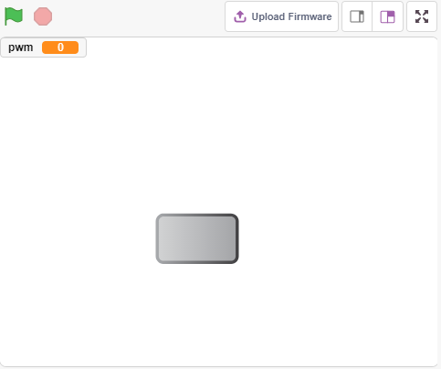
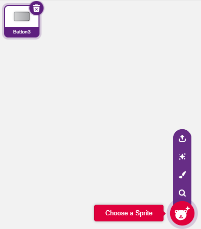
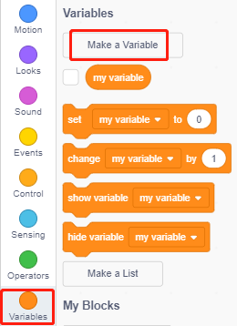
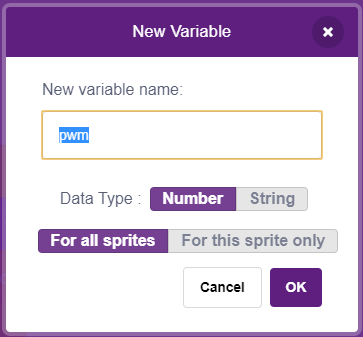
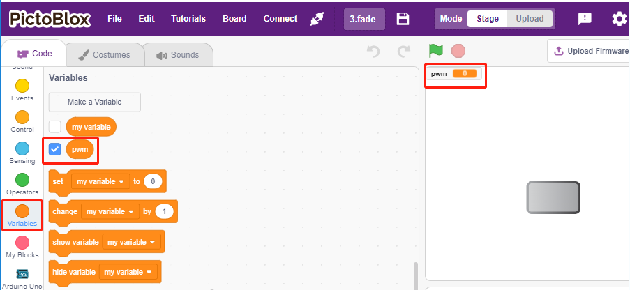
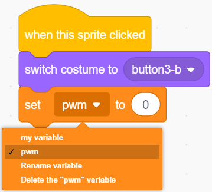
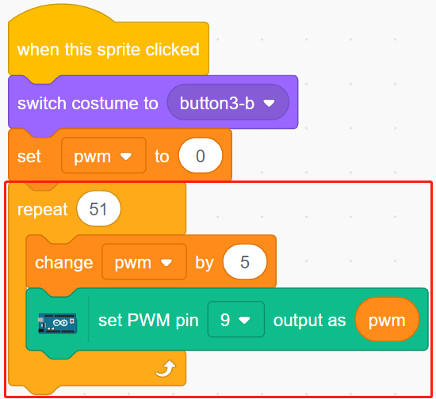
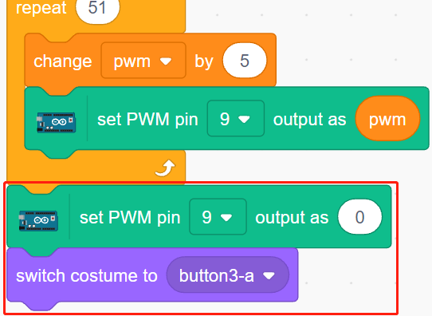

.. _breathing_led:

2.2 Atmungs-LED
========================

Verwenden Sie nun eine andere Methode, um die Helligkeit der LED zu steuern. Im Gegensatz zum vorherigen Projekt wird hier die Helligkeit der LED langsam abnehmen, bis sie verschwindet.

Wenn das Figur auf der Bühne angeklickt wird, nimmt die Helligkeit der LED langsam zu und geht dann sofort wieder aus.

Sie werden lernen
---------------------

- Den Ausgangswert des PWM-Pins einstellen
- Variablen erstellen
- Ändern der Helligkeit des Figurs

Die Schaltung aufbauen
-----------------------

Dieses Projekt verwendet die gleiche Schaltung wie das vorherige Projekt :ref:`table_lamp`, aber anstatt HIGH/LOW zu verwenden, um die LEDs zum Leuchten oder Ausschalten zu bringen, verwendet dieses Projekt das `PWM - Wikipedia <https://en.wikipedia.org/wiki/Pulse-width_modulation>`_ Signal, um die LED langsam auf- oder abzudimmen.

Der PWM-Signalbereich ist 0-255, auf dem Arduno Uno Board können 3, 5, 6, 9, 10, 11 ein PWM-Signal ausgeben; auf dem Mega2560 können 2 - 13, 44 - 46 ein PWM-Signal ausgeben.

.. image:: img/circuit/led_circuit.png

* :ref:`cpn_breadboard`
* :ref:`cpn_led`
* :ref:`cpn_resistor`

Programmierung
------------------

**1. Wählen Sie ein Figur**

Löschen Sie das Standard-Figur, klicken Sie auf die Schaltfläche **Choose a Sprite** in der unteren rechten Ecke des Figur-Bereichs, geben Sie **button3** in das Suchfeld ein, und klicken Sie dann, um es hinzuzufügen.

**2. Erstellen einer Variablen**.

Erstellen Sie eine Variable namens **pwm**, um den Wert der pwm-Änderung zu speichern.

Klicken Sie auf die Palette **Variables(Variablen)** und wählen Sie **Make a Variable**.

Geben Sie den Namen der Variablen ein. Er kann beliebig sein, sollte aber ihre Funktion beschreiben. Der Datentyp ist Zahl und Für alle Figurs.

Nach der Erstellung siehst du **pwm** in der **Variables(Variablen)**-Palette und im markierten Zustand, was bedeutet, dass diese Variable auf der Bühne erscheint. Du kannst versuchen, das Häkchen zu entfernen, um zu sehen, ob pwm immer noch auf der Bühne vorhanden ist.

**3. Setzen Sie den Anfangszustand**

Wenn das Figur **button3** angeklickt wird, schalte das Kostüm auf **button3-b** (angeklickter Zustand) und setze den Anfangswert der Variablen **pwm** auf 0.

* [set pwm to 0]: aus der **Variablen**-Palette, um den Wert der Variable zu setzen.

**4. Die LED heller und heller machen**

Da der Bereich von pwm 255 ist, wird die Variable **pwm** mit dem Block [repeat] auf 255 durch 5 akkumuliert und dann in den Block [set PWM pin] gesetzt, so dass man die LED langsam aufleuchten sieht.

* [change pwm by 5]: aus der **Variablen**-Palette, lassen Sie die Variable jedes Mal eine bestimmte Zahl ändern. Es kann eine positive oder negative Zahl sein, positiv bedeutet, dass sie jedes Mal steigt, negativ bedeutet, dass sie jedes Mal sinkt, zum Beispiel wird hier die Variable pwm jedes Mal um 5 erhöht.
* [set PWM pin]: aus der **Arduino Mega** Palette, wird verwendet, um den Ausgangswert des pwm-Pins zu setzen.

Zum Schluss schalten Sie das Kostüm von Button3 wieder auf **button3-a** um und setzen den PWM-Pin auf den Wert 0, so dass die LED langsam aufleuchtet und dann wieder ausgeht.

