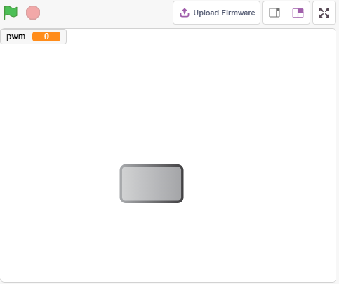
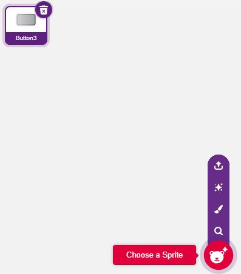
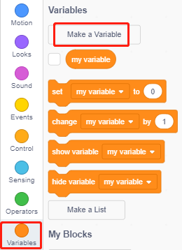
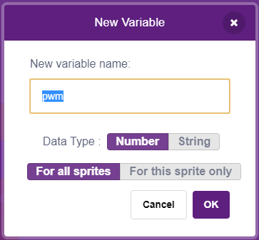
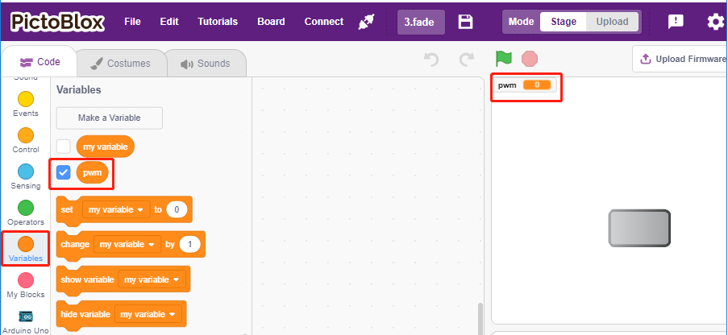
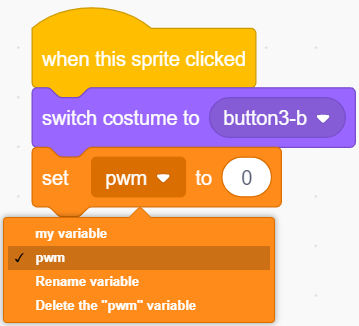
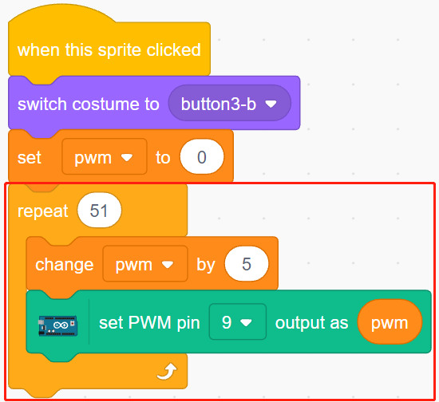
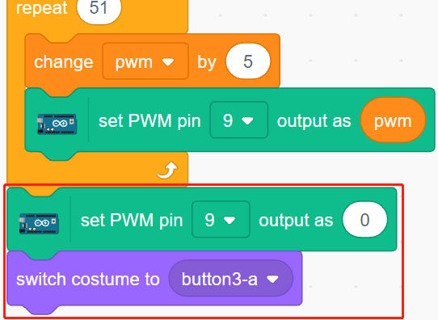

.. note::

    Ciao, benvenuto nella SunFounder Raspberry Pi & Arduino & ESP32 Enthusiasts Community su Facebook! Approfondisci Raspberry Pi, Arduino ed ESP32 con altri appassionati.

    **Perché unirsi?**

    - **Supporto Esperto**: Risolvi problemi post-vendita e sfide tecniche con l'aiuto della nostra comunità e del nostro team.
    - **Impara e Condividi**: Scambia consigli e tutorial per migliorare le tue competenze.
    - **Anteprime Esclusive**: Accedi in anteprima agli annunci di nuovi prodotti.
    - **Sconti Speciali**: Approfitta di sconti esclusivi sui nostri prodotti più recenti.
    - **Promozioni Festive e Giveaway**: Partecipa a giveaway e promozioni festive.

    👉 Pronto per esplorare e creare con noi? Clicca [|link_sf_facebook|] e unisciti oggi stesso!

.. _breathing_led:

2.2 LED Respirante
========================

Ora utilizziamo un altro metodo per controllare la luminosità del LED. A differenza del progetto precedente, qui la luminosità del LED diminuisce lentamente fino a scomparire.

Quando lo sprite sul palco viene cliccato, la luminosità del LED aumenta lentamente per poi spegnersi istantaneamente.

Imparerai
---------------------

- Impostare il valore di uscita del pin PWM
- Creare variabili
- Modificare la luminosità dello sprite

Costruire il Circuito
-----------------------

Questo progetto utilizza lo stesso circuito del progetto precedente :ref:`table_lamp`, ma invece di utilizzare HIGH/LOW per accendere o spegnere il LED, questo progetto utilizza il segnale `PWM - Wikipedia <https://en.wikipedia.org/wiki/Pulse-width_modulation>`_ per accendere lentamente o abbassare gradualmente il LED.

Il range del segnale PWM è 0-255; sulla scheda Arduino Uno, i pin 3, 5, 6, 9, 10, 11 possono emettere segnali PWM; sulla Mega2560, i pin 2 - 13, 44 - 46 possono emettere segnali PWM.

.. image:: img/circuit/led_circuit.png

* :ref:`cpn_breadboard`
* :ref:`cpn_led`
* :ref:`cpn_resistor`

Programmazione
-------------------

**1. Seleziona uno sprite**

Elimina lo sprite predefinito, clicca sul pulsante **Scegli uno Sprite** nell'angolo in basso a destra dell'area sprite, inserisci **button3** nella barra di ricerca e quindi clicca per aggiungerlo.

**2. Creare una variabile**

Crea una variabile chiamata **pwm** per memorizzare il valore della variazione del pwm.

Clicca sulla palette **Variabili** e seleziona **Crea una Variabile**.

Inserisci il nome della variabile; può essere qualsiasi nome, ma è consigliato utilizzare uno che descriva la sua funzione. Il tipo di dato è Numero e seleziona "Per tutti gli sprite".

Una volta creata, vedrai **pwm** all'interno della palette **Variabili** e in stato selezionato, il che significa che questa variabile apparirà sul palco. Puoi deselezionarla per verificare se pwm è ancora presente sul palco.

**3. Imposta lo stato iniziale**

Quando lo sprite **button3** viene cliccato, cambia il costume in **button-b** (stato cliccato) e imposta il valore iniziale della variabile **pwm** a 0.

* [imposta pwm a 0]: dalla palette **Variabili**, utilizzato per impostare il valore della variabile.

**4. Fai diventare il LED sempre più luminoso**

Poiché il range del pwm è 255, usa il blocco [ripeti] per accumulare la variabile **pwm** fino a 255 con incrementi di 5, e quindi inserisci il valore nel blocco [imposta pin PWM], così potrai vedere il LED accendersi lentamente.

* [cambia pwm di 5]: dalla palette **Variabili**, consente alla variabile di cambiare di un numero specifico ogni volta. Può essere positivo o negativo; positivo significa incremento, negativo decremento, ad esempio qui la variabile pwm aumenta di 5 ogni volta.
* [imposta pin PWM]: dalla palette **Arduino Uno**, utilizzato per impostare il valore di uscita del pin pwm.

Infine, cambia il costume di button3 in **button-a** e imposta il valore del pin PWM a 0, così il LED si accenderà lentamente per poi spegnersi di nuovo.

