.. note::

    Ciao, benvenuto nella SunFounder Raspberry Pi & Arduino & ESP32 Enthusiasts Community su Facebook! Approfondisci Raspberry Pi, Arduino ed ESP32 con altri appassionati.

    **Perché unirsi?**

    - **Supporto Esperto**: Risolvi problemi post-vendita e sfide tecniche con l'aiuto della nostra comunità e del nostro team.
    - **Impara e Condividi**: Scambia consigli e tutorial per migliorare le tue competenze.
    - **Anteprime Esclusive**: Accedi in anteprima agli annunci di nuovi prodotti.
    - **Sconti Speciali**: Approfitta di sconti esclusivi sui nostri prodotti più recenti.
    - **Promozioni Festive e Giveaway**: Partecipa a giveaway e promozioni festive.

    👉 Pronto per esplorare e creare con noi? Clicca [|link_sf_facebook|] e unisciti oggi stesso!

.. _colorful_ball:

2.3 Palline Colorate
========================

In questo progetto faremo in modo che i LED RGB visualizzino colori diversi.

Cliccando su diverse palline colorate nell'area dello stage, il LED RGB si illuminerà con colori diversi.

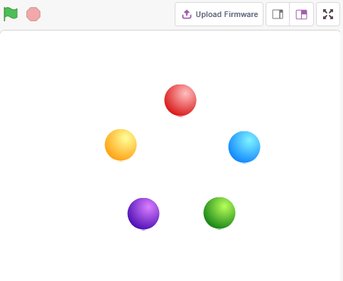

Imparerai
-----------------------

- Il principio del LED RGB
- Copiare sprite e selezionare costumi diversi
- Sovrapposizione dei tre colori primari

Costruire il Circuito
-----------------------

Un LED RGB racchiude tre LED (rosso, verde e blu) in un involucro di plastica trasparente o semi-trasparente. Può visualizzare vari colori modificando la tensione di ingresso sui tre pin e sovrapponendoli. Secondo le statistiche, è possibile creare fino a 16.777.216 colori diversi.

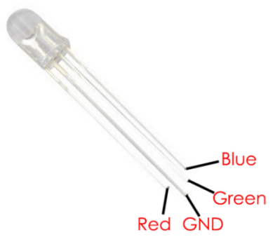

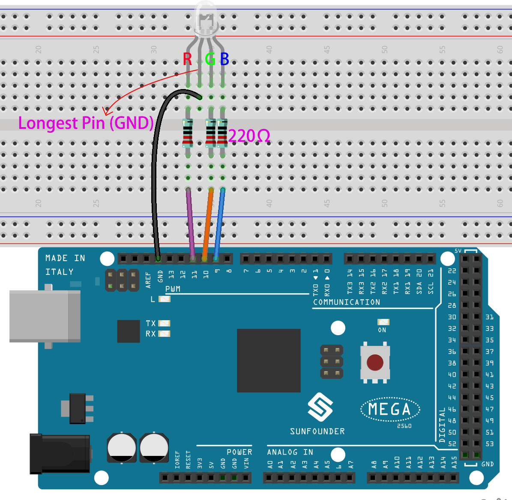

* :ref:`cpn_breadboard`
* :ref:`cpn_rgb`
* :ref:`cpn_resistor`

Programmazione
------------------

**1. Selezionare lo sprite**

Elimina lo sprite predefinito, quindi scegli lo sprite **Ball**.

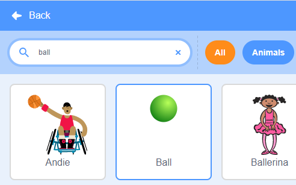

E duplicalo 5 volte.

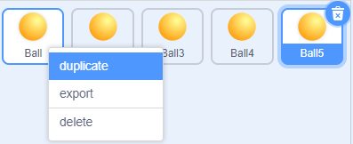

Scegli costumi diversi per questi 5 sprite **Ball** e posizionali nelle posizioni corrispondenti.

.. note::

    **Ball3**: il colore del costume deve essere cambiato manualmente in rosso.

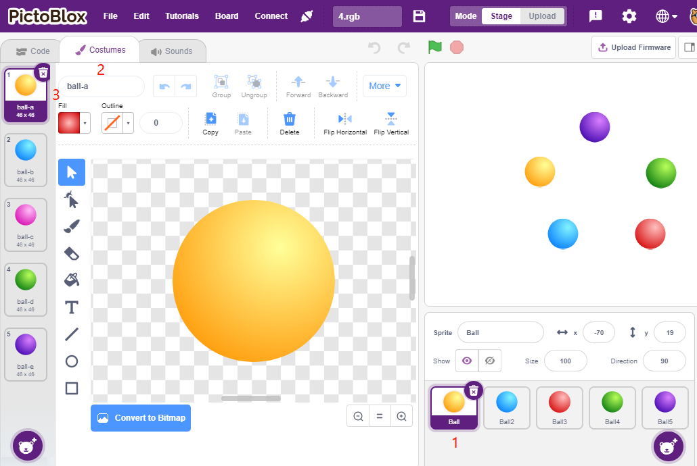

**2. Fare in modo che i LED RGB si illuminino con il colore appropriato**

Prima di comprendere il codice, dobbiamo capire il `modello di colore RGB <https://en.wikipedia.org/wiki/RGB_color_model>`_.

Il modello di colore RGB è un modello additivo in cui le luci rosse, verdi e blu vengono combinate in vari modi per riprodurre un'ampia gamma di colori.

Mescolanza di colori additivi: aggiungendo il rosso al verde si ottiene il giallo; aggiungendo il verde al blu si ottiene il ciano; aggiungendo il blu al rosso si ottiene il magenta; combinando tutti e tre i colori primari si ottiene il bianco.

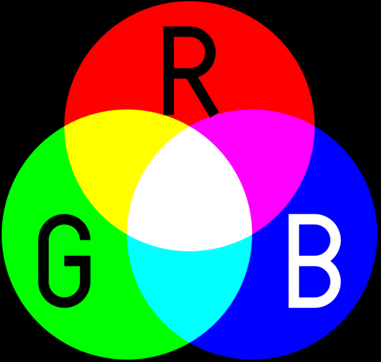

Quindi, il codice per fare in modo che il LED RGB si illumini di giallo è il seguente.

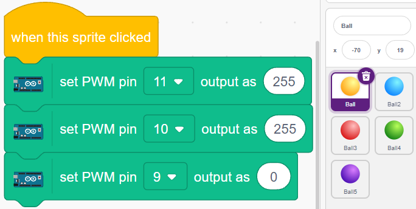

Quando lo sprite Ball (pallina gialla) viene cliccato, impostiamo il pin 11 su HIGH (LED rosso acceso), il pin 10 su HIGH (LED verde acceso) e il pin 9 su LOW (LED blu spento) in modo che il LED RGB si illumini di giallo.

Puoi scrivere i codici per gli altri sprite allo stesso modo per fare in modo che i LED RGB si illuminino con i colori corrispondenti.

**3. Sprite Ball2 (azzurro)**

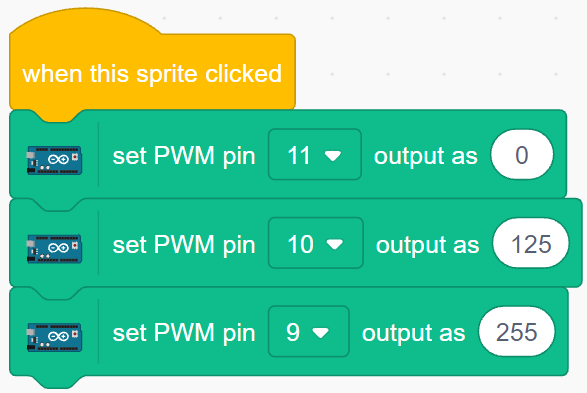

**4. Sprite Ball3 (rosso)**

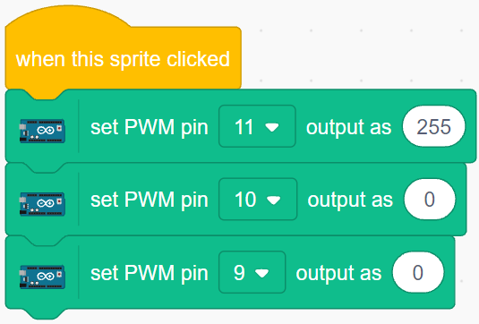

**5. Sprite Ball4 (verde)**

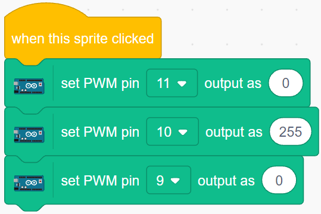

**6. Sprite Ball5 (viola)**

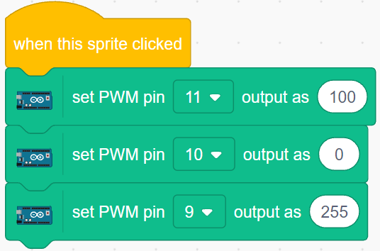
