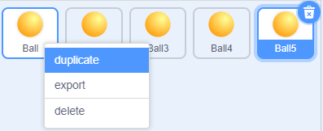

.. _colorful_ball:

2.3 Colorful Balls
=====================

In this project, we will make the RGB LEDs display different colors.

Clicking on different colored balls on the stage area will cause the RGB LED to light up in different colors.

.. image:: img/4_color.png

You Will Learn
---------------------

- The principle of RGB LED
- Copy sprites and select different costumes
- Three primary colors superimposed

Build the Circuit
---------------------

An RGB LED packages three LEDs of red, green, and blue into a transparent or semitransparent plastic shell. It can display various colors by changing the input voltage of the three pins and superimpose them, which, according to statistics, can create 16,777,216 different colors.

.. image:: img/4_rgb.png
    :width: 300

* :ref:`cpn_breadboard`
* :ref:`cpn_rgb`
* :ref:`cpn_resistor`

Programming
------------------

**1. Select sprite**

Delete the default sprite, then choose the **Ball** sprite.

.. image:: img/4_ball.png

And duplicate it 5 times.

Choose different costumes for these 5 **Ball** sprites and move them to the corresponding positions.

.. note::

    **Ball3** sprite costume color needs to be manually changed to red.

.. image:: img/4_rgb1.png
    :width: 800

**2. Make RGB LEDs light up in the appropriate color**

Before understanding the code, we need to understand the `RGB color model <https://en.wikipedia.org/wiki/RGB_color_model>`_.

The RGB color model is an additive color model in which red, green, and blue light are added together in various ways to reproduce a broad array of colors. 

Additive color mixing: adding red to green yields yellow; adding green to blue yields cyan; adding blue to red yields magenta; adding all three primary colors together yields white.

.. image:: img/4_rgb_addition.png
  :width: 400

So the code to make the RGB LED light yellow is as follows.

.. image:: img/4_yellow.png

When the Ball sprite (yellow ball) is clicked, we set pin 11 high (red LED on), pin 10 high (green LED on) and pin 9 low (blue LED off) so that the RGB LED will light yellow.

You can write codes to other sprites in the same way to make the RGB LEDs light up in the corresponding colors.

**3. Ball2 sprite (light blue)**

.. image:: img/4_blue.png

**4. Ball3 sprite (red)**

.. image:: img/4_red.png

**5. Ball4 sprite (green)**

.. image:: img/4_green.png

**6. Ball5 sprite (purple)**

.. image:: img/4_purple.png

