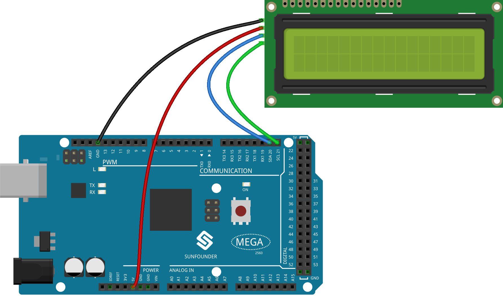
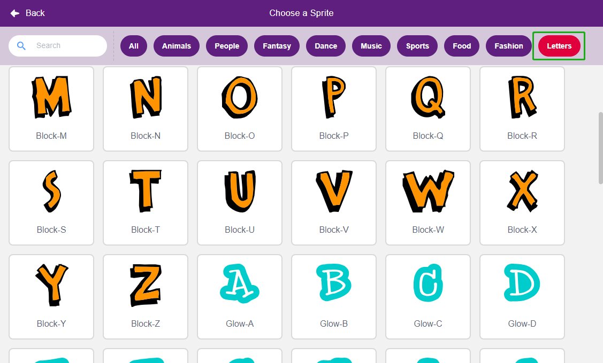
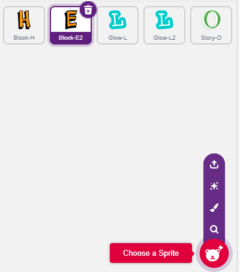
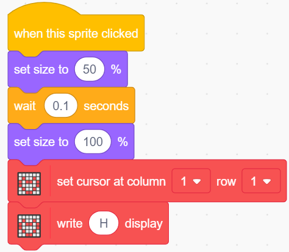
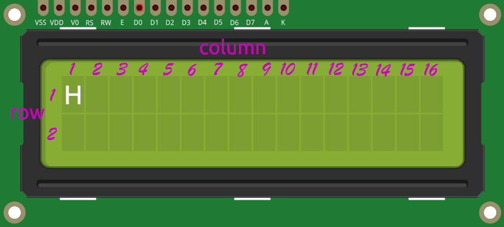
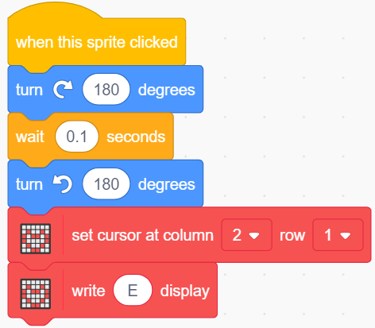
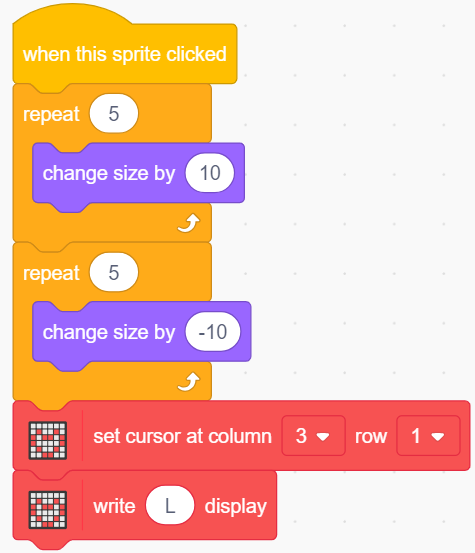
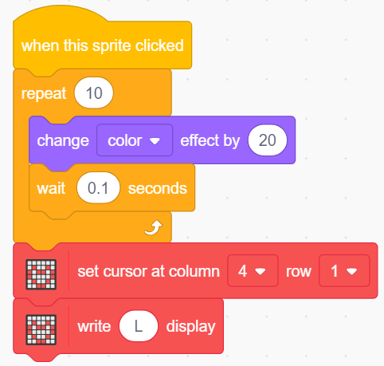
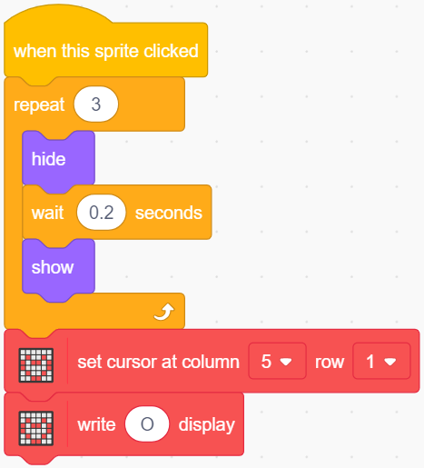

.. _lcd1602:

2.4 LCD1602
=================

LCD1602 kann 2x16 Zeichen anzeigen, jetzt lassen wir es die entsprechenden Zeichen mit den ZeichenFigurs auf der Bühne anzeigen.

Wenn du die Hello auf der Bühne anklickst, werden sie verschiedene Animationseffekte haben und die Zeichen werden gleichzeitig auf dem LCD1602 angezeigt.

.. image:: img/5_hello.png

Sie werden lernen
---------------------

- Die Verwendung des LCD1602
- Mehrere verschiedene Figurs auswählen
- Ändern der Figurgröße, des Drehwinkels, der Farbe und des Ein- und Ausblendens.

Den Schaltkreis aufbauen
--------------------------------

* :ref:`cpn_breadboard`
* :ref:`cpn_i2c_lcd1602`

Programmierung
------------------

**1. Figur auswählen**

Löschen Sie das Standard-Figur, klicken Sie auf **Choose a Sprite**, dann auf **letters** und wählen Sie das gewünschte Figur aus.

Ich habe zum Beispiel Hallo gewählt, wie unten gezeigt.

Jetzt können Sie verschiedene Effekte für diese Figurs einstellen und sie auf dem LCD1602 anzeigen lassen, während Sie klicken.

**2. H ist Vergrößern und Verkleinern**

Klicken Sie auf das Figur **H**, und schreiben Sie nun ein Skript dafür.

Wenn das Figur **H** angeklickt wird, verkleinern Sie es auf 50% und stellen es dann wieder her, während Sie H in der ersten Zeile und Spalte des LCD1602 anzeigen.

* [Größe einstellen auf]: Aus der Palette **Aussehen**, zum Einstellen der Größe des Figur, von 0% bis 100%.
* [Cursor auf die letzte Zeile setzen]: Aus der Palette **Display Modules**, wird verwendet, um den Cursor auf eine bestimmte Zeile des LCD1602 zu setzen, um mit der Anzeige von Zeichen zu beginnen.
* [Anzeige schreiben]: Aus der Palette **Display Modules**, wird verwendet, um Zeichen oder Zeichenketten auf dem LCD1602 anzuzeigen.

Die Verteilung der Zeilen und Spalten auf dem LCD1602 ist in der Abimageung dargestellt.

**3. E kippt nach links und rechts**

Klicken Sie auf das Figur **E**, und schreiben Sie nun ein Skript dafür.

Wenn das Figur **E** angeklickt wird, lass es sich um 180 Grad im Uhrzeigersinn und dann um 180 Grad gegen den Uhrzeigersinn drehen, damit du sehen kannst, wie es nach links und rechts kippt; und zeige H in der ersten Zeile und Spalte 2 des LCD1602.

* [Grad drehen]: Aus der Palette **Bewegung**, wird verwendet, um das Figur im oder gegen den Uhrzeigersinn zu drehen, der Bereich ist 0-360 Grad.

**4. L schrumpft langsam und vergrößert sich**

Klicken Sie auf das **erste L**-Figur und schreiben Sie nun ein Skript für dieses Figur.

Wenn das Figur **L** angeklickt wird, verwende den [repeat]-Block, um es um 50% zu vergrößern (5 Mal, jedes Mal um 10), dann schrumpfe es auf die gleiche Weise wieder auf seine ursprüngliche Größe, während L in der ersten Zeile und Spalte 3 des LCD1602 angezeigt wird.

* [change side by]: Aus der Palette **Bewegungen**, um die Größe des Figur zu ändern.

**5. Das zweite L ändert seine Farbe**

Klicken Sie auf das zweite **L**-Figur und schreiben Sie nun ein Skript für es.

Wenn das Figur **L** angeklickt wird, benutze den [repeat]-Block, um 10 Mal mit einer Rate von 20 Schritten zwischen den Farben zu wechseln und zur ursprünglichen Farbe zurückzukehren. Außerdem wird L in der ersten Zeile und Spalte 4 des LCD1602 angezeigt.

* [change color effect by <https://en.scratch-wiki.info/wiki/Graphic_Effect#Changing_of_colors_using_the_Color_Effect_block>`_]: Wird verwendet, um den Farbeffekt zu ändern, ein Kostüm kann mit dem Farbeffekt 200 verschiedene Farbschemata annehmen, 0 und 200 sind die gleiche Farbe.

**6. O ist verstecken und zeigen**

Klicken Sie auf das Figur **O** und schreiben Sie nun ein Skript dafür.

Wenn das **O**-Figur angeklickt wird, wiederholt es den Ausblendungs- und Einblendungsprozess 3 Mal, während es O in der ersten Zeile und Spalte 5 des LCD1602 anzeigt.

* [Hide] & [Show]: Das Figur wird ein- und ausgeblendet.

