.. note:: 

    Hola, bienvenido a la comunidad de entusiastas de SunFounder Raspberry Pi, Arduino y ESP32 en Facebook. Profundiza en Raspberry Pi, Arduino y ESP32 junto a otros entusiastas.

    **¿Por qué unirse?**

    - **Soporte experto**: Resuelve problemas posventa y desafíos técnicos con ayuda de nuestra comunidad y equipo.
    - **Aprende y comparte**: Intercambia consejos y tutoriales para mejorar tus habilidades.
    - **Avances exclusivos**: Accede anticipadamente a anuncios de nuevos productos y adelantos.
    - **Descuentos especiales**: Disfruta de descuentos exclusivos en nuestros productos más recientes.
    - **Promociones y sorteos festivos**: Participa en sorteos y promociones especiales por festividades.

    👉 ¿Listo para explorar y crear con nosotros? Haz clic en [|link_sf_facebook|] y únete hoy mismo.

.. _lcd1602:

2.4 LCD1602
=================

El LCD1602 puede mostrar 2x16 caracteres. Ahora haremos que muestre los caracteres correspondientes con los sprites de caracteres en el escenario.

Cuando hagas clic en "Hello" en el escenario uno por uno, tendrán diferentes efectos de animación y los caracteres se mostrarán en el LCD1602 al mismo tiempo.

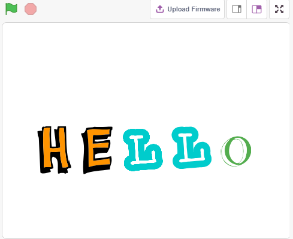

Lo que aprenderás
--------------------

- Cómo usar el LCD1602.
- Seleccionar múltiples sprites diferentes.
- Cambiar el tamaño, ángulo de rotación, color y mostrar u ocultar sprites.

Construir el circuito
------------------------

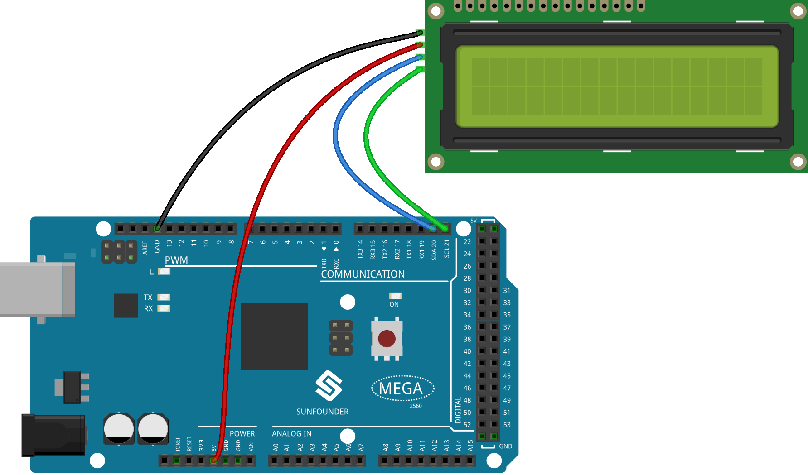

* :ref:`cpn_mega2560`
* :ref:`cpn_i2c_lcd1602`

Programación
--------------

**1. Seleccionar sprite**

Elimina el sprite predeterminado, haz clic en **Elegir un Sprite**, luego selecciona **letters** y elige el sprite que desees.

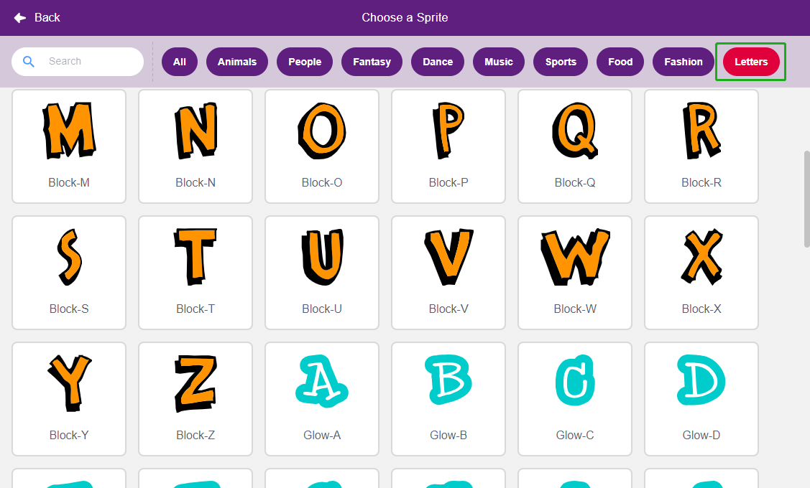

Por ejemplo, seleccioné "Hello", como se muestra a continuación.

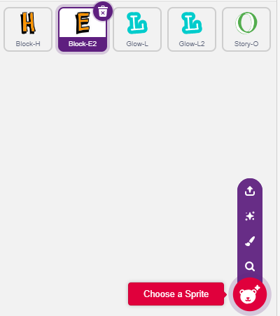

Ahora configura diferentes efectos para estos sprites y haz que se muestren en el LCD1602 al hacer clic.

**2. H se amplía y reduce**

Haz clic en el sprite **H** y escribe un script para él.

Cuando se haga clic en el sprite **H**, cambia su tamaño al 50 %, luego restáuralo, mientras se muestra "H" en la primera fila y columna del LCD1602.

* [set size to]: Desde la paleta **Apariencia**, utilizado para establecer el tamaño del sprite, de 0 % a 100 %.
* [set cursor at column row]: Desde la paleta **Módulos de pantalla**, utilizado para establecer el cursor en una fila específica del LCD1602 para comenzar a mostrar caracteres.
* [write display]: Desde la paleta **Módulos de pantalla**, utilizado para mostrar caracteres o cadenas en el LCD1602.

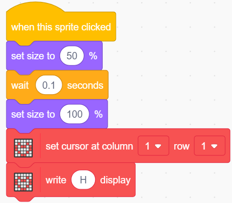

La distribución de filas y columnas en el LCD1602 se muestra en la figura.

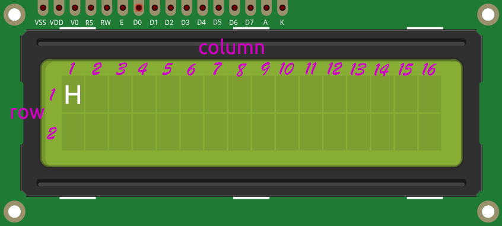

**3. E gira hacia la izquierda y hacia la derecha**

Haz clic en el sprite **E** y escribe un script para él.

Cuando se haga clic en el sprite **E**, haz que gire 180 grados en el sentido de las agujas del reloj, luego 180 grados en sentido contrario, y muestra "E" en la primera fila y columna 2 del LCD1602.

* [turn degrees]: Desde la paleta **Movimiento**, utilizado para girar el sprite en el sentido de las agujas del reloj o en sentido contrario, el rango es de 0 a 360 grados.

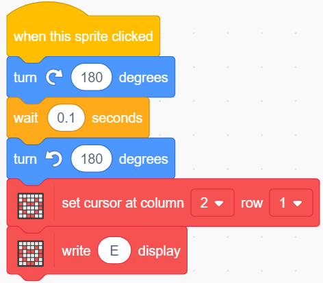

**4. L se encoge y se amplía lentamente**

Haz clic en el primer sprite **L** y escribe un script para él.

Cuando se haga clic en el sprite **L**, utiliza el bloque [repeat] para aumentar su tamaño un 50 % (5 veces, 10 cada vez), luego reduce su tamaño de la misma manera, mientras se muestra "L" en la primera fila y columna 3 del LCD1602.

* [change size by]: Desde la paleta de Movimiento, utilizado para cambiar el tamaño del sprite.

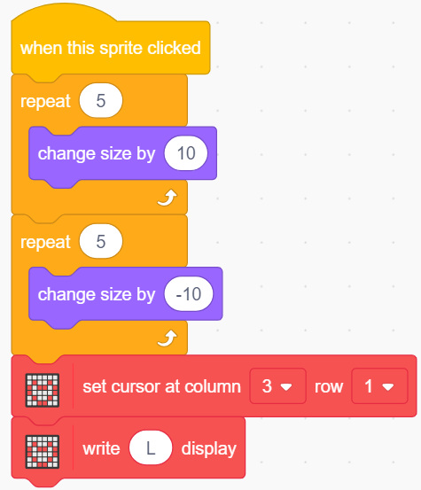

**5. El segundo L cambia de color**

Haz clic en el segundo sprite **L** y escribe un script para él.

Cuando se haga clic en el sprite **L**, utiliza el bloque [repeat] para repetir 10 veces con incrementos de 20 para alternar entre colores y volver al color original. También muestra "L" en la primera fila y columna 4 del LCD1602.

* [`change color effect by <https://en.scratch-wiki.info/wiki/Graphic_Effect#Changing_of_colors_using_the_Color_Effect_block>`_]: Utilizado para cambiar el efecto de color, un disfraz puede tener 200 combinaciones de colores diferentes, 0 y 200 son del mismo color.

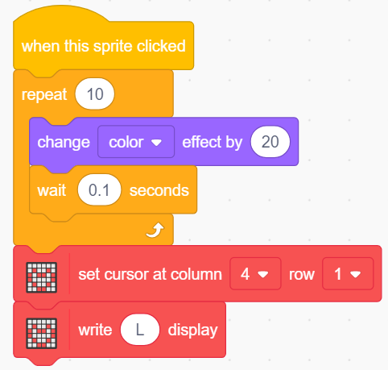

**6. O se oculta y muestra**

Haz clic en el sprite **O** y escribe un script para él.

Cuando se haga clic en el sprite **O**, repite el proceso de ocultar y mostrar 3 veces, mientras muestra "O" en la primera fila y columna 5 del LCD1602.

* [Hide] & [Show]: Hace que el sprite se oculte y muestre.

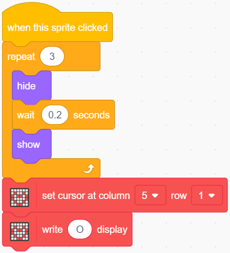

**7. Inicializar el LCD1602**

Después de hacer clic en la bandera verde, configura la dirección I2C del LCD1602 y limpia el último contenido en el fondo.

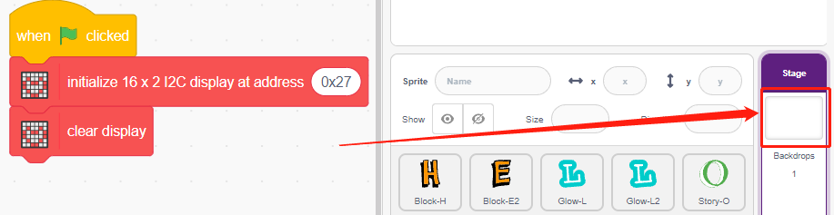