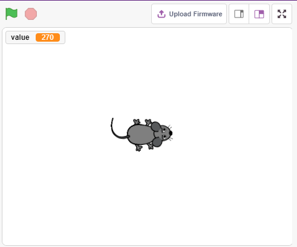
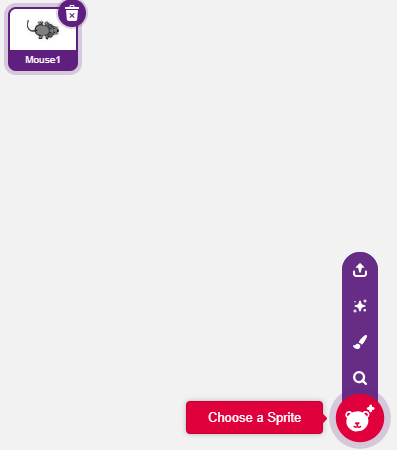
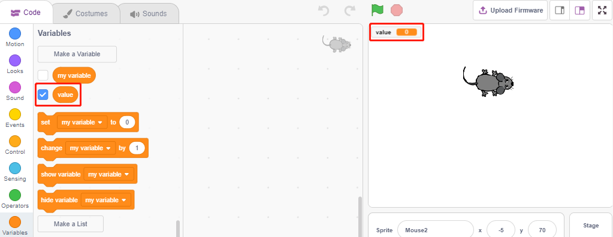
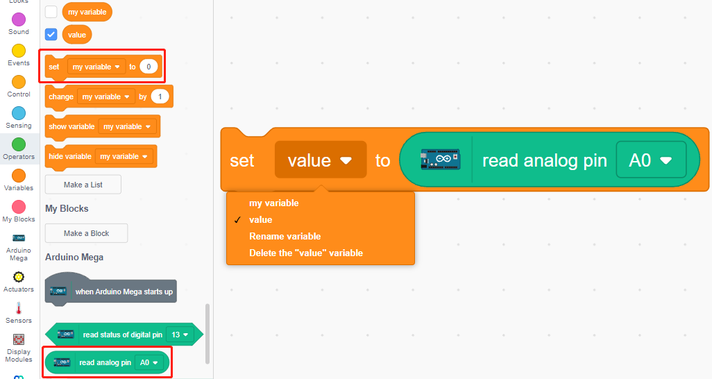
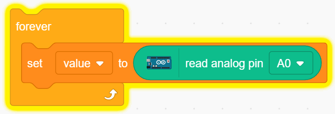
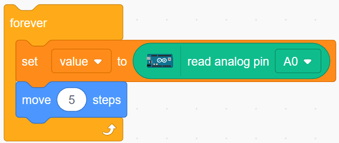
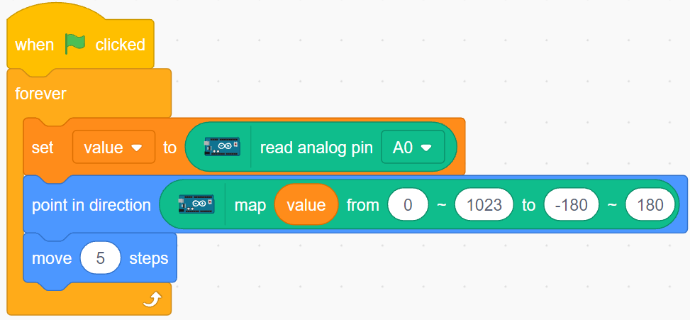

.. _moving_mouse:

2.5 Bewegte Maus
===================

Heute werden wir ein Mausspielzeug bauen, das mit einem Potentiometer gesteuert wird.

Wenn die grüne Fahne angeklickt wird, bewegt sich die Maus auf der Bühne vorwärts, und wenn du das Potentiometer drehst, ändert die Maus ihre Bewegungsrichtung.

Sie werden lernen
---------------------

- Potentiometer-Prinzip
- Ablesen analoger Pins und Bereiche
- Einen Bereich auf einen anderen abbilden
- Bewegen und Ändern der Richtung des Figurs

Aufbau der Schaltung
-----------------------

Das Potentiometer ist ein Widerstandselement mit 3 Anschlüssen. Die 2 seitlichen Pins sind mit 5V und GND verbunden, der mittlere Pin ist mit A0 verbunden. Nach der Umwandlung durch den ADC-Wandler des Arduino-Boards beträgt der Wertebereich 0-1023.

.. image:: img/circuit/potentiometer_circuit.png

* :ref:`cpn_breadboard`
* :ref:`cpn_potentiometer`

Programmierung
------------------

**1. Wählen Sie ein Figur**

Löschen Sie das Standard-Figur, klicken Sie auf die Schaltfläche **Choose a Sprite** in der unteren rechten Ecke des Figur-Bereichs, geben Sie **mouse** in das Suchfeld ein, und klicken Sie dann, um es hinzuzufügen.

**2. Erstellen einer Variable**.

Erstellen Sie eine Variable namens **value**, um den Wert des abgelesenen Potentiometers zu speichern.

Sobald sie erstellt ist, erscheint **value** in der Palette **Variables(Variablen)** und ist markiert, was bedeutet, dass diese Variable auf der Bühne erscheint.

**3. Lesen Sie den Wert von A0**

Speichere den gelesenen Wert von A0 in der Variablen **value**.

* [set my variable to 0]: Setzt den Wert der Variablen.
* [read analog pin A0]: Liest den Wert von A0~A5 im Bereich von 0-1023.

Um den gesamten Bereich lesen zu können, müssen Sie den Block [forever] verwenden. Klicken Sie auf dieses Skript, um es auszuführen, drehen Sie das Potentiometer in beide Richtungen, und Sie werden sehen, dass der Wertebereich 0-1023 beträgt.

**4. Bewege das Figur**

Benutze den [move steps] Block, um das Figur zu bewegen, führe das Skript aus und du wirst sehen, dass sich das Figur von der Mitte nach rechts bewegt.

**5. Ändern der Richtung des Figurs**

Ändern Sie nun die Bewegungsrichtung des Figurs durch den Wert von A0. Da der Wert von A0 von 0-1023 reicht, die Drehrichtung des Figurs aber -180~180 ist, muss ein [map] Block verwendet werden.

Fügen Sie außerdem [when green flag clicked] am Anfang ein, um das Skript zu starten.

* [point in direction <https://en.scratch-wiki.info/wiki/Point_in_Direction_()_(Block)>`_]: Setzt den Lenkungswinkel des Figur, aus der **Bewegung** palette.
* [map from to]: Einen Bereich auf einen anderen Bereich abbilden.

