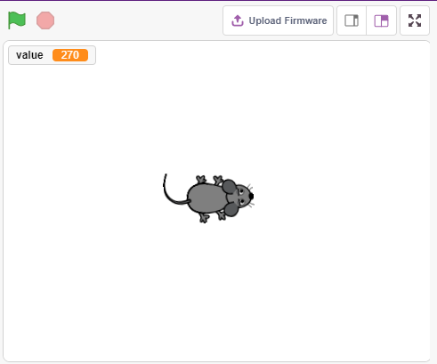
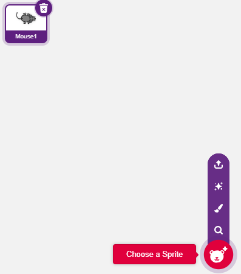
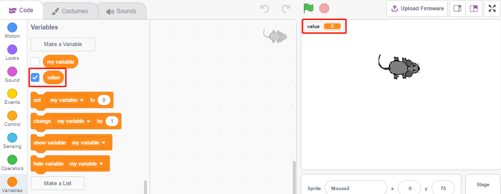
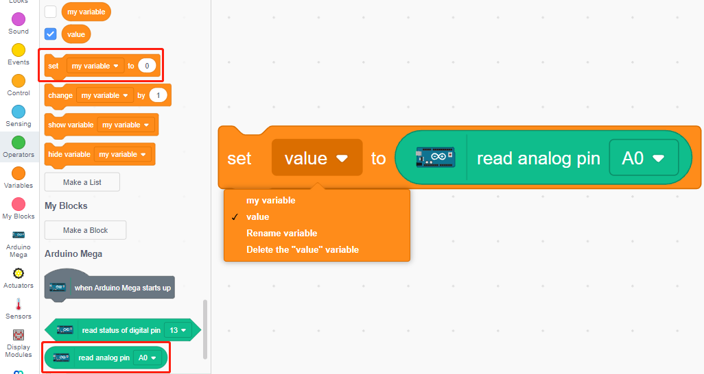
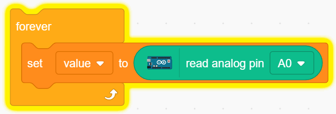
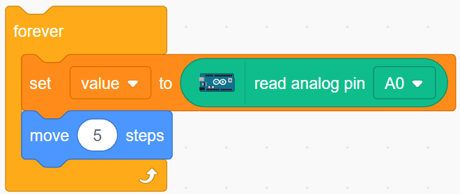
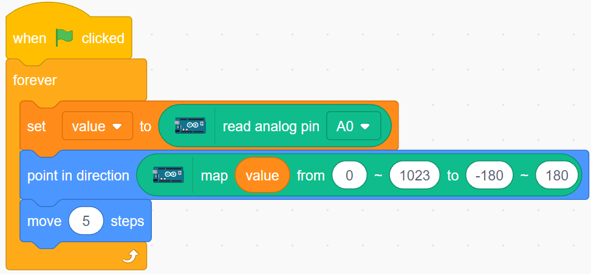

.. note:: 

    Bonjour, bienvenue dans la communauté des passionnés de SunFounder Raspberry Pi, Arduino et ESP32 sur Facebook ! Explorez plus en profondeur le Raspberry Pi, l’Arduino et l’ESP32 avec d’autres passionnés.

    **Pourquoi nous rejoindre ?**

    - **Assistance d'experts** : Résolvez vos problèmes après-vente et techniques grâce à l'aide de notre communauté et de notre équipe.
    - **Apprendre et partager** : Échangez des astuces et tutoriels pour améliorer vos compétences.
    - **Aperçus exclusifs** : Accédez en avant-première aux annonces de nouveaux produits.
    - **Réductions spéciales** : Profitez de remises exclusives sur nos derniers produits.
    - **Promotions festives et concours** : Participez à des concours et promotions festives.

    👉 Prêt à explorer et créer avec nous ? Cliquez sur [|link_sf_facebook|] pour nous rejoindre dès aujourd'hui !

.. _moving_mouse:

2.5 Souris en Mouvement
===========================

Aujourd'hui, nous allons fabriquer un jouet "souris" contrôlé par un potentiomètre.

Lorsque le drapeau vert est cliqué, la souris sur la scène avance, et en tournant le potentiomètre, vous pourrez changer la direction de son mouvement.

Ce Que Vous Apprendrez
--------------------------

- Principe du potentiomètre
- Lecture de la broche analogique et de ses plages
- Mapper une plage vers une autre
- Déplacer et changer la direction d'un lutin

Construire le Circuit
-----------------------

Le potentiomètre est un élément résistif à trois bornes, les deux bornes latérales sont connectées à 5V et GND, et la borne centrale est reliée à A0. Après conversion par le convertisseur ADC de la carte Arduino, la plage de valeurs est de 0 à 1023.

.. image:: img/circuit/potentiometer_circuit.png

* :ref:`cpn_breadboard`
* :ref:`cpn_potentiometer`

Programmation
------------------

**1. Choisir un lutin**

Supprimez le lutin par défaut, cliquez sur le bouton **Choisir un Lutin** dans le coin inférieur droit de la zone des lutins, tapez **mouse** dans la barre de recherche, puis cliquez pour l'ajouter.

**2. Créer une variable**

Créez une variable appelée **valeur** pour stocker la valeur lue du potentiomètre.

Une fois créée, vous verrez **valeur** apparaître dans la palette **Variables** et dans l’état coché, ce qui signifie que cette variable apparaîtra sur la scène.

**3. Lire la valeur de A0**

Stockez la valeur lue de A0 dans la variable **valeur**.

* [définir ma variable à 0] : Définir la valeur de la variable.
* [lire broche analogique A0] : Lire la valeur des broches A0~A5 dans la plage de 0-1023.

Pour effectuer une lecture continue, vous devez utiliser le bloc [toujours]. Cliquez sur ce script pour l'exécuter, tournez le potentiomètre dans les deux directions et vous verrez que la plage de valeurs est de 0 à 1023.

**4. Déplacer le lutin**

Utilisez le bloc [avancer de nombre de pas] pour déplacer le lutin, lancez le script et vous verrez le lutin se déplacer du centre vers la droite.

**5. Changer la direction du lutin**

Maintenant, changez la direction du mouvement du lutin en fonction de la valeur de A0. Comme la valeur de A0 varie de 0 à 1023, mais que l'angle de rotation du lutin est compris entre -180 et 180, un bloc [mapper] doit être utilisé.

Ajoutez également [quand drapeau vert cliqué] au début pour démarrer le script.

* [`point in direction <https://en.scratch-wiki.info/wiki/Point_in_Direction_()_(block)>`_]: Définir l'angle de direction du lutin, depuis la palette **Mouvement**.
* [mapper de à] : Mapper une plage vers une autre.

