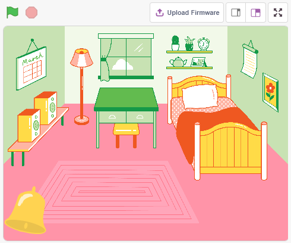
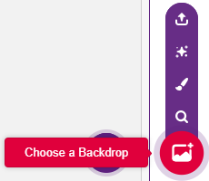
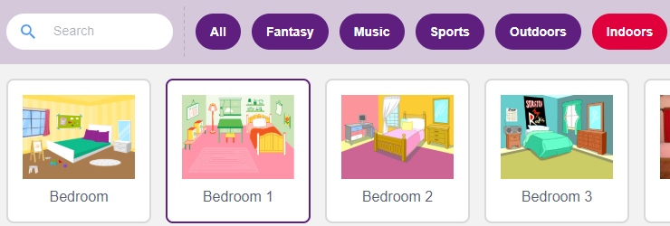
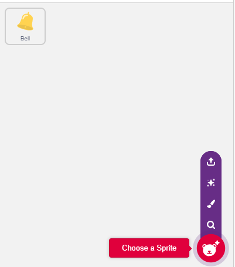
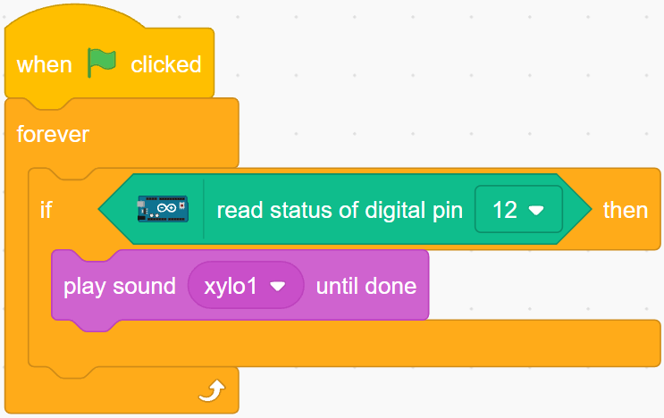

.. _doorbell:

2.6 Doorbell
======================

Here, we will use the button and the bell on the stage to make a doorbell.

When the green flag is clicked, you can press the button and the bell on the stage will make a sound.

You Will Learn
---------------------

- How the button work
- Reading digital pin and ranges
- Creating a conditional loop
- Adding a backdrop
- Playing sound

Build the Circuit
-----------------------

The button is a 4-pin device, since the pin 1 is connected to pin 2, and pin 3 to pin 4, when the button is pressed, the 4 pins are connected, thus closing the circuit.

.. image:: img/5_buttonc.png

Build the circuit according to the following diagram.

* Connect one of the pins on the left side of the button to pin 12, which is connected to a pull-down resistor and a 0.1uF (104) capacitor (to eliminate jitter and output a stable level when the button is working).
* Connect the other end of the resistor and capacitor to GND, and one of the pins on the right side of the button to 5V.

.. image:: img/circuit/button_circuit.png

* :ref:`cpn_breadboard`
* :ref:`cpn_button`
* :ref:`cpn_resistor`
* :ref:`cpn_capacitor`

Programming
------------------

**1. Add a Backdrop**

Click the **Choose a Backdrop** button in the lower right corner.

Choose **Bedroom 1**.

**2. Select the sprite**

Delete the default sprite, click the **Choose a Sprite** button in the lower right corner of the sprite area, enter **bell** in the search box, and then click to add it.

Then select the **bell** sprite on the stage and move it to the right position.

**3. Press the button and the bell makes a sound**

Use [if then] to make a conditional statement that when the value of the pin12 read is equal to 1 (the key is pressed), the sound **xylo1** will be played.

* [read status of digital pin]: This block is from the **Arduino Uno** palette and used to read the value of a digital pin, the result is 0 or 1.
* [`if then <https://en.scratch-wiki.info/wiki/If_()_Then_(block)>`_]: This block is a control block and from **Control** palette. If its boolean condition is true, the blocks held inside it will run, and then the script involved will continue. If the condition is false, the scripts inside the block will be ignored. The condition is only checked once; if the condition turns to false while the script inside the block is running, it will keep running until it has finished.
* [play sound until done]: from the Sound palette, used to play specific sounds.

