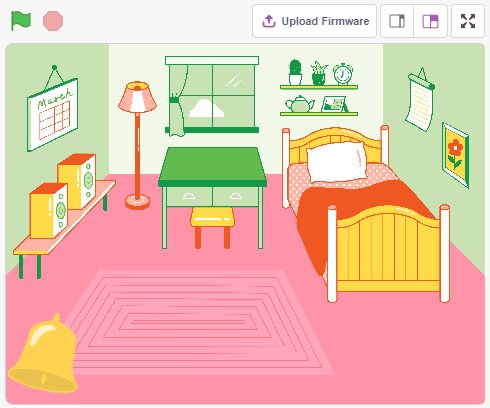
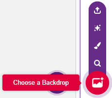
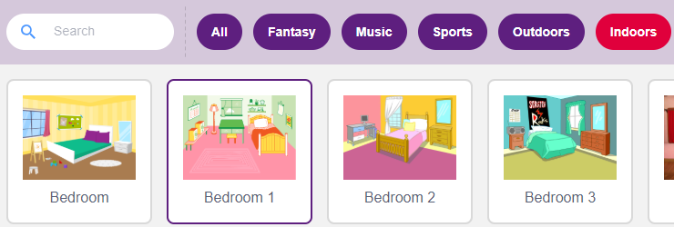
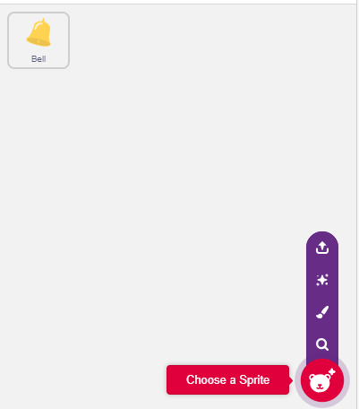
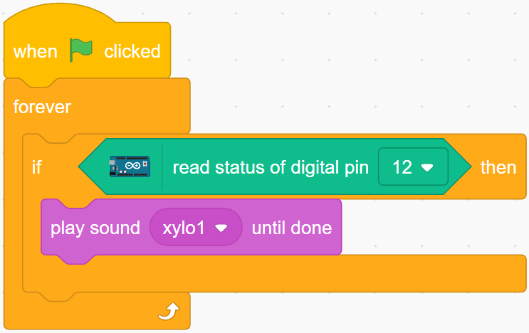

.. note:: 

    Hola, bienvenido a la comunidad de entusiastas de SunFounder Raspberry Pi, Arduino y ESP32 en Facebook. Profundiza en Raspberry Pi, Arduino y ESP32 junto a otros entusiastas.

    **¿Por qué unirse?**

    - **Soporte experto**: Resuelve problemas posventa y desafíos técnicos con ayuda de nuestra comunidad y equipo.
    - **Aprende y comparte**: Intercambia consejos y tutoriales para mejorar tus habilidades.
    - **Avances exclusivos**: Accede anticipadamente a anuncios de nuevos productos y adelantos.
    - **Descuentos especiales**: Disfruta de descuentos exclusivos en nuestros productos más recientes.
    - **Promociones y sorteos festivos**: Participa en sorteos y promociones especiales por festividades.

    👉 ¿Listo para explorar y crear con nosotros? Haz clic en [|link_sf_facebook|] y únete hoy mismo.

.. _doorbell:

2.6 Timbre
===============

Aquí, usaremos el botón y la campana en el escenario para crear un timbre.

Cuando se hace clic en la bandera verde, puedes presionar el botón y la campana en el escenario emitirá un sonido.

Lo que aprenderás
--------------------

- Cómo funciona el botón.
- Leer un pin digital y sus rangos.
- Crear un bucle condicional.
- Agregar un fondo.
- Reproducir sonidos.

Construir el circuito
-----------------------

El botón es un dispositivo de 4 pines; dado que el pin 1 está conectado al pin 2, y el pin 3 al pin 4, cuando se presiona el botón, los 4 pines se conectan, cerrando así el circuito.

.. image:: img/5_buttonc.png

Construye el circuito de acuerdo con el siguiente diagrama:

* Conecta uno de los pines en el lado izquierdo del botón al pin 12, que está conectado a una resistencia pull-down y un condensador de 0.1uF (104) (para eliminar el ruido y generar un nivel estable cuando el botón está funcionando).
* Conecta el otro extremo de la resistencia y el condensador a GND, y uno de los pines del lado derecho del botón a 5V.

.. image:: img/circuit/button_circuit.png

* :ref:`cpn_breadboard`
* :ref:`cpn_button`
* :ref:`cpn_resistor`
* :ref:`cpn_capacitor`

Programación
---------------

**1. Agregar un fondo**

Haz clic en el botón **Elegir un Fondo** en la esquina inferior derecha.

Selecciona **Bedroom 1**.

**2. Seleccionar el sprite**

Elimina el sprite predeterminado, haz clic en el botón **Elegir un Sprite** en la esquina inferior derecha del área de sprites, escribe **bell** en el cuadro de búsqueda y luego haz clic para añadirlo.

Luego selecciona el sprite **bell** en el escenario y muévelo a la posición correcta.

**3. Presiona el botón y la campana emite un sonido**

Usa [if then] para crear una declaración condicional: cuando el valor del pin12 leído sea igual a 1 (el botón está presionado), se reproducirá el sonido **xylo1**.

* [read status of digital pin]: Este bloque está en la paleta de **Arduino Mega** y se utiliza para leer el valor de un pin digital, el resultado es 0 o 1.
* [`if then <https://en.scratch-wiki.info/wiki/If_()_Then_(block)>`_]: Este bloque es de control y está en la paleta **Control**. Si su condición booleana es verdadera, los bloques dentro de él se ejecutarán y el script continuará. Si la condición es falsa, los bloques dentro se ignorarán.
* [play sound until done]: De la paleta de Sonidos, se utiliza para reproducir sonidos específicos.

