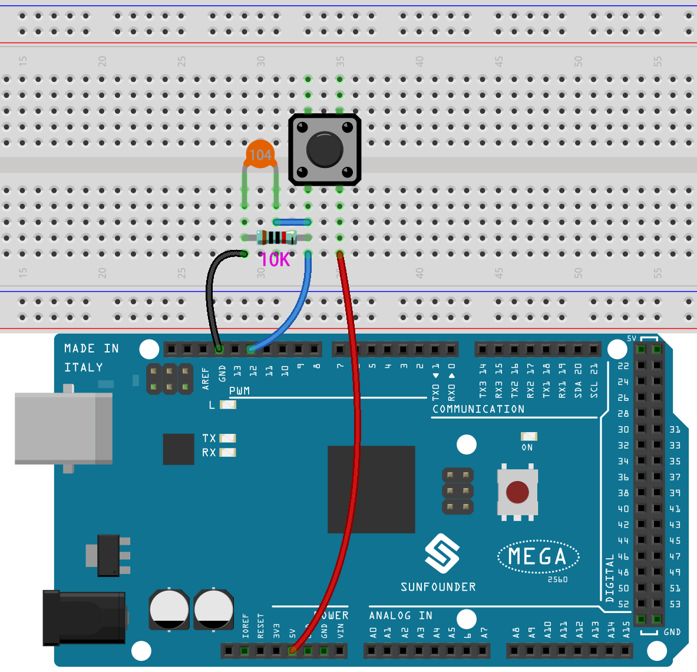

.. _doorbell:

2.6 Türklingel
======================

Hier werden wir den Knopf und die Glocke auf der Bühne benutzen, um eine Türklingel zu machen.

Wenn die grüne Fahne angeklickt wird, kannst du den Knopf drücken und die Glocke auf der Bühne wird einen Ton von sich geben.

.. image:: img/7_doorbell.png

Sie werden lernen
---------------------

- Wie der Knopf funktioniert
- Lesen von digitalen Pins und Bereichen
- Erstellen einer bedingten Schleife
- Hinzufügen eines Hintergrunds
- Ton abspielen

Die Schaltung aufbauen
-----------------------

Der Taster ist ein 4-Pin-Bauteil, da Pin 1 mit Pin 2 und Pin 3 mit Pin 4 verbunden ist. Wenn der Taster gedrückt wird, werden die 4 Pins miteinander verbunden, wodurch der Stromkreis geschlossen wird.

.. image:: img/5_buttonc.png

Baue die Schaltung nach dem folgenden Schema auf.

* Verbinde einen der Stifte auf der linken Seite des Knopfes mit Pin 12, der mit einem Pull-Down-Widerstand und einem 0,1uF (104) Kondensator verbunden ist (um Jitter zu eliminieren und einen stabilen Pegel auszugeben, wenn der Knopf funktioniert).
* Verbinden Sie das andere Ende des Widerstands und des Kondensators mit GND und einen der Pins auf der rechten Seite des Tasters mit 5 V.

* :ref:`cpn_breadboard`
* :ref:`cpn_button`
* :ref:`cpn_water`
* :ref:`cpn_capacitor`

Programmierung
------------------

**1. Eine Kulisse hinzufügen**

Klicken Sie auf die Schaltfläche **Choose a Backdrop** in der unteren rechten Ecke.

.. image:: img/7_backdrop.png

Wählen Sie **Bedroom 1**.

**2. Wählen Sie das Figur**

Löschen Sie das Standard-Figur, klicken Sie auf die Schaltfläche **Choose a Sprite** in der unteren rechten Ecke des Figur-Bereichs, geben Sie **bell** in das Suchfeld ein, und klicken Sie dann, um es hinzuzufügen.

.. image:: img/7_sprite.png

Wähle dann das Figur **bell** auf der Bühne aus und verschiebe es an die richtige Position.

.. image:: img/7_doorbell.png

**3. Drücke den Knopf und die Klingel macht einen Ton**

Benutze [if then], um eine bedingte Anweisung zu machen, die besagt, dass der Ton **xylo1** abgespielt wird, wenn der Wert des gelesenen Pin12 gleich 1 ist (die Taste gedrückt wird).

* [read status of digital pin]: Dieser Block stammt aus der **Arduino Mega**-Palette und wird verwendet, um den Wert eines digitalen Pins zu lesen, das Ergebnis ist 0 oder 1.
* [`if then <https://en.scratch-wiki.info/wiki/If_()_Then_(block)>`_]: Dieser Block ist ein Kontrollblock und stammt aus der **Steuerung**-Palette. Wenn seine boolesche Bedingung wahr ist, werden die darin enthaltenen Blöcke ausgeführt, und das betreffende Skript wird fortgesetzt. Wenn die Bedingung falsch ist, werden die Skripte innerhalb des Blocks ignoriert. Die Bedingung wird nur einmal geprüft; wird die Bedingung zu "false", während das Skript innerhalb des Blocks läuft, wird es so lange ausgeführt, bis es beendet ist.
* [play sound until done]: aus der **Klang**-Palette, um bestimmte Sounds abzuspielen.

