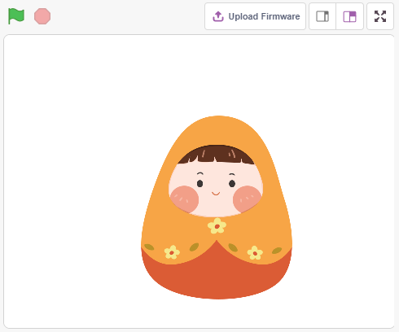
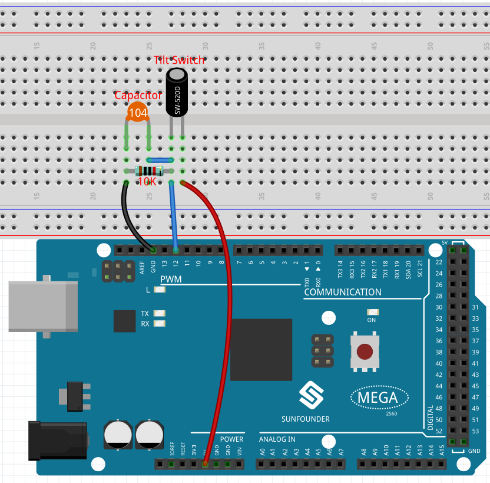
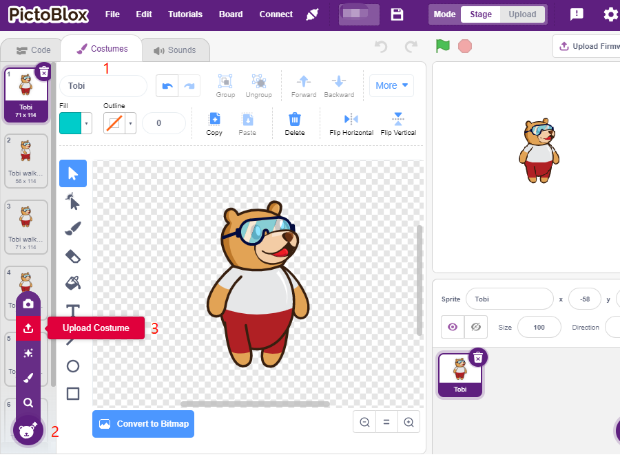
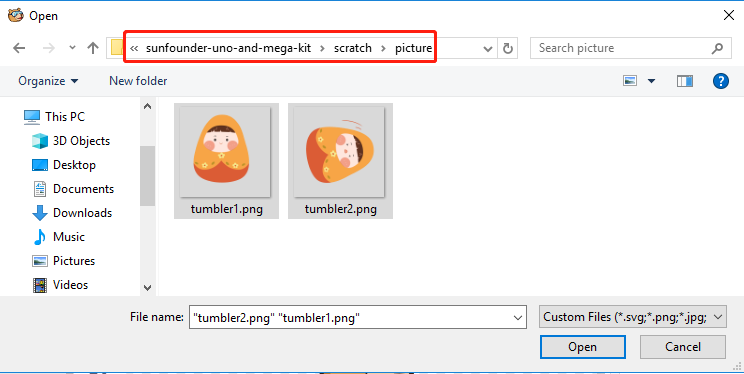
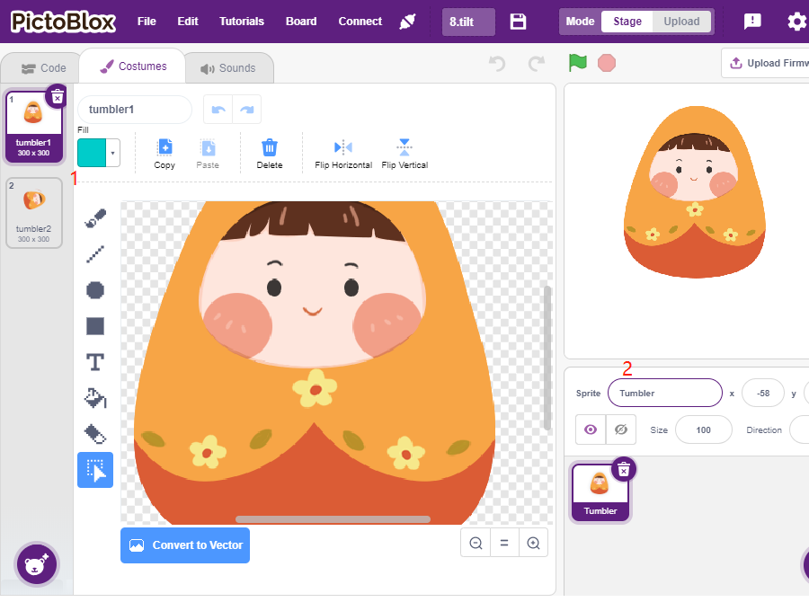
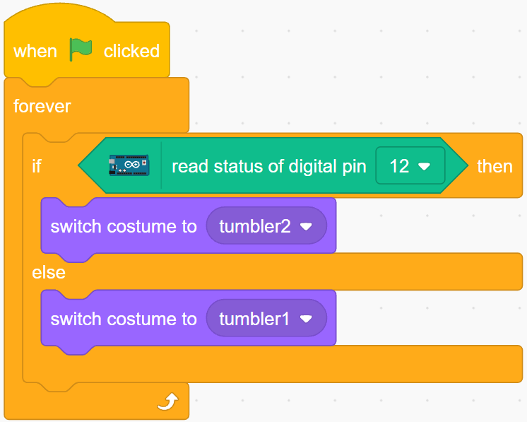

.. note:: 

    Hola, bienvenido a la comunidad de entusiastas de SunFounder Raspberry Pi, Arduino y ESP32 en Facebook. Profundiza en Raspberry Pi, Arduino y ESP32 junto a otros entusiastas.

    **¿Por qué unirse?**

    - **Soporte experto**: Resuelve problemas posventa y desafíos técnicos con ayuda de nuestra comunidad y equipo.
    - **Aprende y comparte**: Intercambia consejos y tutoriales para mejorar tus habilidades.
    - **Avances exclusivos**: Accede anticipadamente a anuncios de nuevos productos y adelantos.
    - **Descuentos especiales**: Disfruta de descuentos exclusivos en nuestros productos más recientes.
    - **Promociones y sorteos festivos**: Participa en sorteos y promociones especiales por festividades.

    👉 ¿Listo para explorar y crear con nosotros? Haz clic en [|link_sf_facebook|] y únete hoy mismo.

.. _tumbler:

2.7 Juguete de Balanceo
=======================

Ahora usamos un interruptor de inclinación para controlar un juguete de balanceo en el escenario, de manera que al inclinar el interruptor, el juguete también se incline.

Lo que aprenderás
-------------------

- Cómo funciona el interruptor de inclinación.
- Bloque [`if then else <https://en.scratch-wiki.info/wiki/If_()_Then,_Else_(block)#:~:text=The%20if%20()%20then%2C%20else,the%20second%20C%20 20will%20activate.>`_] 
- Agregar un sprite externo.

Construir el circuito
-----------------------

El interruptor de inclinación utilizado aquí es un sensor con una bola metálica en su interior. Cuando está en posición vertical, los dos pines están conectados, y cuando se inclina, se separan.

Construye el circuito de acuerdo con el siguiente diagrama:

* Conecta un pin del interruptor de inclinación al pin 12, que está conectado a una resistencia pull-down y un condensador de 0.1uF (104) (usado para eliminar el ruido y generar un nivel estable cuando el interruptor de inclinación está operando).
* Conecta el otro extremo de la resistencia y el condensador a GND y el otro pin del interruptor de inclinación a 5V.

* :ref:`cpn_breadboard`
* :ref:`cpn_tilt`
* :ref:`cpn_resistor`
* :ref:`cpn_capacitor`

Programación
---------------

**1. Personalizar el sprite**

Selecciona el sprite **Tobi** y ve a la página **Disfraces**. Selecciona el ícono en la esquina inferior izquierda y luego selecciona **Cargar Disfraz**.

Luego abre ``tumbler1.png`` y ``tumbler2.png`` en la ruta ``sunfounder_vincent_kit_for_arduino\scratch\picture`` y asegúrate de haber descargado el material correspondiente desde `github <https://github.com/sunfounder/sunfounder_vincent_kit_for_arduino/archive/refs/heads/master.zip>`_.

Elimina los disfraces relacionados con el sprite **Tobi** y cambia el nombre a **Tumbler**. Ahora que hemos personalizado un nuevo sprite llamado Tumbler, comenzamos a programarlo.

**2. Inclinar el interruptor**

Si el valor leído del pin12 es 0 (el interruptor está inclinado), cambia el disfraz del sprite a **tumbler2**, que también está en estado inclinado. De lo contrario, cambia el disfraz del sprite a **tumbler1**, en posición vertical.

* [`if then else <https://en.scratch-wiki.info/wiki/If_()_Then,_Else_(block)#:~:text=The%20if%20()%20then%2C%20else,the%20second%20C%20 20will%20activate.>`_]: El bloque verifica su condición booleana; si la condición es verdadera, el código dentro del primer espacio C se activará; si la condición es falsa, el código dentro del segundo espacio C se activará.
* [=]: El bloque se utiliza para comparar la igualdad de los valores a ambos lados del signo igual, de la paleta **Operadores**.

