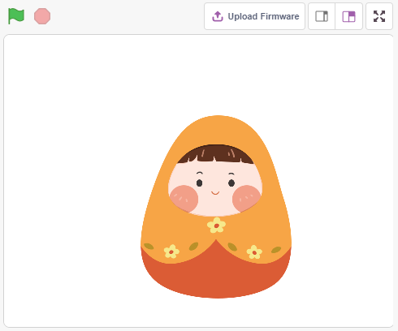

.. _tumbler:

2.7 Becher
=============

Jetzt benutzen wir einen Kippschalter, um den Tumbler auf der Bühne zu steuern, so dass der Schalter gekippt wird und der Tumbler ebenfalls kippt.

Du wirst lernen
---------------------

- Wie der Kippschalter funktioniert
- [`if then else <https://en.scratch-wiki.info/wiki/If_()_Then,_Else_(block)#:~:text=Der%20if%20()%20then%2C%20else,der%20zweite%20C%20 20wird%20aktiviert.>`_] block
- Hinzufügen eines externen Figur

Aufbau der Schaltung
-----------------------

Der hier verwendete Kippschalter ist eine Kugel mit einer Metallkugel im Inneren. Wenn sie aufrecht steht, sind die 2 Stifte miteinander verbunden, und wenn sie gekippt wird, sind sie getrennt.

Baue die Schaltung nach dem folgenden Schema auf:

* Verbinden Sie einen Stift des Kippschalters mit Stift 12, der mit einem Pull-Down-Widerstand und einem Kondensator von 0,1uF (104) verbunden ist (um Jitter zu eliminieren und einen stabilen Pegel auszugeben, wenn der Kippschalter in Betrieb ist).
* Verbinden Sie das andere Ende des Widerstands und des Kondensators mit GND und den anderen Pin des Kippschalters mit 5 V.

.. image:: img/circuit/tilt_circuit.png

* :ref:`cpn_breadboard`
* :ref:`cpn_tilt`
* :ref:`cpn_water`
* :ref:`cpn_capacitor`

Programmierung
------------------

**1. Anpassen des Figur**

Wähle das **Tobi**-Figur und gehe auf die Seite **Costumes**. Wähle das Symbol in der unteren linken Ecke und dann **Upload Costume**.

Öffnen Sie dann ``tumbler1.png`` und ``tumbler2.png`` im Pfad ``sunfounder_vincent_kit_for_arduino\scratch\picture`` und stellen Sie sicher, dass Sie das entsprechende Material von `github <https://github.com/sunfounder/sunfounder_vincent_kit_for_arduino/archive/refs/heads/master.zip>`_ heruntergeladen haben.

Entfernen Sie das **Tobi**-Kostüm des Figur und ändern Sie den Namen in **Tumbler**. Nun, da wir ein neues Figur **Tumbler** angepasst haben, beginnen wir mit dem Scripting.

.. image:: img/8_rename.png

**2. Kippen des Schalters**

Wenn der Wert von Pin 12 als 0 gelesen wird (der Schalter ist gekippt), schalte das Figur-Kostüm auf **tumbler2** um, das sich ebenfalls im gekippten Zustand befindet. Andernfalls schalte das Figur-Kostüm auf **tumbler1**, aufrecht.

* [`if then else <https://en.scratch-wiki.info/wiki/If_()_Then,_Else_(block)#:~:text=Der%20if%20()%20then%2C%20else,der%20zweite%20C%20 20wird%20aktiviert.>`_]: Der Block prüft seine boolesche Bedingung; wenn die Bedingung wahr ist, wird der Code innerhalb des ersten C (Leerzeichen) aktiviert; wenn die Bedingung falsch ist, wird der Code innerhalb des zweiten C aktiviert.
* [=]: Der Block wird verwendet, um die Gleichheit der Werte auf den beiden Seiten des Gleichheitszeichens aus der **Operators**-Platine zu vergleichen.

.. image:: img/8_script.png