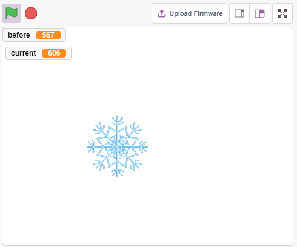
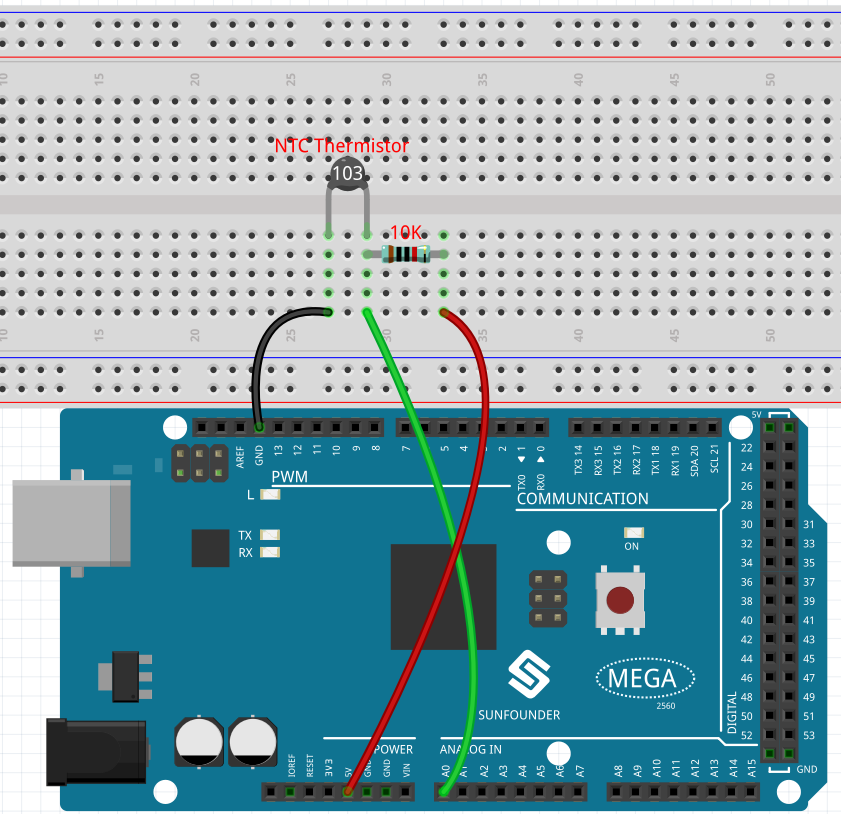
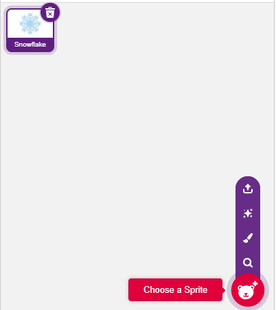
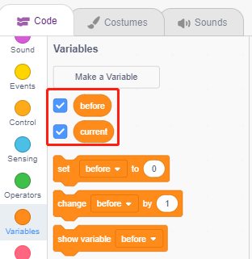
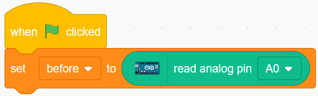
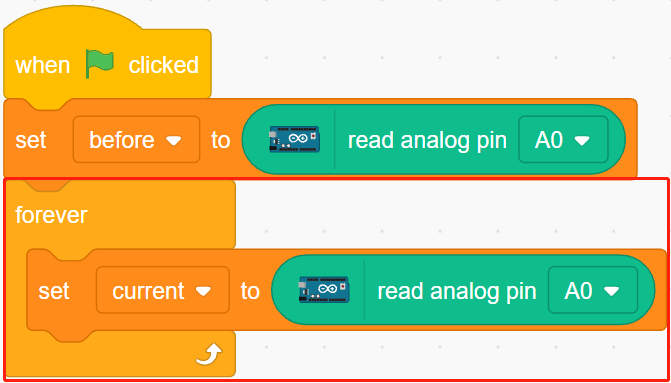
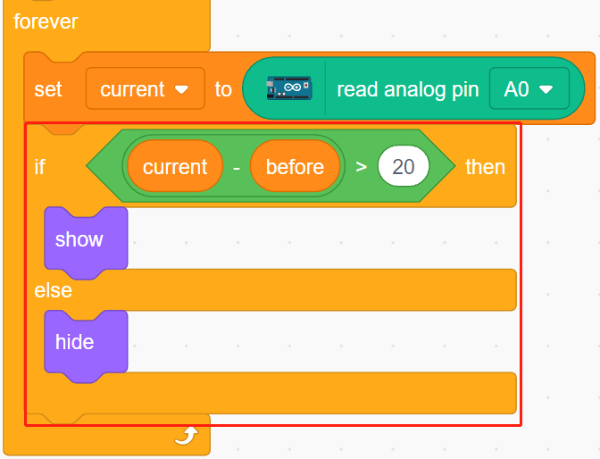

.. _low_temperature:

2.8 Alarm bei niedriger Temperatur
===========================================

In diesem Projekt werden wir ein Alarmsystem für niedrige Temperaturen erstellen. Wenn die Temperatur unter dem Schwellenwert liegt, wird das Figur **Schneeflocke** auf der Bühne erscheinen.

Sie werden lernen
---------------------

- Das Funktionsprinzip eines Thermistors
- Multivariable und subtraktive Operationen

Aufbau der Schaltung
-----------------------

Ein Thermistor ist ein Widerstandstyp, dessen Widerstand stark von der Temperatur abhängt, und zwar stärker als bei Standardwiderständen. Es gibt zwei Arten von Widerständen: PTC (der Widerstand steigt mit steigender Temperatur) und PTC (der Widerstand sinkt mit steigender Temperatur).

Bauen Sie die Schaltung nach dem folgenden Schema auf.

Ein Ende des Thermistors wird an GND angeschlossen, das andere Ende an A0, und ein 10K-Widerstand wird in Reihe an 5V angeschlossen.

Hier wird ein NTC-Thermistor verwendet. Wenn die Temperatur steigt, sinkt der Widerstand des Thermistors, die Spannungsteilung von A0 nimmt ab und der von A0 erhaltene Wert sinkt, und umgekehrt steigt er.

* :ref:`cpn_breadboard`
* :ref:`cpn_thermistor` 
* :ref:`cpn_water`

Programmierung
------------------

**1. Wählen Sie ein Figur**

Löschen Sie das Standard-Figur, klicken Sie auf die Schaltfläche **Choose a Sprite** in der unteren rechten Ecke des Figur-Bereichs, geben Sie **Snowflake** in das Suchfeld ein und klicken Sie dann, um es hinzuzufügen.

**2. Erstellen Sie 2 Variablen**

Erstellen Sie zwei Variablen, **before** und **current**, um den Wert von A0 in verschiedenen Fällen zu speichern.

**3. Lesen Sie den Wert von A0**

Wenn die grüne Flagge angeklickt wird, wird der Wert von A0 gelesen und in der Variablen **before** gespeichert.

**4. Lesen Sie den Wert von A0 erneut aus**

In [forever] wird der Wert von A0 erneut gelesen und in der Variablen **current** gespeichert.

**5. Bestimmung der Temperaturänderungen**

Ermitteln Sie mit Hilfe des [if else]-Blocks, ob der aktuelle Wert von A0 um 50 größer ist als zuvor, was eine Temperaturabnahme bedeutet. Lassen Sie zu diesem Zeitpunkt das Figur **Snowflake** anzeigen, andernfalls ausblenden.

* [-] & [>]: Subtraktions- und Vergleichsoperatoren aus der **Operatoren**-Palette.

