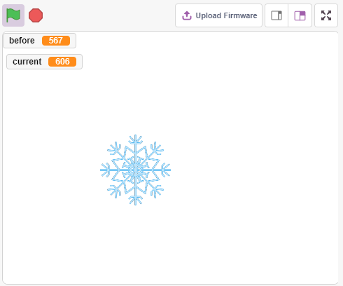
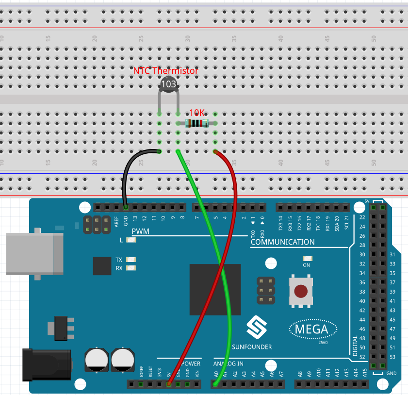
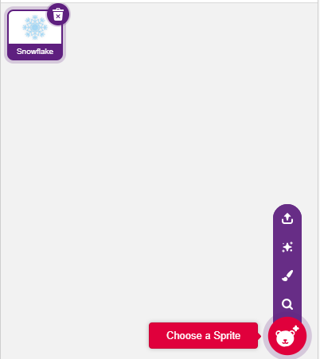
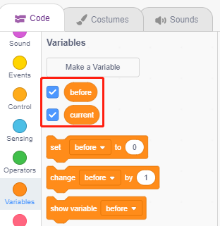
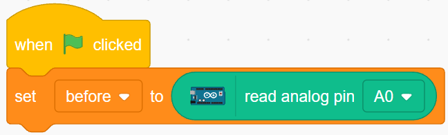
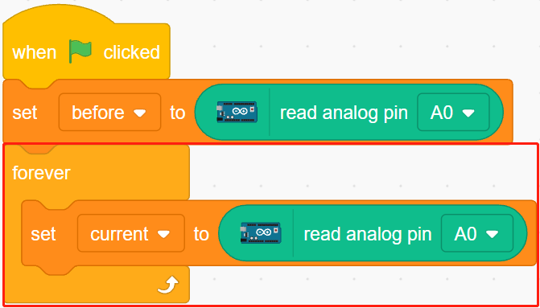
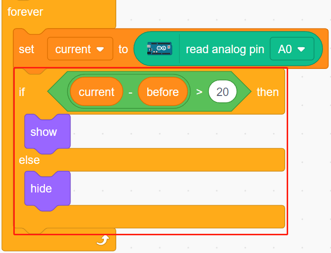

.. note::

    Ciao, benvenuto nella SunFounder Raspberry Pi & Arduino & ESP32 Enthusiasts Community su Facebook! Approfondisci Raspberry Pi, Arduino ed ESP32 con altri appassionati.

    **Perché unirti?**

    - **Supporto esperto**: Risolvi problemi post-vendita e sfide tecniche con l'aiuto della nostra comunità e del nostro team.
    - **Impara e condividi**: Scambia consigli e tutorial per migliorare le tue competenze.
    - **Anteprime esclusive**: Accedi in anteprima agli annunci di nuovi prodotti.
    - **Sconti speciali**: Approfitta di sconti esclusivi sui nostri prodotti più recenti.
    - **Promozioni festive e giveaway**: Partecipa a giveaway e promozioni festive.

    👉 Pronto a esplorare e creare con noi? Clicca [|link_sf_facebook|] e unisciti oggi!

.. _low_temperature:

2.8 Allarme Bassa Temperatura
================================

In questo progetto, realizzeremo un sistema di allarme per basse temperature. Quando la temperatura scende al di sotto della soglia, lo sprite **Snowflake** apparirà sullo stage.

Cosa Imparerai
----------------------

- Principio di funzionamento del termistore
- Operazioni multivariable e sottrattive

Costruire il Circuito
------------------------

Un termistore è un tipo di resistore la cui resistenza dipende fortemente dalla temperatura, più che nei resistori standard. Esistono due tipi di termistori: PTC (la resistenza aumenta all’aumentare della temperatura) e NTC (la resistenza diminuisce all’aumentare della temperatura).

Costruisci il circuito seguendo il diagramma sottostante.

Un’estremità del termistore è collegata a GND, l’altra estremità è collegata ad A0, e un resistore da 10K è collegato in serie a 5V.

Qui utilizziamo un termistore NTC, quindi quando la temperatura aumenta, la resistenza del termistore diminuisce, la tensione di divisione su A0 diminuisce e il valore ottenuto da A0 diminuisce, e viceversa aumenta.

* :ref:`cpn_breadboard`
* :ref:`cpn_thermistor` 
* :ref:`cpn_resistor`

Programmazione
--------------------

**1. Seleziona uno sprite**

Elimina lo sprite predefinito, clicca sul pulsante **Scegli uno Sprite** nell'angolo in basso a destra dell'area degli sprite, inserisci **Snowflake** nella barra di ricerca e clicca per aggiungerlo.

**2. Crea 2 variabili**

Crea due variabili, **prima** e **attuale**, per memorizzare il valore di A0 in diverse condizioni.

**3. Leggi il valore di A0**

Quando si clicca sulla bandiera verde, il valore di A0 viene letto e memorizzato nella variabile **prima**.

**4. Leggi nuovamente il valore di A0**

Nel blocco [per sempre], leggi nuovamente il valore di A0 e memorizzalo nella variabile **attuale**.

**5. Determina le variazioni di temperatura**

Utilizzando il blocco [se altrimenti], determina se il valore attuale di A0 è maggiore di 50 rispetto a quello precedente, il che rappresenta una diminuzione della temperatura. A questo punto, fai apparire lo sprite **Snowflake**, altrimenti nascondilo.

* [-] & [>]: operatori di sottrazione e confronto dal palette **Operatori**.

