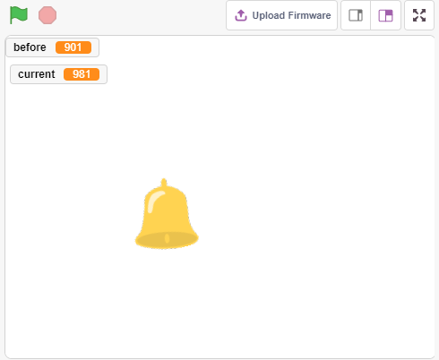
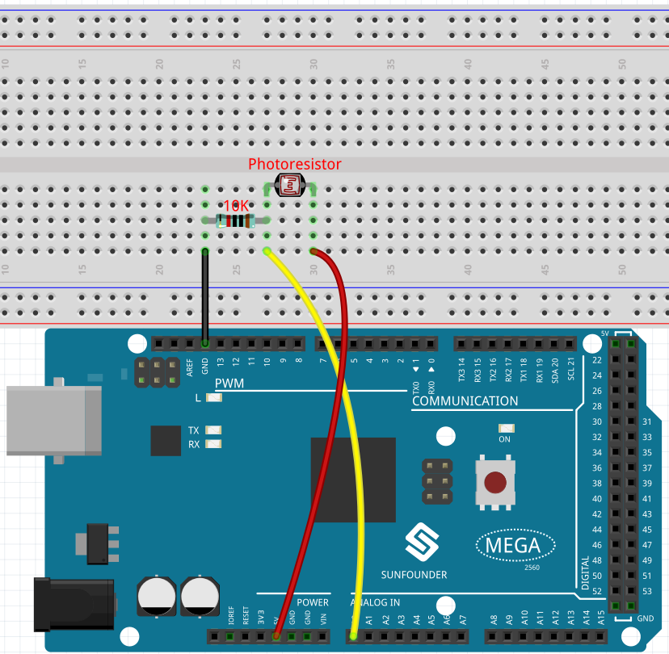
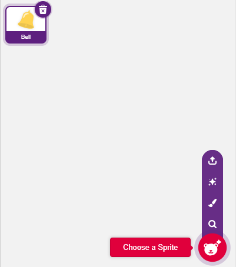
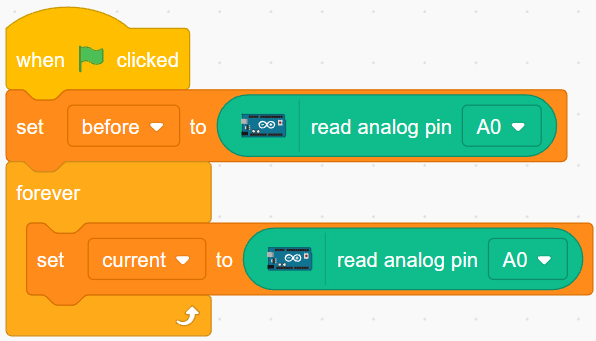
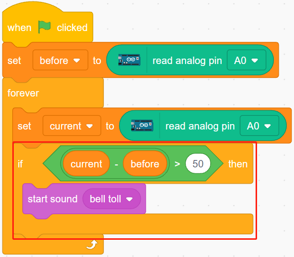
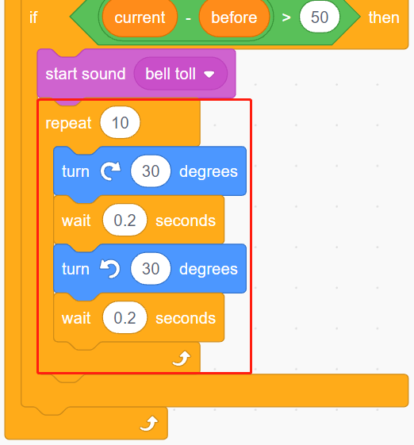
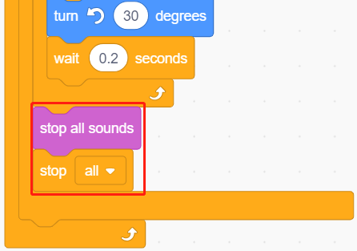

.. _light_alarm:

2.9 Lichtwecker
======================

Im Leben gibt es verschiedene Arten von Zeitweckern. Jetzt wollen wir einen lichtgesteuerten Wecker bauen. Wenn der Morgen anbricht, wird die Helligkeit des Lichts zunehmen und dieser lichtgesteuerte Wecker wird dich daran erinnern, dass es Zeit ist, aufzustehen.

Sie werden lernen
---------------------

- Das Funktionsprinzip eines Fotowiderstandes
- Anhalten der Tonwiedergabe und Anhalten von Skripten

Aufbau der Schaltung
-----------------------

Ein Fotowiderstand oder eine Fotozelle ist ein lichtgesteuerter variabler Widerstand. Der Widerstand eines Fotowiderstands nimmt mit zunehmender Lichtintensität ab.

Bauen Sie die Schaltung nach dem folgenden Schema auf.

Schließe ein Ende des Fotowiderstands an 5 V an, das andere Ende an A0, und schließe an diesem Ende einen 10 K-Widerstand in Reihe mit GND an.

Wenn also die Lichtintensität zunimmt, sinkt der Widerstand des Fotowiderstands, die Spannungsteilung des 10K-Widerstands nimmt zu, und der von A0 erhaltene Wert wird größer.

* :ref:`cpn_breadboard`
* :ref:`cpn_photoresistor` 
* :ref:`cpn_resistor`

Programmierung
------------------

**1. Wählen Sie ein Figur**

Löschen Sie das Standard-Figur, klicken Sie auf die Schaltfläche **Choose a Sprite** in der unteren rechten Ecke des Figur-Bereichs, geben Sie **bell** in das Suchfeld ein, und klicken Sie dann, um es hinzuzufügen.

**2. Lesen Sie den Wert von A0**

Erstellen Sie zwei Variablen **before** und **current**. Wenn die grüne Flagge angeklickt wird, lese den Wert von A0 und speichere ihn in der Variablen **before** als Referenzwert. In [forever] lese den Wert von A0 erneut und speichere ihn in der Variablen **current**.

**3. Einen Ton erzeugen**

Wenn der Wert von A0 größer ist als der vorherige Wert von 50, was bedeutet, dass die aktuelle Lichtintensität größer ist als der Schwellenwert, dann lass das Figur einen Ton erzeugen.

**4. Drehen des Figur**

Benutze [turn block], um das **bell** Figur nach links und rechts drehen zu lassen, um den Alarmeffekt zu erreichen.

**5. Alles stoppen**

Hält den Alarm an, wenn er eine Weile geklingelt hat.

