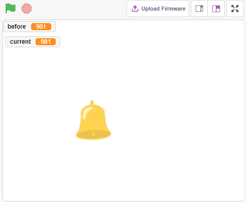
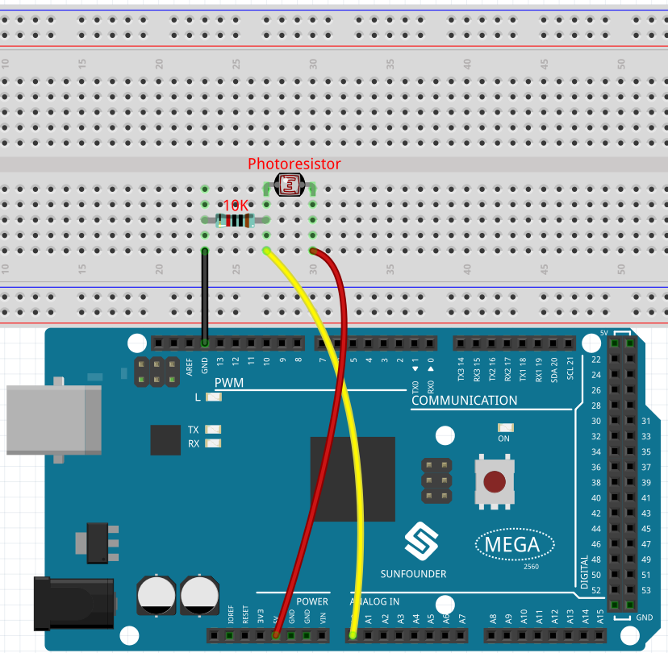
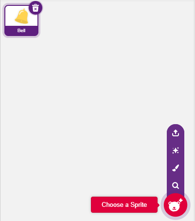
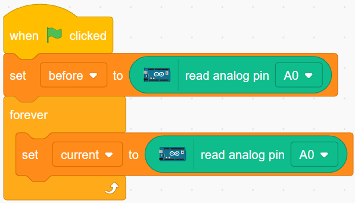
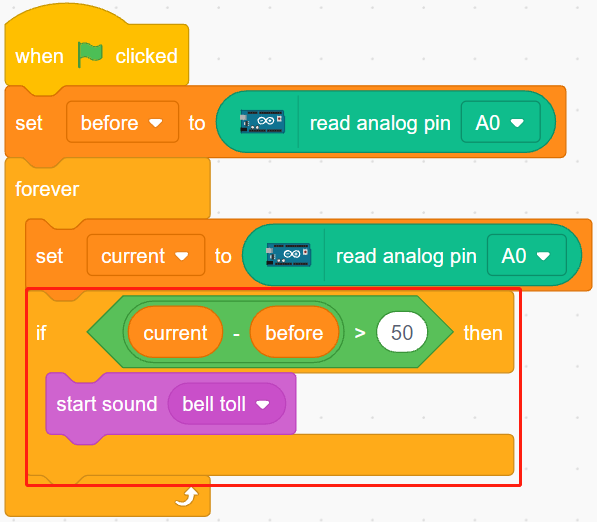
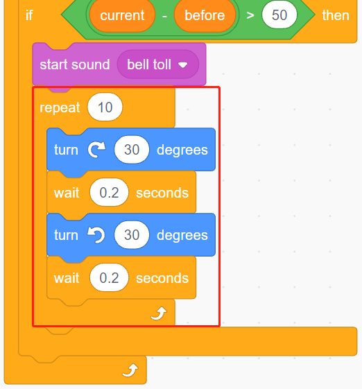
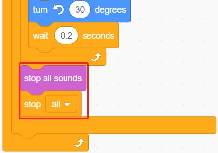

.. note:: 

    Bonjour, bienvenue dans la communauté des passionnés de SunFounder Raspberry Pi, Arduino et ESP32 sur Facebook ! Plongez dans l'univers de Raspberry Pi, Arduino et ESP32 avec d'autres passionnés.

    **Pourquoi nous rejoindre ?**

    - **Support d'experts** : Résolvez les problèmes post-vente et les défis techniques avec l'aide de notre communauté et de notre équipe.
    - **Apprendre et partager** : Échangez des astuces et des tutoriels pour améliorer vos compétences.
    - **Aperçus exclusifs** : Accédez en avant-première aux nouvelles annonces de produits et aux aperçus.
    - **Réductions spéciales** : Profitez de réductions exclusives sur nos produits récents.
    - **Promotions festives et concours** : Participez aux concours et promotions festives.

    👉 Prêt à explorer et créer avec nous ? Cliquez sur [|link_sf_facebook|] et rejoignez-nous dès aujourd'hui !

.. _light_alarm:

2.9 Réveil Lumineux
======================

Dans la vie quotidienne, il existe différents types de réveils. Créons maintenant un réveil contrôlé par la lumière. Quand le matin arrive, la luminosité augmente, et ce réveil lumineux vous rappellera qu'il est temps de vous lever.

Vous Apprendrez
---------------------

- Principe de fonctionnement de la photo-résistance
- Arrêter la lecture du son et arrêter l'exécution des scripts

Construire le Circuit
-----------------------

Une photo-résistance, ou cellule photoélectrique, est une résistance variable contrôlée par la lumière. La résistance d'une photo-résistance diminue avec l'augmentation de l'intensité lumineuse incidente.

Construisez le circuit selon le schéma suivant.

Connectez une extrémité de la photo-résistance à 5V, l'autre extrémité à A0, et ajoutez une résistance de 10K en série avec la masse (GND) à cette extrémité.

Ainsi, lorsque l'intensité lumineuse augmente, la résistance de la photo-résistance diminue, la tension sur la résistance de 10K augmente, et la valeur obtenue par A0 devient plus grande.

* :ref:`cpn_breadboard`
* :ref:`cpn_photoresistor` 
* :ref:`cpn_resistor`

Programmation
------------------

**1. Sélectionnez un lutin**

Supprimez le lutin par défaut, puis cliquez sur le bouton **Choisir un lutin** en bas à droite de la zone des lutins, entrez **cloche** dans la barre de recherche, et cliquez pour l'ajouter.

**2. Lire la valeur de A0**

Créez deux variables, **avant** et **actuel**. Lorsque le drapeau vert est cliqué, lisez la valeur de A0 et stockez-la dans la variable **avant** comme valeur de référence. Dans [pour toujours], relisez la valeur de A0 et stockez-la dans la variable **actuel**.

**3. Émettre un son**

Lorsque la valeur actuelle de A0 est supérieure de 50 à la précédente, ce qui indique que l'intensité lumineuse est supérieure au seuil, faites émettre un son au lutin.

**4. Faire tourner le lutin**

Utilisez le [bloc tourner] pour faire tourner le lutin **cloche** à gauche et à droite, créant ainsi l'effet d'alarme.

**5. stop all**

Arrêtez l'alarme après qu'elle ait sonné pendant un certain temps.

