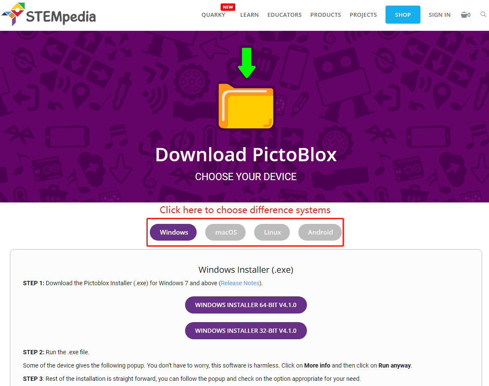

1.1 Installieren Sie PictoBlox
===================================

Klicken Sie auf diesen Link: https://thestempedia.com/product/pictoblox/download-pictoblox/，wählen Sie das entsprechende Betriebssystem (Windows, macOS, Linux) und befolgen Sie die Installationsschritte.

