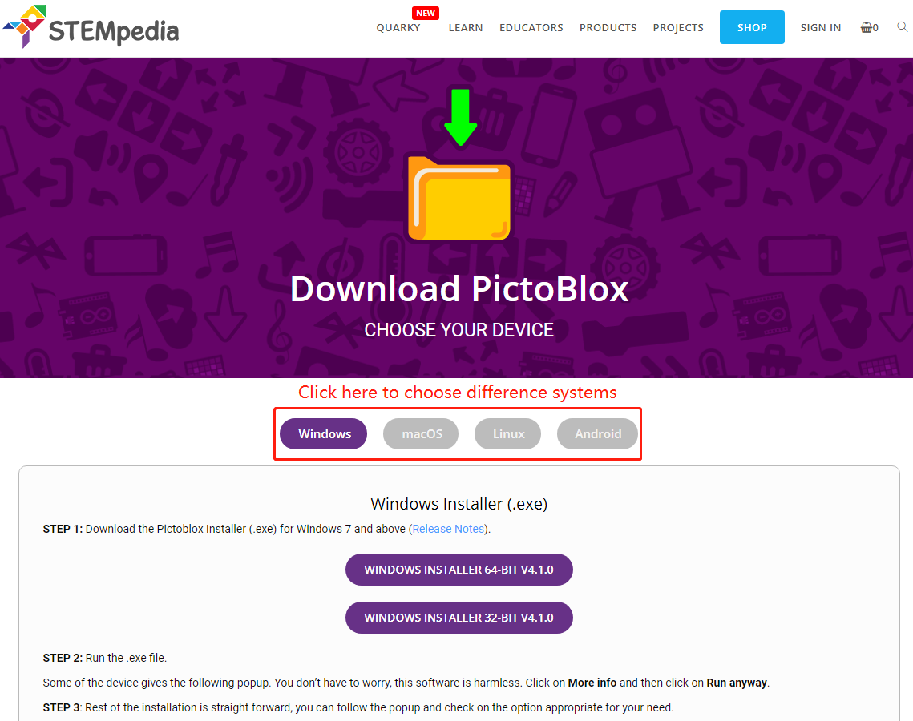

.. note:: 

    Bonjour et bienvenue dans la communauté des passionnés de Raspberry Pi, Arduino et ESP32 de SunFounder sur Facebook ! Plongez au cœur de Raspberry Pi, Arduino et ESP32 avec d’autres passionnés.

    **Pourquoi nous rejoindre ?**

    - **Support d’experts** : Résolvez vos problèmes après-vente et défis techniques avec l’aide de notre communauté et de notre équipe.
    - **Apprendre & Partager** : Échangez des conseils et des tutoriels pour améliorer vos compétences.
    - **Aperçus exclusifs** : Profitez d’un accès anticipé aux nouvelles annonces de produits.
    - **Réductions spéciales** : Bénéficiez de réductions exclusives sur nos derniers produits.
    - **Promotions festives et cadeaux** : Participez aux concours et promotions spéciales des fêtes.

    👉 Prêt à explorer et créer avec nous ? Cliquez sur [|link_sf_facebook|] et rejoignez-nous dès aujourd’hui !

1.1 Installer PictoBlox
===========================

Cliquez sur ce lien : https://thestempedia.com/product/pictoblox/download-pictoblox/, sélectionnez le système d'exploitation correspondant (Windows, macOS, Linux) et suivez les étapes d'installation.

