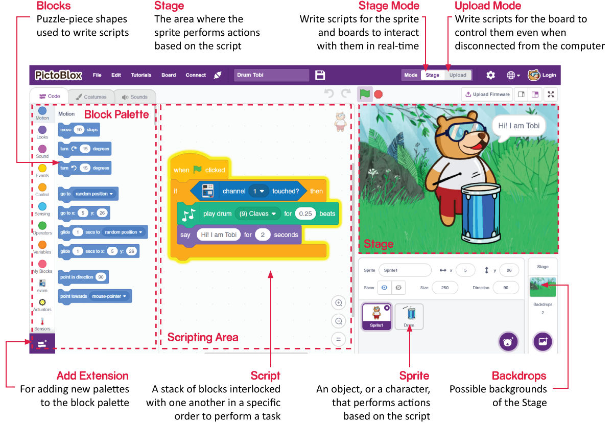

1.2 Einführung in die Benutzeroberfläche
=============================================

**Figur**

Ein Figur ist ein Objekt oder eine Figur, die verschiedene Aktionen in einem Projekt ausführt. Es versteht und befolgt die ihm gegebenen Befehle. Jeder Figur hat spezifische Kostüme und Sounds, die Sie auch anpassen können.

**Stage**

Die **Stage** ist sder Bereich, in dem der Figur gemäß Ihrem Programm Aktionen in Kulissen ausführt.

**Backdrops**

Kulissen werden verwendet, um die **Stage** zu dekorieren. Sie können einen Hintergrund von PictoBlox auswählen, selbst einen zeichnen oder ein Bild von Ihrem Computer hochladen.

**Scripting Area**

Ein Skript ist ein Programm oder ein Code im PictoBlox/Scratch-Jargon. Es ist eine Reihe von „Blöcken“, die in einer bestimmten Reihenfolge angeordnet sind, um eine Aufgabe oder eine Reihe von Aufgaben auszuführen. Sie können mehrere Skripts schreiben, die alle gleichzeitig ausgeführt werden können. Sie können Skripte nur im Skriptbereich in der Mitte des Bildschirms schreiben.

**Blocks**

Blöcke sind wie Teile eines Puzzles, die zum Schreiben von Programmen verwendet werden, indem sie einfach im Skriptbereich aneinander gestapelt werden. Die Verwendung von Blöcken zum Schreiben von Code kann die Programmierung vereinfachen und die Wahrscheinlichkeit von Fehlern verringern.

**Block Palette**

Die Blockpaletten befinden sich im linken Bereich und sind nach ihren Funktionen wie Bewegung, Sound und Steuerung benannt. Jede Palette verfügt über unterschiedliche Blöcke. Beispielsweise steuern die Blöcke in der Bewegungspalette die Bewegung der Figurs, und die Blöcke in der Steuerungspalette steuern die Arbeit des Skripts basierend auf bestimmten Bedingungen.

Es gibt andeere Arten von Blockpaletten, die über die Schaltfläche Erweiterung hinzufügen unten links geladen werden können.

**Mode**

Im Gegensatz zu Scratch hat PictoBlox zwei Modi:

* :ref:`stage_mode`: In diesem Modus können Sie Skripte für Figurs und Boards schreiben, um in Echtzeit mit Figurs zu interagieren. Wenn Sie das Board mit Pictoblox trennen, können Sie nicht mehr interagieren.
* :ref:`upload_mode`: In diesem Modus können Sie Skripte schreiben und auf das Board hochladen, damit Sie es verwenden können, auch wenn es nicht mit Ihrem Computer verbunden ist. Sie müssen beispielsweise ein Skript hochladen, um sich bewegende Roboter zu erstellen.

Weitere Informationen finden Sie unter: https://thestempedia.com/tutorials/getting-started-pictoblox