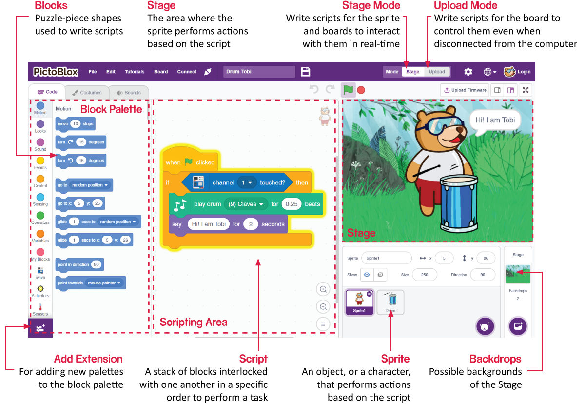

.. note::

    Hello, welcome to the SunFounder Raspberry Pi & Arduino & ESP32 Enthusiasts Community on Facebook! Dive deeper into Raspberry Pi, Arduino, and ESP32 with fellow enthusiasts.

    **Why Join?**

    - **Expert Support**: Solve post-sale issues and technical challenges with help from our community and team.
    - **Learn & Share**: Exchange tips and tutorials to enhance your skills.
    - **Exclusive Previews**: Get early access to new product announcements and sneak peeks.
    - **Special Discounts**: Enjoy exclusive discounts on our newest products.
    - **Festive Promotions and Giveaways**: Take part in giveaways and holiday promotions.

    👉 Ready to explore and create with us? Click [|link_sf_facebook|] and join today!

1.2 Interface Introduction
================================

**Sprites**

A sprite is an object, or a character, that performs different actions in a project. It understands and obeys the commands given to it. Each sprite has specific costumes and sounds that you can also customize.

**Stage**

The stage is the area where the sprite performs actions in backdrops according to your program. 

**Backdrops**

Backdrops are used to decorate the stage. You can choose a backdrop from PictoBlox, draw one yourself or upload an image from your computer.

**Script Area**

A script is a program or a code in PictoBlox/Scratch lingo.  It is a set of "blocks" arranged in a specific order to perform a task or a series of tasks. You can write multiple scripts, all of which can run simultaneously. You can only write scripts in the script area in the center of the screen.

**Blocks**

Blocks are like pieces of a puzzle that are used to write programs by simply stacking them together in the script area. Using blocks to write code can make programming easier and reduce the probability of errors.

**Block Palette**

The block palettes are located in the left area and are named by their functions, such as motion, sound and control. Each palette has different blocks, for example, the blocks in the Motion palette will control the movement of the sprites, and the blocks in the Control palette will control the work of the script based on specific conditions.

There are other kinds of block palettes that can be loaded from the **Add Extension** button located at the bottom left.

**Modes**

Unlike Scratch, PictoBlox has two modes:

* :ref:`Stage Mode`: In this mode, you can write scripts for the sprite and boards to interact with sprites in real-time. If you disconnect the board with Pictoblox, you cannot interact anymore.
* :ref:`Upload Mode`: This mode allows you to write scripts and upload it to the board so that you can use even when it is not connected to your computer, for example, you need to upload a script for making moving robots.

For more information, please refer to: https://thestempedia.com/tutorials/getting-started-pictoblox