1.3 Kurzanleitung zu PictoBlox
====================================

Lassen Sie uns nun lernen, wie man PictoBlox in zwei Modi verwendet.

Außerdem gibt es eine On-Board-LED, die mit Pin 13 auf dem Arduino Uno/Mega2560 verbunden ist. Wir werden lernen, diese LED in 2 verschiedenen Modi blinken zu lassen.

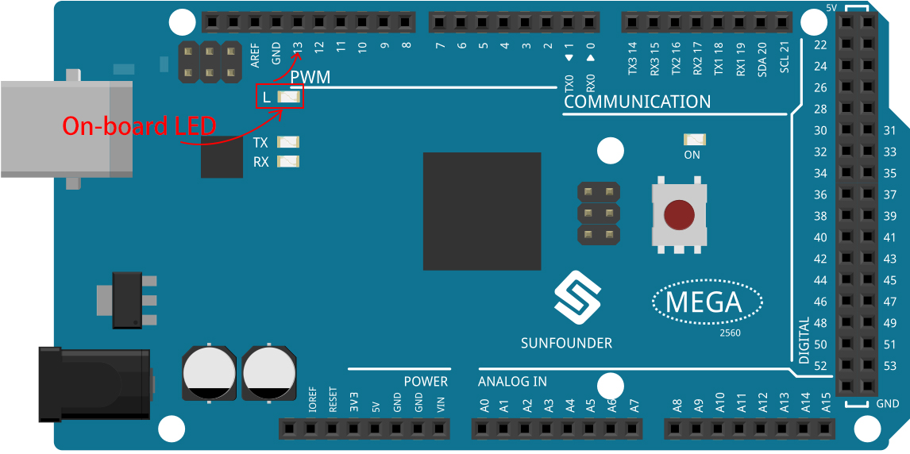

.. _stage_mode:

Stage Mode
---------------

**1. Anschließen an das Arduino-Board**

Schließen Sie Ihr Arduino-Board mit einem USB-Kabel an den Computer an. Normalerweise erkennt der Computer Ihr Board automatisch und weist ihm schließlich einen COM-Port zu.

Öffnen Sie PictoBlox, die Python-Programmierschnittstelle wird standardmäßig geöffnet. Und wir müssen auf die **Blocks**-Schnittstelle umschalten.

.. image:: img/0_choose_blocks.png

Dann sehen Sie in der oberen rechten Ecke die Möglichkeit, den Modus zu wechseln. Die Voreinstellung ist der Stage Mode, in dem Tobi auf der Bühne steht.

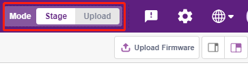

Klicke in der oberen rechten Navigationsleiste auf **Board**, um das Brett auszuwählen.

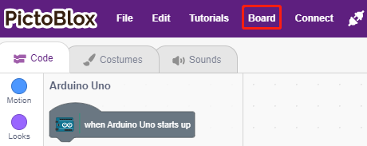

Wählen Sie zum Beispiel **Arduino Mega**.

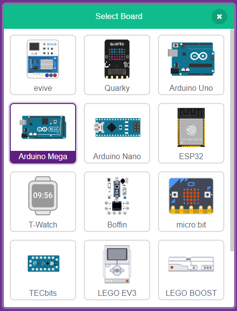

Es öffnet sich dann ein Verbindungsfenster, in dem Sie den Port auswählen können, mit dem Sie sich verbinden möchten. Sobald die Verbindung hergestellt ist, kehren Sie zur Startseite zurück. Wenn Sie die Verbindung während der Nutzung unterbrechen, können Sie auch auf **Connect** klicken, um die Verbindung wiederherzustellen.

.. image:: img/1_connect.png

Gleichzeitig erscheinen in der **Block Palette** Arduino-Mega-bezogene Paletten wie Arduino Mega, Aktuatoren usw..

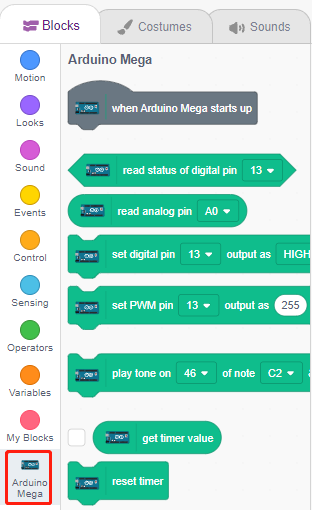

**2. Firmware hochladen**

Da wir im Stage-Modus arbeiten werden, müssen wir die Firmware auf das Board hochladen. Dadurch wird die Echtzeitkommunikation zwischen dem Board und dem Computer sichergestellt. Das Hochladen der Firmware ist ein einmaliger Vorgang. Klicken Sie dazu auf die Schaltfläche Upload Firmware.

Nachdem Sie eine Weile gewartet haben, erscheint die Meldung, dass das Hochladen erfolgreich war.

.. note::

    Wenn Sie dieses Arduino-Board zum ersten Mal in PictoBlox verwenden oder wenn dieses Arduino zuvor mit der Arduino-IDE hochgeladen wurde. Dann müssen Sie auf **Upload Firmware** tippen, bevor Sie es verwenden können.

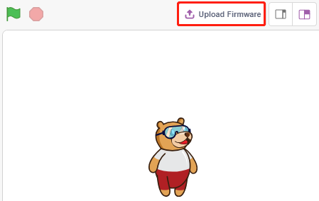

**3. Programmieren**

* Öffnen Sie das Skript und führen Sie es direkt aus

Natürlich können Sie die Skripte direkt öffnen, um sie auszuführen, aber bitte laden Sie sie zuerst von `github <https://github.com/sunfounder/sunfounder_vincent_kit_for_arduino/archive/refs/heads/master.zip>`_ herunter.

Du kannst oben rechts auf **File** klicken und dann **Open** wählen.

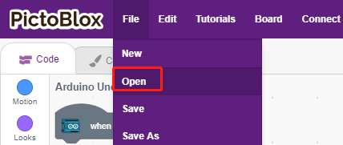

Wählen Sie **Open from Computer**.

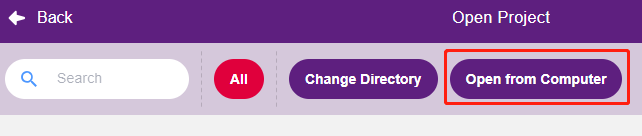

Gehen Sie dann in den Pfad von ``sunfounder_vincent_kit_for_arduino\scratch\code``, und öffnen Sie **1. Stage Mode.sb3**. Bitte stellen Sie sicher, dass Sie den benötigten Code von `github <https://github.com/sunfounder/sunfounder_vincent_kit_for_arduino/archive/refs/heads/master.zip>`_ heruntergeladen haben.

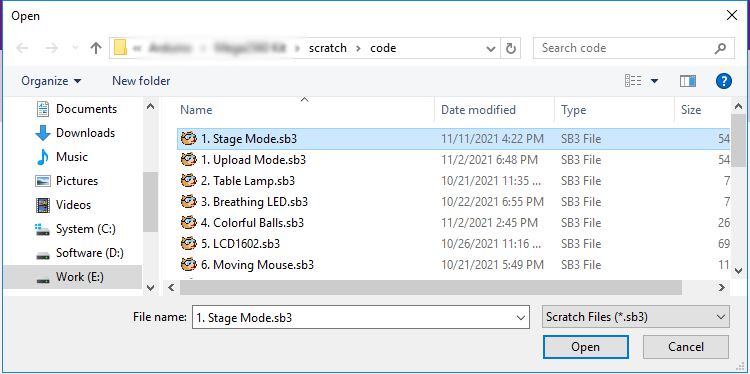

Klicken Sie direkt auf das Skript, um es auszuführen, bei manchen Projekten klicken Sie auf die grüne Flagge oder auf das Figur.

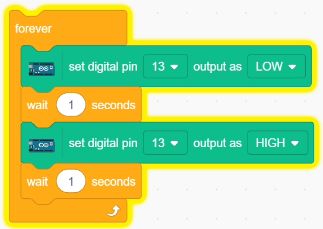

* Programm Schritt für Schritt

Du kannst das Skript auch Schritt für Schritt schreiben, indem du diese Schritte befolgst.

Klicke auf die Palette **Arduino Mega**.

Die LED auf dem Arduino-Board wird über den digitalen Pin 13 gesteuert (nur 2 Zustände, HIGH oder LOW), also ziehen Sie den Block [set digital pin out as] in den Skriptbereich.

Da die LED standardmäßig leuchtet, setzen Sie Pin 13 auf LOW und klicken Sie auf diesen Block, um zu sehen, wie die LED erlischt.

* [set digital pin out as]: Setzen Sie die digitalen Pins (2~13) auf (HIGH/LOW) Pegel.

.. image:: img/1_digital.png

Um den Effekt der kontinuierlich blinkenden LED zu sehen, müssen Sie die Blöcke [Wait 1 seconds] und [forever] in der **Steuerung**-Palette verwenden. Klicken Sie auf diese Blöcke nach dem Schreiben, es gibt einen gelben Lichthof bedeutet, dass es läuft.

* [Wait 1 seconds]: aus der **Steuerung**-Palette, wird verwendet, um das Zeitintervall zwischen 2 Blöcken einzustellen.
* Für immer]: aus der **Steuerung**-Palette, lässt das Skript weiterlaufen, wenn es nicht manuell angehalten wird.

.. _upload_mode:

Upload-Modus
---------------

**1. Anschließen an das Arduino-Board**

Schließen Sie Ihr Arduino-Board mit einem USB-Kabel an den Computer an. Normalerweise erkennt der Computer Ihr Board automatisch und weist ihm einen COM-Port zu.

Öffnen Sie PictoBlox und klicken Sie auf **Board** in der Navigationsleiste oben rechts, um das Board auszuwählen.

Wählen Sie zum Beispiel **Arduino Mega**.

Es öffnet sich dann ein Verbindungsfenster, in dem Sie den Port auswählen können, mit dem Sie sich verbinden möchten. Sobald die Verbindung hergestellt ist, kehren Sie zur Startseite zurück. Wenn Sie die Verbindung während der Nutzung unterbrechen, können Sie auch auf **Connect** klicken, um die Verbindung wiederherzustellen.

.. image:: img/1_connect.png

Gleichzeitig erscheinen in der **Block Palette** Arduino-Mega-bezogene Paletten, wie z. B. Arduino Mega, Aktuatoren usw..

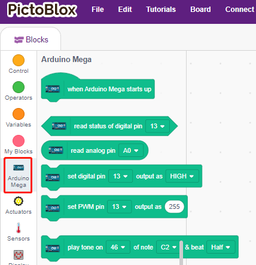

Nachdem Sie den Upload-Modus ausgewählt haben, wechselt die Bühne in den ursprünglichen Arduino-Code-Bereich.

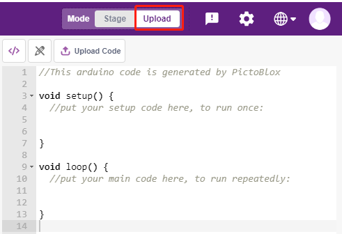

**2. Programmieren**

* Öffnen Sie das Skript und führen Sie es direkt aus.

Du kannst auf **File** in der oberen rechten Ecke klicken.

Wählen Sie **Open from Computer**.

Gehen Sie dann in den Pfad von ``sunfounder_vincent_kit_for_arduino\scratch\code``, und öffnen Sie **1. Upload Mode.sb3**. Bitte stellen Sie sicher, dass Sie den benötigten Code von `github <https://github.com/sunfounder/sunfounder_vincent_kit_for_arduino/archive/refs/heads/master.zip>`_ heruntergeladen haben.

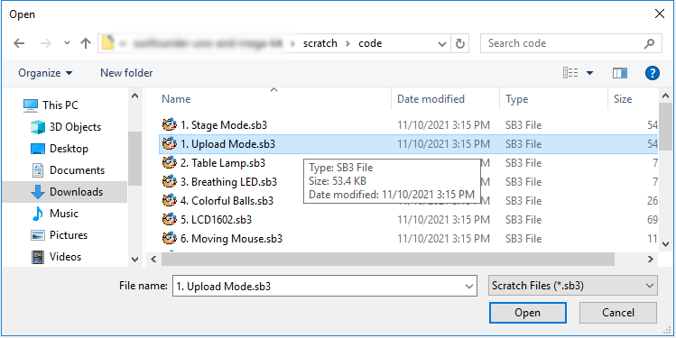

Klicken Sie schließlich auf die Schaltfläche **Upload Code**.

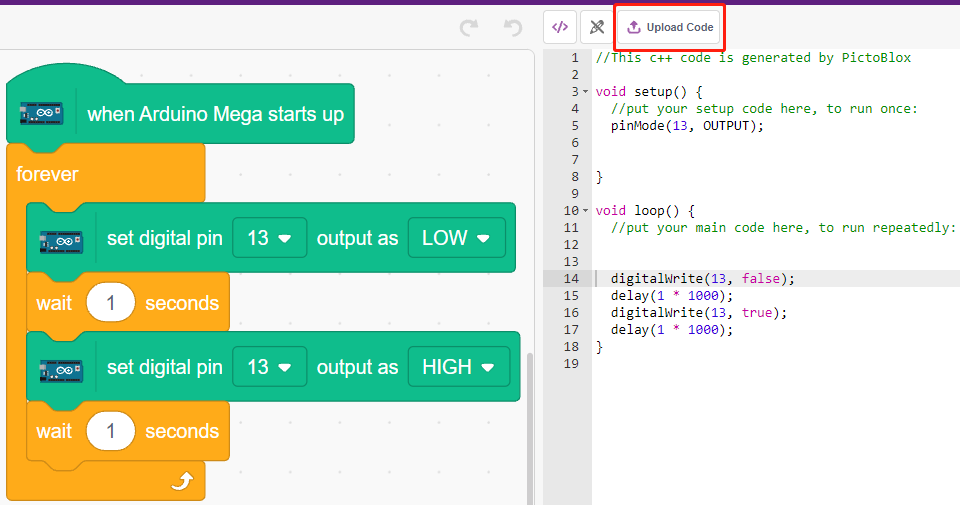

* Programm Schritt für Schritt

Sie können das Skript auch Schritt für Schritt schreiben, indem Sie diese Schritte befolgen.

Klicken Sie auf die Palette **Arduino Mega**.

Ziehen Sie [When Arduino Mega starts up] in den Skriptbereich, der für jedes Skript erforderlich ist.

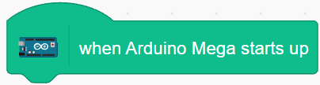

Die LED auf dem Arduino-Board wird durch den digitalen Pin13 gesteuert (nur 2 Zustände HIGH oder LOW), also ziehen Sie den Block [set digital pin out as] in den Skriptbereich.

Da die LED standardmäßig leuchtet, setzen Sie Pin 13 auf LOW und klicken Sie auf diesen Block, um zu sehen, wie die LED erlischt.

* [set digital pin out as]: Setzen Sie den digitalen Pin (2~13) auf (HIGH/LOW).

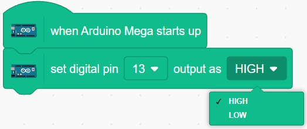

An dieser Stelle wird der Arduino-Code auf der rechten Seite angezeigt. Wenn Sie diesen Code bearbeiten möchten, können Sie den Bearbeitungsmodus einschalten.

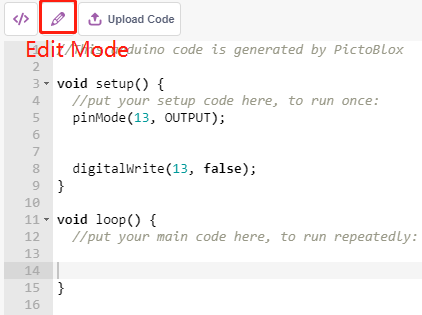

Um den Effekt der kontinuierlich blinkenden LED zu sehen, müssen Sie die Blöcke [Wait 1 seconds] und [forever] in der **Steuerung**-Palette verwenden. Klicken Sie auf diese Blöcke nach dem Schreiben, es gibt einen gelben Lichthof bedeutet, dass es läuft.

* [Wait 1 seconds]: aus der **Steuerung**-Palette, wird verwendet, um das Zeitintervall zwischen 2 Blöcken einzustellen.
* [forever]: aus der **Steuerung**-Palette, erlaubt dem Skript, weiterzulaufen, bis der Strom abgeschaltet wird.

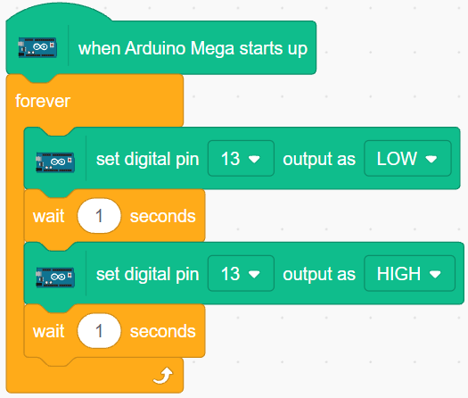

Klicken Sie schließlich auf die Schaltfläche **Upload Code**.

