.. note::

    Ciao, benvenuto nella Community SunFounder per appassionati di Raspberry Pi, Arduino ed ESP32 su Facebook! Approfondisci le tue conoscenze su Raspberry Pi, Arduino ed ESP32 insieme ad altri appassionati.

    **Perché unirti a noi?**

    - **Supporto esperto**: Risolvi problemi post-vendita e sfide tecniche con l'aiuto della nostra comunità e del nostro team.
    - **Impara e condividi**: Scambia consigli e tutorial per migliorare le tue competenze.
    - **Anteprime esclusive**: Ottieni accesso anticipato agli annunci di nuovi prodotti e anteprime.
    - **Sconti speciali**: Goditi sconti esclusivi sui nostri prodotti più recenti.
    - **Promozioni festive e omaggi**: Partecipa a concorsi e promozioni durante le festività.

    👉 Pronto per esplorare e creare con noi? Clicca [|link_sf_facebook|] e unisciti oggi stesso!

1.3 Guida rapida a PictoBlox
====================================

Ora impariamo a utilizzare PictoBlox in due modalità.

Inoltre, c'è un LED integrato collegato al Pin 13 su Arduino Uno/Mega2560. Impareremo a far lampeggiare questo LED in 2 modalità diverse.

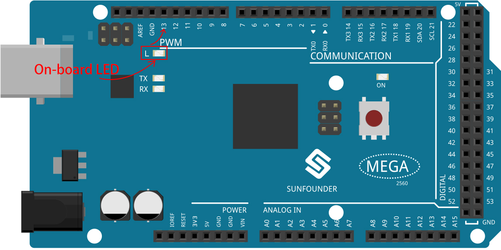

Modalità Stage
-----------------

**1. Collegare la scheda Arduino**

Collega la tua scheda Arduino al computer con un cavo USB; di solito il computer riconoscerà automaticamente la scheda e assegnerà una porta COM.

Apri PictoBlox; l'interfaccia Python si aprirà di default. Dobbiamo passare all'interfaccia Blocks.

.. image:: img/0_choose_blocks.png

Vedrai l'angolo in alto a destra per cambiare modalità. La modalità predefinita è Stage, dove Tobi si trova sul palcoscenico.

.. image:: img/1_stage_upload.png

Clicca su **Board** nella barra di navigazione in alto a destra per selezionare la scheda.

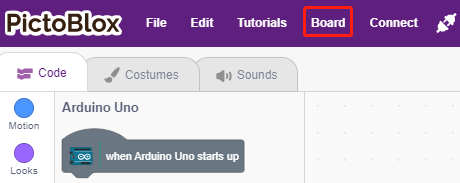

Ad esempio, scegli **Arduino Mega**.

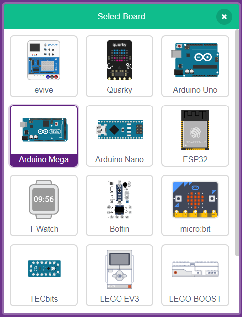

Apparirà una finestra di connessione per selezionare la porta da collegare. Una volta completata la connessione, ritorna alla home page. Se interrompi la connessione durante l'uso, puoi cliccare su **Connect** per riconnetterti.

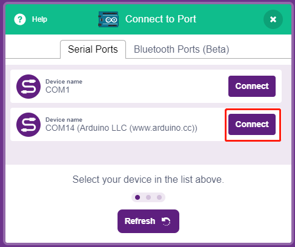

Allo stesso tempo, palette relative ad Arduino Mega, come Arduino Mega, Attuatori, ecc., appariranno nella **Block Palette**.

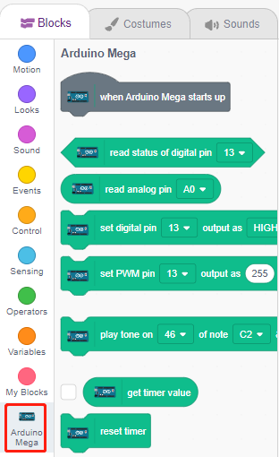

**2. Caricare il firmware**

Poiché lavoreremo in modalità Stage, dobbiamo caricare il firmware sulla scheda. Garantirà la comunicazione in tempo reale tra la scheda e il computer. Caricare il firmware è un processo unico. Per farlo, clicca sul pulsante **Upload Firmware**.

Dopo un po', apparirà un messaggio di successo del caricamento.

.. note::

    Se stai usando questa scheda Arduino in PictoBlox per la prima volta, o se è stata precedentemente caricata con l'IDE di Arduino, devi cliccare su **Upload Firmware** prima di poterla utilizzare.

.. image:: img/1_firmware.png

**3. Programmazione**

* Apri e avvia lo script direttamente

Puoi aprire direttamente gli script per eseguirli, ma prima scaricali da `github <https://github.com/sunfounder/sunfounder_vincent_kit_for_arduino/archive/refs/heads/master.zip>`_.

Clicca su **File** in alto a destra, quindi scegli **Open**.

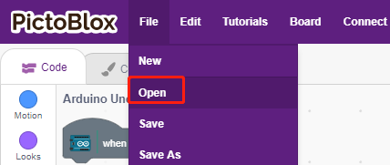

Seleziona **Open from Computer**.

.. image:: img/0_dic.png

Vai al percorso ``sunfounder_vincent_kit_for_arduino\scratch\code``, e apri **1. Stage Mode.sb3**. Assicurati di aver scaricato il codice richiesto da `github <https://github.com/sunfounder/sunfounder_vincent_kit_for_arduino/archive/refs/heads/master.zip>`_.

.. image:: img/0_stage.png

Clicca direttamente sullo script per eseguirlo. Alcuni progetti richiedono di cliccare sulla bandiera verde o sullo sprite.

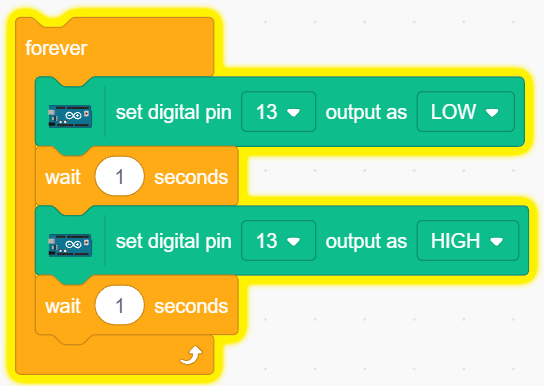

* Programma passo passo

Puoi anche scrivere lo script passo dopo passo seguendo questi passaggi.

Clicca sulla palette **Arduino Mega**.

Il LED sulla scheda Arduino è controllato dal pin digitale 13 (solo 2 stati: HIGH o LOW), quindi trascina il blocco [set digital pin out as] nell'area script.

Poiché lo stato predefinito del LED è acceso, ora imposta il pin 13 su LOW, clicca su questo blocco e vedrai che il LED si spegne.

* [set digital pin out as]: Imposta i pin digitali (2~13) al livello (HIGH/LOW).

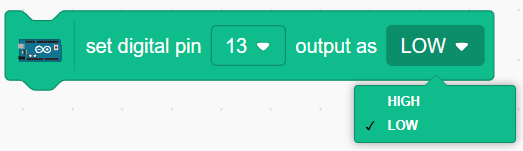

Per vedere l'effetto di un LED che lampeggia continuamente, devi usare i blocchi [Wait 1 seconds] e [forever] nella palette **Control**. Clicca su questi blocchi dopo averli scritti: se appare un alone giallo, significa che lo script è in esecuzione.

* [Wait 1 seconds]: dalla palette **Control**, utilizzato per impostare l'intervallo di tempo tra 2 blocchi.
* [forever]: dalla palette **Control**, permette allo script di continuare a funzionare fino a quando non viene messo in pausa manualmente.

Modalità Upload
-------------------

**1. Collegare la scheda Arduino**

Collega la tua scheda Arduino al computer con un cavo USB; di solito il computer riconoscerà automaticamente la scheda e assegnerà una porta COM.

Apri PictoBlox e clicca su **Board** nella barra di navigazione in alto a destra per selezionare la scheda.

Ad esempio, scegli **Arduino Mega**.

Apparirà una finestra di connessione per selezionare la porta da collegare. Una volta completata la connessione, ritorna alla home page. Se interrompi la connessione durante l'uso, puoi cliccare su **Connect** per riconnetterti.

Allo stesso tempo, palette relative ad Arduino Mega, come Arduino Mega, Attuatori, ecc., appariranno nella **Block Palette**.

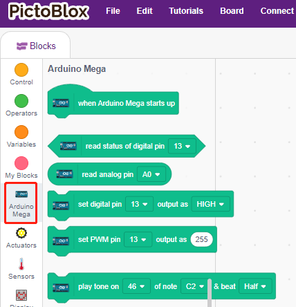

Dopo aver selezionato la modalità Upload, il palcoscenico passerà all'area codice Arduino originale.

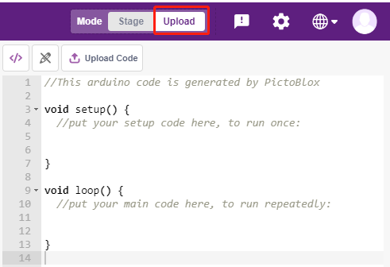

**2. Programmazione**

* Apri e avvia lo script direttamente

Clicca su **File** in alto a destra.

Seleziona **Open from Computer**.

.. image:: img/0_dic.png

Vai al percorso ``sunfounder_vincent_kit_for_arduino\scratch\code``, e apri **1. Upload Mode.sb3**. Assicurati di aver scaricato il codice richiesto da `github <https://github.com/sunfounder/sunfounder_vincent_kit_for_arduino/archive/refs/heads/master.zip>`_.

.. image:: img/0_upload.png

Infine, clicca sul pulsante **Upload Code**.

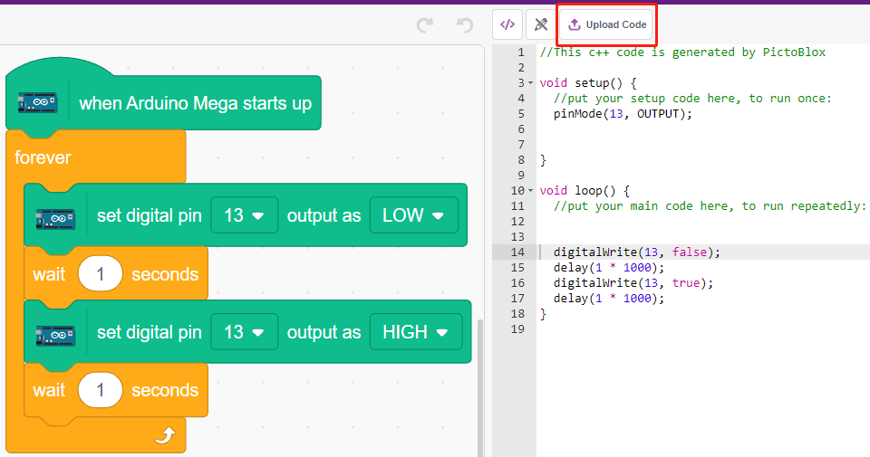

* Programma passo passo

Puoi anche scrivere lo script passo dopo passo seguendo questi passaggi.

Clicca sulla palette **Arduino Mega**.

Trascina [when Arduino Mega starts up] nell'area script, un passaggio obbligatorio per ogni script.

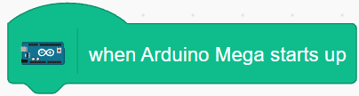

Il LED sulla scheda Arduino è controllato dal pin digitale 13 (solo 2 stati 
HIGH o LOW), quindi trascina il blocco [set digital pin out as] nell'area script.

Poiché lo stato predefinito del LED è acceso, ora imposta il pin 13 su LOW e 
clicca su questo blocco: vedrai che il LED si spegne.

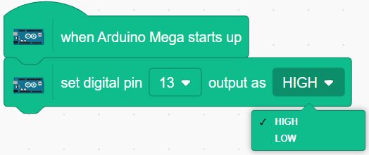

A questo punto vedrai il codice Arduino apparire sul lato destro. Se vuoi modificare questo codice, puoi attivare la modalità di modifica.

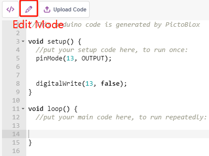

Per vedere l'effetto di un LED lampeggiante continuo, usa i blocchi [Wait 1 
seconds] e [forever] nella palette **Control**. Clicca su questi blocchi dopo 
aver scritto; apparirà un alone giallo che indica che è in esecuzione.

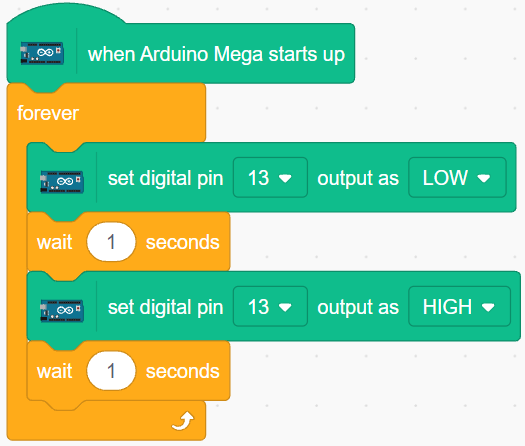

Infine, clicca sul pulsante **Upload Code**.

