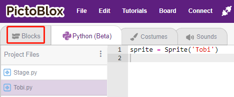

1.3 Quick Guide on PictoBlox
====================================

Now let's learn how to use PictoBlox in two modes.

Also, there is an On-board LED connected to Pin 13 on the Arduino Uno/Mega2560, we will learn to make this LED blink in 2 different modes.

.. image:: img/1_led.jpg
    :width: 500
    :align: center

Stage Mode
---------------

**1. Connect to Arduino Board**

Connect your Arduino board to the computer with a USB cable, usually the computer will automatically recognize your board and finally assign a COM port.

Open PictoBlox, the Python programming interface will open by default. And we need to switch to the Blocks interface.

Then you will see the top right corner for mode switching. The default is Stage mode, where Tobi is standing on the stage.

.. image:: img/1_stage_upload.png

Click **Board** in the upper right navigation bar to select the board.

For example, choose **Arduino Mega**.

.. image:: img/1_choose_mega.png

A connection window will then pop up for you to select the port to connect to, and return to the home page when the connection is complete. If you break the connection during use, you can also click **Connect** to reconnect.

.. image:: img/1_connect.png

At the same time, Arduino Mega related palettes, such as Arduino Mega, Actuators, etc., will appear in the **Block Palette**.

.. image:: img/1_arduino_mega.png

**2. Upload Firmware**

Since we’re going to work in the Stage mode, we must upload the firmware to the board. It will ensure real-time communication between the board and the computer. Uploading the firmware it is a one-time process. To do so, click on the Upload Firmware button.

After waiting for a while, the upload success message will appear.

.. note::

    If you are using this Arduino board in PictoBlox for the first time, or if this Arduino was previously uploaded with the Arduino IDE. Then you need to tap **Upload Firmware** before you can use it.

.. image:: img/1_firmware.png

**3. Programming**

* Open and run the script directly

Of course, you can open the scripts directly to run them, but please download them from `github <https://github.com/sunfounder/sunfounder_vincent_kit_for_arduino/archive/refs/heads/master.zip>`_ first.

You can click on **File** in the top right corner and then choose **Open**.

Choose **Open from Computer**.

.. image:: img/0_dic.png

Then go to the path of ``sunfounder_vincent_kit_for_arduino\scratch\code``, and open **1. Stage Mode.sb3**. Please ensure that you have downloaded the required code from `github <https://github.com/sunfounder/sunfounder_vincent_kit_for_arduino/archive/refs/heads/master.zip>`_.

.. image:: img/0_stage.png

Click directly on the script to run it, some projects are click on the green flag or click on the sprite.

.. image:: img/1_more.png

* Program step by step

You can also write the script step by step by following these steps.

Click on the **Arduino Mega** palette.

.. image:: img/1_arduino_mega.png

The LED on the Arduino board is controlled by the digital pin 13 (only 2 states, HIGH or LOW), so drag the [set digital pin out as]  block to the script area.

Since the default state of the LED is lit, now set pin 13 to LOW and click on this block and you will see the LED go off.

* [set digital pin out as]: Set the digital pins (2~13) to (HIGH/LOW) level.

.. image:: img/1_digital.png

In order to see the effect of continuous blinking LED, you need to use the [Wait 1 seconds] and [forever] blocks in the **Control** palette. Click on these blocks after writing, there is a yellow halo means it is running.

* [Wait 1 seconds]: from the **Control** palette, used to set the time interval between 2 blocks.
* [forever]: from the **Control** palette, allows the script to keep running unless manually paused.

.. image:: img/1_more.png

Upload Mode
---------------

**1. Connect to Arduino Board**

Connect your Arduino board to the computer with a USB cable, usually the computer will automatically recognize your board and finally assign a COM port.

Open PictoBlox and click **Board** in the top right navigation bar to select the board.

For example, choose **Arduino Mega**.

.. image:: img/1_choose_mega.png

A connection window will then pop up for you to select the port to connect to, and return to the home page when the connection is complete. If you break the connection during use, you can also click **Connect** to reconnect.

.. image:: img/1_connect.png

At the same time, Arduino Mega related palettes, such as Arduino Mega, Actuators, etc., will appear in the **Block Palette**.

.. image:: img/1_upload_mega.png

After selecting Upload mode, the stage will switch to the original Arduino code area.

**2. Programming**

* Open and run the script directly

You can click on **File** in the top right corner.

Choose **Open from Computer**.

.. image:: img/0_dic.png

Then go to the path of ``sunfounder_vincent_kit_for_arduino\scratch\code``, and open **1. Upload Mode.sb3**. Please ensure that you have downloaded the required code from `github <https://github.com/sunfounder/sunfounder_vincent_kit_for_arduino/archive/refs/heads/master.zip>`_.

.. image:: img/0_upload.png

Finally, click the **Upload Code** button.

* Program step by step

You can also write the script step by step by following these steps.

Click on the **Arduino Mega** palette.

.. image:: img/1_upload_mega.png

Drag [when Arduino Mega starts up] to the script area, which is required for every script.

.. image:: img/1_mega_starts.png

The LED on the Arduino board is controlled by the digital pin13 (only 2 states HIGH or LOW), so drag the [set digital pin out as]  block to the script area.

Since the default state of the LED is lit, now set pin 13 to LOW and click on this block and you will see the LED go off.

* [set digital pin out as]: Set the digital pin (2~13) to (HIGH/LOW) level.

.. image:: img/1_upload_digital.png

At this point you will see the Arduino code appear on the right side, if you want to edit this code, then you can turn Edit mode on.

.. image:: img/1_upload1.png

In order to see the effect of continuous blinking LED, you need to use the [Wait 1 seconds] and [forever] blocks in the **Control** palette. Click on these blocks after writing, there is a yellow halo means it is running.

* [Wait 1 seconds]: from the **Control** palette, used to set the time interval between 2 blocks.
* [forever]: from the **Control** palette, allows the script to keep running unless the power is off.

.. image:: img/1_upload_more.png

Finally, click the **Upload Code** button.

