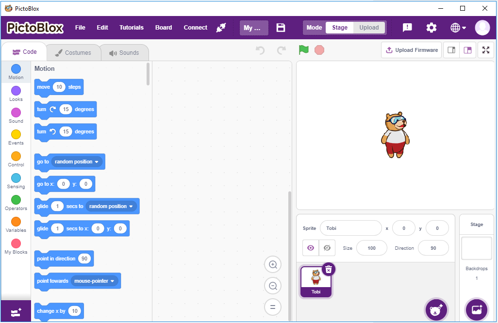

Play with Scratch
========================

Neben der Programmierung auf der Arduino IDE mit Uno/Mega2560-Boards können wir diese auch für die grafische Programmierung verwenden.

Hier empfehlen wir die Programmierung mit Scratch, aber das offizielle Scratch ist derzeit nur mit Raspberry Pi kompatibel, daher haben wir uns mit einer Firma, STEMPedia, zusammengetan, die eine auf Scratch 3 basierende grafische Programmiersoftware für Arduino-Boards (Uno, Mega2560 und Nano) entwickelt hat - `PictoBlox <https://thestempedia.com/product/pictoblox/>`_.

Es behält die Grundfunktionen von Scratch 3 bei, fügt aber auch Steuerplatinen wie Arduino Uno, Mega, Nano, ESP32, Microbit und STEAMPedia hausgemachte Hauptplatinen hinzu, die externe Sensoren verwenden können, Roboter zur Steuerung der Figur auf der Bühne, mit starken Hardware-Interaktionsfähigkeiten.

Darüber hinaus verfügt es über KI und maschinelles Lernen, auch wenn Sie nicht über viel Programmiergrundlage verfügen, können Sie diese beliebten und hochtechnologischen Funktionen erlernen und verwenden.

Ziehen Sie einfach die Scratch-Codierungsblöcke und legen Sie sie ab, und erstellen Sie coole Spiele, Animationen, interaktive Projekte und steuern Sie sogar Roboter so, wie Sie es möchten!

Jetzt lasst uns die Entdeckungsreise beginnen!

**1. Fangen Sie an**

.. toctree::
    :maxdepth: 2
    
    pictoblox_start/1_install
    pictoblox_start/2_introduce
    pictoblox_start/3_quick_guide

    

**2. Projekte**

Die folgenden Projekte sind nach Programmierschwierigkeiten geordnet, daher empfehlen wir, sie der Reihe nach zu lesen.

In jedem Projekt gibt es sehr detaillierte Schritte, die Ihnen beibringen, wie Sie die Schaltung aufbauen und Schritt für Schritt programmieren, um das Endergebnis zu erzielen.

Natürlich können Sie das Skript auch direkt öffnen, um es auszuführen, aber Sie müssen sicherstellen, dass Sie das entsprechende Material von `github <https://github.com/sunfounder/sunfounder_vincent_kit_for_arduino/archive/refs/heads/master.zip>`_ heruntergeladen haben.

Sobald der Download abgeschlossen ist, entpacken Sie es. Siehe :ref:`stage_mode`, um einzelne Skripte direkt auszuführen.

Aber :ref:`humiture` wird im :ref:`upload_mode` verwendet.

.. toctree::
    :maxdepth: 1

    1_table_lamp
    2_breathing
    3_colorful_ball
    4_lcd1602
    5_moving_mouse
    6_doorbell
    7_tumbler
    8_temperature
    9_alarm_clock
    10_dht11
    11_pendulum
    12_rotating_fan
    13_blow_ball
    14_shooting
    15_balloon
    16_star_crossed
    17_apple
    18_parrot
    19_brick
    20_fish
    21_starfish
    22_dragon

    

    

