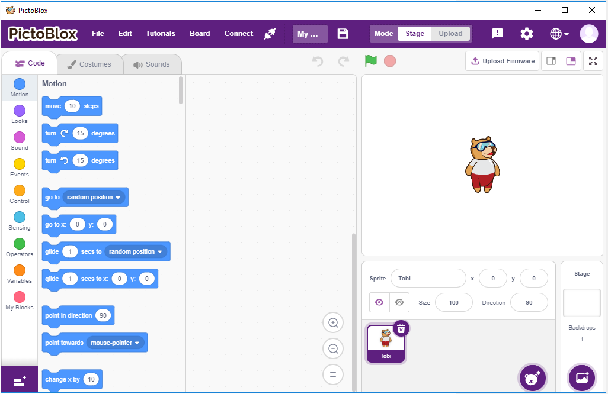

.. note::

    Ciao, benvenuto nella Community di SunFounder per appassionati di Raspberry Pi, Arduino e ESP32 su Facebook! Approfondisci le tue conoscenze su Raspberry Pi, Arduino ed ESP32 insieme ad altri appassionati.

    **Perché unirti a noi?**

    - **Supporto esperto**: Risolvi problemi post-vendita e sfide tecniche con l'aiuto della nostra comunità e del nostro team.
    - **Impara e condividi**: Scambia suggerimenti e tutorial per migliorare le tue competenze.
    - **Anteprime esclusive**: Accedi in anteprima agli annunci di nuovi prodotti e anticipazioni.
    - **Sconti speciali**: Goditi sconti esclusivi sui nostri prodotti più recenti.
    - **Promozioni festive e giveaway**: Partecipa a giveaway e promozioni durante le festività.

    👉 Pronto a esplorare e creare con noi? Clicca [|link_sf_facebook|] e unisciti oggi stesso!

Gioca con Scratch
========================

Oltre a programmare su Arduino IDE con le schede Uno/Mega2560, possiamo utilizzarle anche per la programmazione grafica.

Ti consigliamo di utilizzare Scratch per programmare, ma la versione ufficiale di Scratch è attualmente compatibile solo con Raspberry Pi. Per questo motivo, abbiamo collaborato con un'azienda, STEMPedia, che ha sviluppato un software di programmazione grafica basato su Scratch 3 per schede Arduino (Uno, Mega2560 e Nano): `PictoBlox <https://thestempedia.com/product/pictoblox/>`_.

Mantiene le funzioni base di Scratch 3, ma aggiunge il supporto per schede di controllo come Arduino Uno, Mega, Nano, ESP32, Microbit e schede personalizzate di STEMPedia. È possibile utilizzare sensori esterni e robot per controllare gli sprite sullo stage, offrendo una forte capacità di interazione hardware.

Inoltre, include funzionalità di intelligenza artificiale e apprendimento automatico, che ti permettono di imparare e utilizzare queste tecnologie avanzate anche senza una solida base di programmazione.

Basta trascinare e rilasciare i blocchi di codice Scratch per creare fantastici giochi, animazioni, progetti interattivi e persino controllare robot a tuo piacimento!

Iniziamo il viaggio della scoperta!

**1. Inizia**

.. toctree::
    :maxdepth: 2
    
    pictoblox_start/1_install
    pictoblox_start/2_introduce
    pictoblox_start/3_quick_guide
    

**2. Progetti**

I seguenti progetti sono organizzati in base al livello di difficoltà della programmazione, quindi ti consigliamo di seguirli nell'ordine indicato.

Ogni progetto include passaggi dettagliati per costruire il circuito e programmare passo dopo passo per raggiungere il risultato finale.

Naturalmente, puoi anche aprire direttamente gli script per eseguirli, ma devi assicurarti di aver scaricato i materiali pertinenti da `github <https://github.com/sunfounder/sunfounder_vincent_kit_for_arduino/archive/refs/heads/master.zip>`_.

Una volta completato il download, decomprimi i file. Fai riferimento a :ref:`Modalità Stage` per eseguire direttamente gli script individuali.

Tuttavia, il progetto :ref:`humiture` utilizza la modalità :ref:`Modalità Upload`.

.. toctree::
    :maxdepth: 1

    1_table_lamp
    2_breathing
    3_colorful_ball
    4_lcd1602
    5_moving_mouse
    6_doorbell
    7_tumbler
    8_temperature
    9_alarm_clock
    10_dht11
    11_rotating_fan
    12_blow_ball
    13_shooting
    14_balloon
    15_star_crossed
    16_apple
    17_parrot
    18_brick
    19_fish
    20_starfish
    21_dragon

    

    

